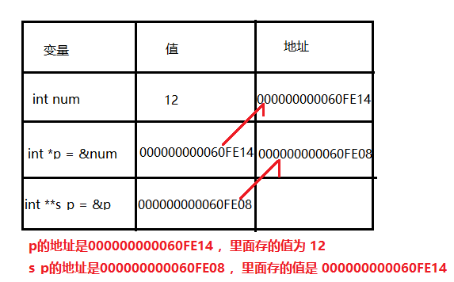

# <center>C基础：02.指针运算和函数指针<center>

# 1.二级指针和多级指针



二级指针：**对一级指针取地址**

n级指针：**对（n-1）指针取对峙**

```c++
int main(){
    int num = 12;
    // int* 指针  & 取地址
    int* p = &num;

    int** s_p = &p; // 对一级指针取地址

//    int*** s_s_p = &s_p; // 多级指针

    printf("p 的值是：%p, s_p 的值是：%p\n",p,s_p);
    // p的地址是000000000060FE14 里面存的值为 12
    // s_p的地址是000000000060FE08 ，里面存的值是 000000000060FE14

    // 通过二级指针获取值
    printf("获取最终的值是：%d",**s_p);

    getchar();// 暂停
}
```

# 2.数组与数组指针
- 数组 arr 的值 = arr 取地址的值  = arr[0]的地址的值（首地址）
- 数组 arr_p[i] == *(arr_p+i)

数组指针指向的是数组的首地址

```c++
int main(){
    // 定义数组
    int arr[] = {1,2,3,4};

    //遍历数组，linux 就有问题
    for(int i = 0; i<4 ; i++){
        printf("%d\n",arr[i]);
    }

    // for 循环在 c 和 c++ 中的正确写法
    int i = 0;
    for(; i < 4; i++){
        printf("%d\n",arr[i]);
    }

    // 看一种现象：arr 的值 = arr 取地址的值 , arr 地址的值 = arr[0]的地址的值（首地址）
    printf("arr = %p\n",arr); // arr = 000000000060FE00
    printf("&arr = %p\n",&arr); // &arr = 000000000060FE00
    printf("&arr[0] = %p\n",&arr[0]); // &arr[0] = 000000000060FE00

    // 如何获取数组的指针
    int* arr_p = arr;// 数组指针指向的是数组的首地址

    // 做一系列的操作
    printf("%d\n",*arr_p); // 1

    // 对指针进行 ++
    arr_p++;

    printf("%d\n",*arr_p); // 2

    // 指针再往后挪动两位
    arr_p += 2;

    printf("%d\n",*arr_p); // 4

    getchar();
}
```

## 2.1. 采用指针遍历数据

```c++
int main(){
    int arr[] = {1,2,3,4};

    int* arr_p = arr;

    int i = 0;
    for (; i < 4; i++) {
        printf("位置%d的值是：%d\n",i,*(arr_p+i));
    }

    getchar();
}
```

打印结果：

```
位置0的值是：1
位置1的值是：2
位置2的值是：3
位置3的值是：4
```

## 2.2. 采用指针循环为数组赋值

```c++
int main(){
    int arr[4]; // 指定数组[4]

    int* arr_p = arr;

    int i = 0;
    for(; i< 4; i++){
        *(arr_p + i) = i;
    }

    i = 0;
    for(; i< 4; i++){
        printf("位置%d的值是：%d\n",i,arr[i]);
    }
    getchar();
}
```

打印结果：

```
位置0的值是：0
位置1的值是：1
位置2的值是：2
位置3的值是：3
```

## 2.3.数组指针的几种操作方式

```c++
int main(){

    int arr[] = {1,2,3,4};

    int* arr_p = arr;

    int i = 0;
    for(; i < 4; i++){
        printf("使用arr_p[i]算出位置%d的值是：%d\n",i,arr_p[i]); // == *(arr_p+i)
        printf("使用*(arr + i)算出位置%d的值是：%d\n", i, *(arr + i));
    }

    getchar();
}
```

打印结果

```
使用arr_p[i]算出位置0的值是：1
使用*(arr + i)算出位置0的值是：1
使用arr_p[i]算出位置1的值是：2
使用*(arr + i)算出位置1的值是：2
使用arr_p[i]算出位置2的值是：3
使用*(arr + i)算出位置2的值是：3
使用arr_p[i]算出位置3的值是：4
使用*(arr + i)算出位置3的值是：4
```

# 3.函数指针  
方法指针怎么定义？ `方法的返回（*方法的名称）（方法的参数)`,中间的 * 号可以省略

`函数指针跟数组类似  数组是 arr = &arr,  函数指针是 void(*method)(int,int) = &method,&可以不要`

例如：

```
// 方法指针， 传两个数
void operator1(void(method)(int,int),int num1,int num2){
    method(num1,num2);
}

// 加上*号也是可以的
void operator1(void(*method)(int,int),int num1,int num2){
    method(num1,num2);
}
```

```c++
void call_back(int current,int total){
    printf("压缩的进度是：%d/%d\n",current,total);
}

// 这个方法 3 ，他是一个额外的文件了
void compress(char* file_name,void(*call_back)(int,int)){
    call_back(12,24);
}

int main(){

    void(*call)(int,int); // 声明了一个函数
    call = call_back; // 给函数指针赋值

    // call(1,2) 通过函数指针间接的调用call_back
    compress("1.png",call);

    getchar();

}
```