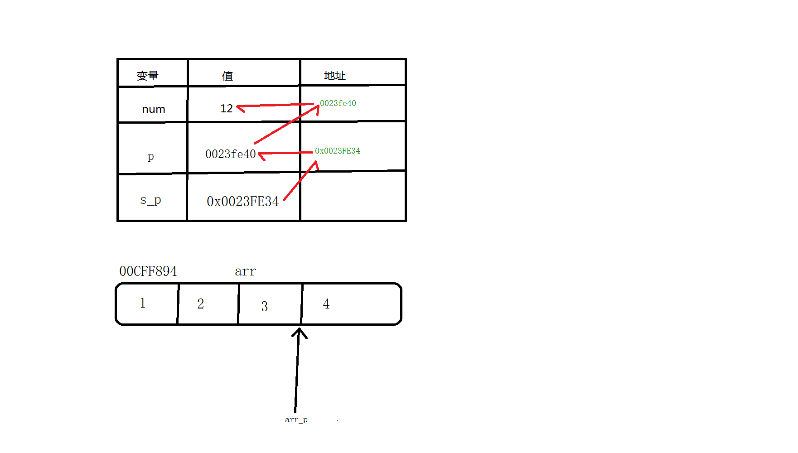
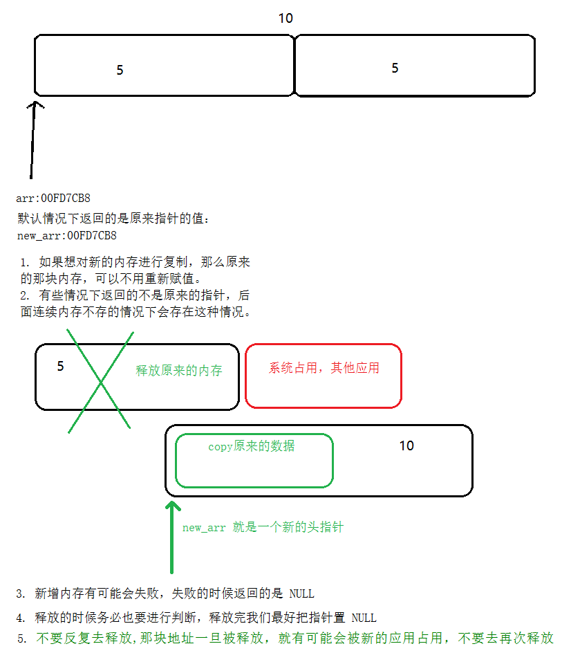

# <center>03.随机数和内存开辟<center>
@[TOC](C基础)



# 知识点：

## 1.生成随机数

```
// 可以随机但是每次运行，随机数都一致，解决的方式就是初始化发生器
// 初始化随机发生器, 每次发生器都是当前时间，啰嗦，实用场景，在 C 层生成秘钥（安全）
srand((unsigned)time(NULL));
int i;
for (i = 0; i<10; i++)
    printf("%d\n", rand() % 100);
getchar();
```

## 2.重点，内存开辟
- c 有分区，四驱模型，栈，堆
- 栈：占用内存空间最大值 2M ，开辟内存的方式是静态内存开辟 int arr[10*1024*1024]，方法结束会自动回收
- 堆：占用内存空间最大值 80% ，开辟内存的方式是动态内存开辟 ，不会自动回收必须手动回收（内存不再使用的时候一定要手动回收）

## 3.动态内存开辟  
int* arr = (int*)malloc(sizeof(int)*num);

    
    
## 4.改变内存空间大小  
// 原来那块内存的指针，总的大小（原来的大小+新的大小）
int* new_arr = (int*)realloc(arr, sizeof(int)*(num+new_num));	

   	
    
