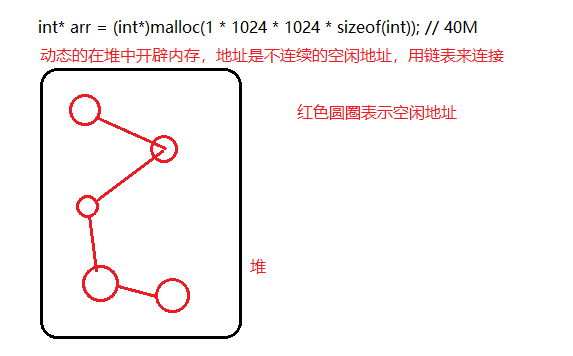

# <center>03.随机数和内存开辟<center>

# 知识点：

## 1.生成随机数

1. 初始化随机发生器：**`srand(NULL)`**　**`srand((unsigned)time(NULL))`**
2. 调用函数：**`rand()`**

问题：`srand(NULL)`初始化发生器时每次随机数都是一样的。  

解决：  
　　
　　初始化随机发生器时调用**`srand((unsigned)time(NULL))`**，每次发生器都是当前时间，所以随机数不会再一样了。


```
int main(){
    // 可以随机但是每次运行，随机数都一致，解决的方法就是初始化发生器
    // 初始化随机发生器，每次发生器都是当前时间，啰嗦，实用场景，在 c 层生成秘钥（安全）
    srand((unsigned)time(NULL));
    int i = 0;
    for(; i< 10; i++)
        printf("%d\n",rand() % 100);
    getchar();
}
```

## 2.重点，内存开辟
- c 有分区，四驱模型，栈，堆
- 栈(**是一块连续的内存的区域**)：占用内存空间最大值 2M ，开辟内存的方式是静态内存开辟 int arr[10*1024*1024]，方法结束会自动回收
- 堆(是用链表来存储的空闲内存地址的，**是不连续的**)：占用内存空间最大值 80% ，开辟内存的方式是动态内存开辟 ，不会自动回收必须手动回收（内存不再使用的时候一定要手动回收）

静态内存开辟

```c++
void staticlloc(){
    int arr[5]; // 静态开辟 0.8M
    int i = 0;
    for(; i < 5; i++){
        arr[i] = i;
        printf("%d,%p\n",*(arr+i),arr + i);
    }
}

// 静态内存开辟
int main(){
    // Stack overflow 栈溢出， 如何判断一块内存中有没有写入数据， 判 NULL? ，判越界
    // int arr[10*1024*1024]; // 占用的内存是多少？ 大小？ 10M数组大小， int 占用4字节，40M空间

    // c 有分区，四驱模型，栈，堆
    // 栈： 占用内存空间最大值 2M, 开辟内存的方式是静态内存开辟 int arr[10*1024*1024], 方法结束会自动回收
    // 堆： 占用内存空间最大值 80%, 开内存的方式是动态内存开辟 不会自动回收必须手动回收（内存不再使用的时候一定要手动回收）
    while (true){
        Sleep(100);
        staticlloc();// 不会内存溢出
    }
    getchar();
}
```

## 3.动态内存开辟  
1. 开辟内存：`malloc`　**`int* arr = (int*)malloc(sizeof(int)*num);`**
2. 释放内存： `free`　　**`free(arr)`** 不要反复去释放，那块地址一旦被释放，就有可能会被新的应用占用，不要去再次释放。

```c++
void dynamiclloc(){
    int* arr = (int*)malloc(1 * 1024 * 1024 * sizeof(int)); // 40M

    // 第二个重要的方法,手动释放 free , 释放arr 这一块内存
    free(arr);
}

//动态内存开辟
int main(){
    // int arr[1 * 1024 * 1024];

    // 操作
    while(true){
        Sleep(100);
        dynamiclloc();
    }
    getchar();
}
```



```c++
int main(){
    // 假设我们现在需要接收用户所输入的数，然后进行排序
    int num;
    printf("请输入数的个数：");
    // 获取用户输入的值
    scanf("%d",&num);

    // 定义一个数组来存放用户的数据
    // int arr[num]; 静态开辟，内存大小不能改变。
    int* arr = (int*)malloc(sizeof(int)*num);

    // for 循环接收
    int i = 0;
    int print_num;
    for(; i < num; i++){
        printf("请输入第%d个的值：",i);
        scanf("%d",&print_num);
        arr[i] = print_num; // arr[i] = *(arr+i)
        printf("%d,%p\n",*(arr+i),arr + i);
    }

    // 排序 堆排序（4个小时），快排序
    free(arr);

    getchar();

}
```

打印结果

```
请输入数的个数：3
请输入第0个的值：2
2,0000000000AE1440
请输入第1个的值：5
5,0000000000AE1444
请输入第2个的值：10
10,0000000000AE1448
```
    
    
## 4.改变内存空间大小  
- `realloc`：**`int* new_arr = (int*)realloc(arr, sizeof(int)*(num+new_num));`**	

```c++
// 改变内存空间大小
int main(){
    int num;
    printf("请输入数的个数：");
    // 获取用户输入的值
    scanf("%d",&num);

    // 5 个值
    int* arr = (int*)malloc(sizeof(int)*num);
    int i = 0;
    for(; i < num; i++){
        arr[i] = i; // arr[i] == *(arr + i);
    }

    printf("开辟内存的指针：%p\n",arr);

    // 再加点内存
    printf("请输入新增的个数：");
    // 获取用户新输入的值
    int new_num;
    scanf("%d",&new_num); // 5
    // 原来那块内存的指针，总的大小（原来的大小+新的大小）
    int* new_arr = (int*)realloc(arr,sizeof(int)*(num+new_num));

    if(new_arr){ // = if(new_arr != NULL)
        i = num;
        for(; i < (num+new_num); i++){
            arr[i] = i; // arr[i] == *(arr + i);
        }

        printf("新开辟内存的指针：%p\n",new_arr);

        // 打印数组
        int i = 0;
        for(; i < (num + new_num); i++){
            printf("%d,%p\n",*(arr + i),arr + i);
        }

    }

    if(new_arr){
        // 如果成功了，只需要释放新的地址就行
        free(new_arr);
        new_arr = NULL;
    } else{
        // 如果没成功，释放原来的内存
        free(arr);
    }

    // 不要反复去释放，那块地址一旦被释放，就有可能会被新的应用占用，不要去再次释放。
    // free(new_arr);

    // 工作 C/C++ 精通

    getchar();
}
```

打印结果：

```
请输入数的个数：2
开辟内存的指针：0000000000B81440
请输入新增的个数：1
新开辟内存的指针：0000000000B81440
0,0000000000B81440
1,0000000000B81444
2,0000000000B81448
```


   	
    
