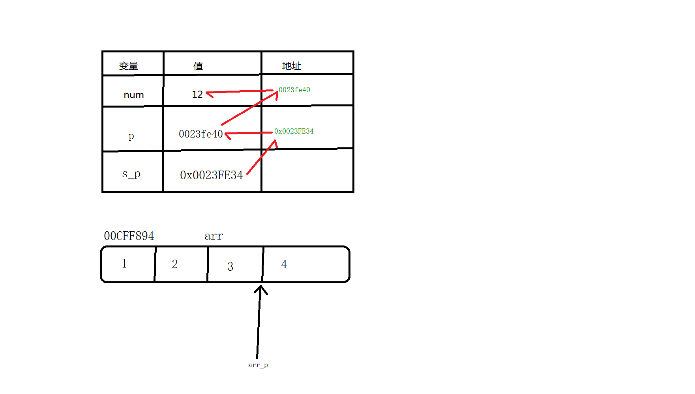

# <center>02.C基础<center>
@[TOC](C基础)



# 知识点：

1. 二级指针和多级指针

2. 数组与数组指针 (重点)
    -  arr 的值 = arr 去地址的值 ，arr 地址的值 = arr[0]的地址的值（首地址）
    - printf("位置%d的值是：%d\n", i, arr_p[i]);// == *(arr_p+i)

3. 函数指针  
    // 方法指针怎么定义？ 方法的返回（*方法的名称）（方法的参数）  
    中间的 * 号可以省略
    
    例如：
    ```$xslt
    // 方法指针， 传两个数
    void operator1(void(method)(int,int),int num1,int num2){
        method(num1,num2);
    }
    
    // 加上*号也是可以的
    void operator1(void(*method)(int,int),int num1,int num2){
        method(num1,num2);
    }
    
    ```

4. 监听数据压缩回调