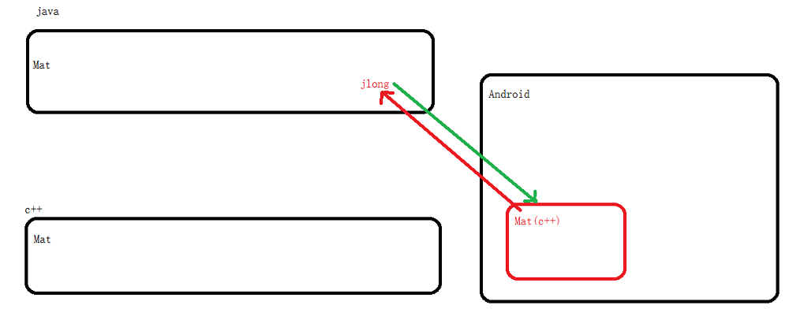

# <center>09.Android共享内存的序列化过程<center>

**代码请看：[NDKPractice项目的jni09](https://github.com/EastUp/NDKPractice/tree/master/jni09)**

# 知识点：


## 1. 面试题：

1. 进程间的通信方式有哪些
2. binder 和 socket 通信的区别有哪些 
    - 从传输性能上说 ： `Socket `,`传输效率低`，`开销大`，主要用在`跨网络的进程间通信`;消息队列和管道采用存储-转发方式.数据先从发送方拷贝到内存开辟的缓存区中，
    然后再从内核缓存区拷贝到接收方缓存区，至少有两次拷贝过程。`Binder`只需要拷贝一次（因为内存映射）
    - 从安全性上来说： Socket 没有任何安全措施，完全依赖上层协议来确保。`Binder` 通过包名和类名在`serviceManager`中进行查找，`Binder.getCallingUID();` 就能取得对方UID来检验它的身分等。还可以进行 `checkCallingPermission()`等
    - 总结:（binder 共享内存，Soket需要copy内存） Socket 远程，本地低速（zygote）
3. Android 为什么在大部分场景下用 Binder 进行进程间通信 (效率高，开销小，安全性高)
4. Serializable 和 Parcelable 之间的区别  
    Serializable ：主要是IO操作，消耗较大 ，好处就是 `简单`
    Parcelable ：因为原理是`共享内存`,所以效率高，内存消耗小
5. Parcelable 序列化和反序列化的具体过程


## 2. <font color=red>重点：</font> Native 构建对象如何与 Java 层对应



### 2.1 opencv Mat 源码阅读

Java -> Mat.java = C++ Mat.cpp 对象

```
public class Mat {// Java 对象
    // 

    public final long nativeObj;
    public Mat(){
        nativeObj = n_Mat(rows, cols, type);// c++ 创建一个对象，返回的是 long 类型（c++ 对象的指针地址）
    }
    public static native long n_Mat(int rows, int cols, int type);
}
```

c 层 构建的对象

```c
JNIEXPORT jlong JNICALL Java_org_opencv_core_Mat_n_1Mat__DDI
  (JNIEnv* env, jclass, jdouble size_width, jdouble size_height, jint type)
{
    static const char method_name[] = "Mat::n_1Mat__DDI()";
    try {
        LOGD("%s", method_name);
        Size size((int)size_width, (int)size_height);
        return (jlong) new Mat( size, type );
    } catch(const std::exception &e) {
        throwJavaException(env, &e, method_name);
    } catch (...) {
        throwJavaException(env, 0, method_name);
    }

    return 0;
}
```

### 2.2 Parcel.java 的源码


java层 创建对象调用 c 层的创建对象并获取到 c 层的指针（地址）：

```
    private void init(long nativePtr) {
        if (nativePtr != 0) {
            mNativePtr = nativePtr;
            mOwnsNativeParcelObject = false;
        } else {
            // 这里获取 c 层 parcel 对象的 指针（地址）
            mNativePtr = nativeCreate();
            mOwnsNativeParcelObject = true;
        }
    }
```

c 层创建 Parcel 对象

```c
static jlong android_os_Parcel_create(JNIEnv* env, jclass clazz)
{
    Parcel* parcel = new Parcel();
    return reinterpret_cast<jlong>(parcel);
}
```

java 层调用 c 层写入Int

```
 // nativePtr 指针地址
 private static native void nativeWriteInt(long nativePtr, int val);
```

c 层的写入： 

- mData : 共享内存的首地址
- mDataPos：内存首地址的当前逻动位置
- mDataCapacity：共享内存的总大小

```c
template<class T>
status_t Parcel::writeAligned(T val) {
    COMPILE_TIME_ASSERT_FUNCTION_SCOPE(PAD_SIZE_UNSAFE(sizeof(T)) == sizeof(T));

    if ((mDataPos+sizeof(val)) <= mDataCapacity) {
restart_write:
        *reinterpret_cast<T*>(mData+mDataPos) = val;
        return finishWrite(sizeof(val));
    }

    status_t err = growData(sizeof(val));
    if (err == NO_ERROR) goto restart_write;
    return err;
}
```

## 3.手写个Native层的Parcel.cpp，便于理解

```c++
#include <jni.h>
#include <string>
#include <malloc.h>
#include "com_east_jni09_Parcel.h"
extern "C"

JNIEXPORT jstring JNICALL Java_com_east_jni09_MainActivity_stringFromJNI
(JNIEnv* env,jobject jobj){
    std::string hello = "Hello from C++";
    return env->NewStringUTF(hello.c_str());
}

// 结构体 == C++ 中对象 Parcel.cpp
class Parcel{
    char* mData; // char 1 共享内存的首地址
    int mDataPos = 0; // 必须初始化 结构体没有默认值，除非在 } 后跟上几个默认的子项

public:
    Parcel(){
        mData = static_cast<char *>(malloc(1024));
    }


    void writeInt(jint value) {
        *reinterpret_cast<int*>(mData+mDataPos) = value; // 0 ,4
        mDataPos += sizeof(int);
    }

    void setDataPosition(jint value) {
        mDataPos = value;
    }

    jint readInt() {
        int result = *reinterpret_cast<int*>(mData+mDataPos);
        mDataPos += sizeof(int);
        return result;
    }
};


extern "C" JNIEXPORT jlong JNICALL Java_com_east_jni09_Parcel_nativeCreate
        (JNIEnv * env, jobject jobj){
    Parcel* parcel = new Parcel();
    return reinterpret_cast<jlong>(parcel);
}

extern "C" JNIEXPORT void JNICALL Java_com_east_jni09_Parcel_nativeWriteInt
        (JNIEnv * env, jobject jobj,jlong nativePtr,jint value){
    Parcel* parcel = reinterpret_cast<Parcel*>(nativePtr);
    parcel -> writeInt(value);
}

extern "C" JNIEXPORT void JNICALL Java_com_east_jni09_Parcel_nativeSetDataPosition
        (JNIEnv * env, jobject jobj,jlong nativePtr,jint value){
    Parcel* parcel = reinterpret_cast<Parcel*>(nativePtr);
    parcel -> setDataPosition(value);
}

extern "C"  JNIEXPORT jint JNICALL Java_com_east_jni09_Parcel_nativeReadInt
        (JNIEnv * env, jobject jobj,jlong nativePtr){
    Parcel* parcel = reinterpret_cast<Parcel*>(nativePtr);
    return parcel->readInt();
}
```

java 层调用：

```kotlin
 var parcel = Parcel()
        parcel.writeInt(12)
        parcel.writeInt(24)

        parcel.setDataPosition(0)

        val number1 = parcel.readInt()
        val number2 = parcel.readInt()

        Log.e("TAG","number1 = $number1 , number2 = $number2") // 12,24
```


