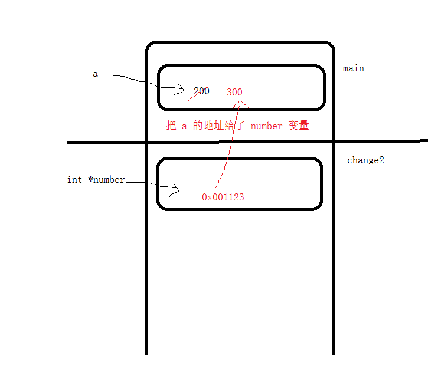
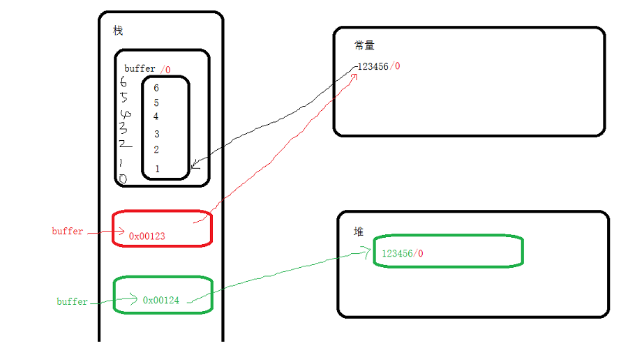

# <center>12.指针赋值、野指针、项目开发模型强化<center>

# 知识点：

## 1. 内存四驱模型

```c++
void change1(int number){ // 不能修改
    number = 300;
    printf("%p\n",&number);
}

int main(){
    int a = 100;

    // 修改 a 的值

    a = 200;
    change1(a); // a变量的值复制给了 number 变量，number 是在另一个函数中，number 是一个新的变量
    printf("change1：a = %d\n",a); // a = 200

    // getchar();
}
```


## 2. 指针间接赋值的意义

```c++
void change2(int* number){ //  可以
    *number = 300;
}

int main(){
    int a = 100;
    change2(&a); //  a 的地址复制给了 number 变量，number 是在另一个函数中，number 是一个新的变量

    printf("change2：a = %d\n",a); // a = 300;

    // getchar();
}
```



在做开发的时候，离不开指针，指针出现的意义有很多，其中一种就是通过方法去修改值 :

1. 获取Bitmap信息
  
```c
 AndroidBitmapInfo android_bitmap_info; // 结构体
 AndroidBitmap_getInfo(env,bitmap,&android_bitmap_info);// 通过 getInfo 方法去获取 Bitmap 的属性
 // 获取Bitmap的 宽，高，format
 int bitmap_width = android_bitmap_info.width;
 int bitmap_height = android_bitmap_info.height;
```

`c 和 java 的方法不同所在，c 可以传对象的地址在方法里面去赋值，java 一般都是通过返回值`

java 写法：  
　　`AndroidBitmapInfo android_bitmap_info = AndroidBitmap_getInfo(env,bitmap);`


## 3. 野指针和 null 地址

`野指针`:指 释放了指针对应的内存地址后，没有把指针置为 NULL

`NULL` : NULL 相当于指向 `0x00000000`,这块地方是 c 和 c++ 编译器所持有的，不能在这块区域赋值

strcpy(p,"string");  
p="string";  
`第一个是把string赋值给p，第二个是p指向“string”的首地址。`


```c++
int main(){
    // 写入位置 0x00000000 时发生访问冲突
    char* p1 = NULL; // p1 = NULL,NUll 也是地方，指针指向 NULL 相当于指向 0x00000000

    // 但是我们不能对 0x00000000 去操作，这块地方是 c 和 c++ 编译器所持有的

    // Student student = null; 不用纠结 null 是啥，跟 c 和 c++ 有点类似

    strcpy(p1,"1122"); // 把 1122 赋值给p1 NUll的位置，这是错误的

    printf("p1 = %s",p1); // Null的地址不能操作

    getchar();
}
```

## 4. 字符串强化

```c
int main(){
    // char buff[100] = {'e','a','s','t','r','i','s','e'};// 后面 8 - 99 都是默认值 0
    // char buff[5] = {'e','a','s','t','r'};
    // char buff[] = {'e','a','s','t','r'}; // 长度是 12（'\0'）, size 是 5（默认统计里面的个数）
    // char buff[2] = {'e','a','s','t','r'}; // 编译不通过，长度超出
    // char buff[100] = { 0 }; // 把数组初始化为 0
    // char buff[100] 数据都是默认值 -52

      char buff[] = "123456"; // len 是 6（'\0'）,size 是 7
    // 相当于 char buff[] = {1,2,3,4,5,6,\0}
//    char* buff= "123456"; // len==6, size==8（64位系统指针占8字节）

    // 纠结一下 char buff[] = "123456" 和 char* buff= "123456"; malloc 的方式 啥区别 ？
    // 字符串可以在任何地方开辟内存，栈区，堆区，常量区

    // 大小 size 100
    int len = strlen(buff);// len 5 碰到 '\0' 就结束了
    int size = sizeof(buff);

    printf("len = %d , size = %d\n",len,size);

    // 内容
    printf("%d,%d,%d,%d",buff[0],buff[66],buff[99],buff[77]);

    getchar();

}
```



## 5. 项目开发模型强化
1. 确定你的参数，传递指针
2. 一定要考虑健壮性
3. 要异常错误进行抛出说明 萤视频 ffmpeg
4. 不要直接轻易的去改变调用传递给你的指针


