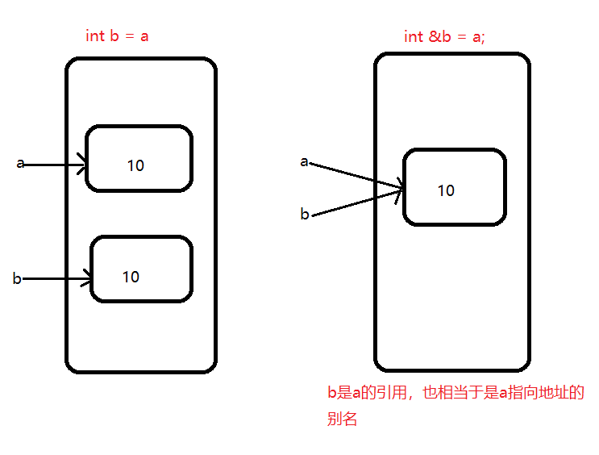

# <center>15.引用和函数重载<center>
@[TOC](C++基础)

# 知识点：

## 1. c 和 c++ 的区别

1. c++ 代码中可以混编 c 代码，c++ 里面写 c 代码也可以调用
2. c++ 面向对象（java）, c 面向过程
3. 很多的开源框架都是用 c++ 写的（大部分基于 c++）

打印：

```c++
#include <iostream> // c++ 的包

using namespace std; // 命名的空间， java中的内部类

int main(){
    cout << "Hello World" << endl;
}
```

## 2. 常量

c++ 中 通过指针修改常量，编译都不会通过

```c
    const int number = 10;

    // number = 20;

    int* numberP = &number; //  不能通过地址去修改值，但是某些编译器上面能通过，但是也不能修改值。
```
## 3. 引用和常量引用

### 3.1 引用

```c
    int a  = 10;

    // int b = a; // 这个地址不一样
    int &b = a; // 给 a 指向的内存取另外一个别，名 b

    b = 20;

    cout << "a的地址" << &a << endl;
    cout << "b的地址" << &b << endl;
    cout << "a的值" << a <<endl;
    cout << "b的值" << b <<endl;
```



### 3.2 常量引用

```c
typedef struct{
    char name[20];
    int age;
} Student;

void insertStu(const Student &stu) {// &stu  不想改，常量引用
    // 可以修改 stu 的值
    // strcpy(stu.name,"Jack");

    // 就变成了只读
    cout << stu.name << "," << stu.age << endl;

}
```


## 4. 函数重载和默认参数

 `c 不允许函数的重载,c++ 中可以`

```c++
int add(int number1, int number2 = 200, bool cache = 0) { // number2 = 200 默认的参数 kotlin 很像
    return number1 + number2;
}

// 错误 1 error C2084：函数 "int add(int,int)" 已有主题， c 不允许函数的重载,c++ 中可以
int add(int number1, int number2, int number3) {
    return number1 + number2 + number3;
}
```

## 5. 类的初探

1. class 定义类，跟 java 几乎类似
2. 真正的开发过程中我们的 cpp 或者 c 文件，最终 dll 或者 so 库供调用者使用，所以为了确保类能够正常被调用，我们一般需要定义 .h 头文件
3. 实现方法的使用要用命名空间  xxx类名::xxx方法

头文件：

```c++
class Student{ // 结构体类似
private: // 私有，包装，影响下面所有的属性
    char* name;
    int age;

public:
    void setAge(int age);

    void setName(char* name);
    // private： // 影响到下面的所有方法

    int getAge();

    char* getName();
};
```

实现文件：

```c++
// 写实现，定义了另外一个方法
void Student::setAge(int age){ // 实现 Student 的 setAge 方法
    this->age = age;
}

void Student::setName(char* name){
    this -> name = name;
}

int Student::getAge(){
    return this->age;
}

char* Student::getName(){
    return this->name;
}
```


