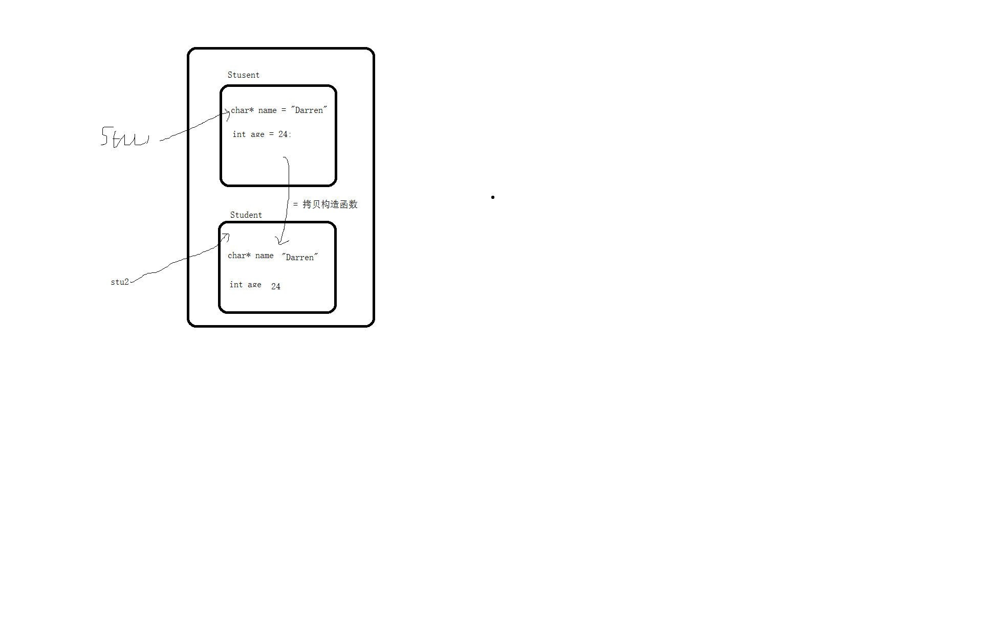

# <center>16.类的构造函数、析构函数、拷贝函数<center>

# 知识点：

## 面试题：finalize , finally, final 之间的区别 
`finalize` : java中垃圾回收回收该对象的时候会调用的方法   (c 中的析构函数)  

`finally`： finally作为异常处理的一部分，它只能用在try/catch语句中，并且附带一个语句块，表示这段语句最终一定会被执行（不管有没有抛出异常,即使try语句块中有`return`）

`final` ：  在java中，final可以用来修饰类，方法和变量（成员变量或局部变量）。  

```
修饰类：当用final修饰类的时，表明该类不能被其他类所继承。
修饰方法：当用final修饰方法时，把方法锁定，以防止继承类对其进行更改不能被重写。（注意：若父类中final方法的访问权限为private，
        将导致子类中不能直接继承该方法，因此，此时可以在子类中定义相同方法名的函数，此时不会与重写final的矛盾，而是在子类中重新地定义了新方法。）
修饰变量：final成员变量表示常量，只能被赋值一次，赋值后其值不再改变。类似于C++中的const。
```

## 1. 构造函数（可以有很多）

### 1.1.定义

```c++
class Student{
public:
    // 构造函数
    Student(){// 空参构造函数
        cout << "空参构造函数" << endl;
    }

    /*Student(char* name):age(0){//  一个参数构造函数，相当于 this->age = 0;
        cout << "一个参数构造函数" << endl;
        // this->name = name;
        // this->age = age;
    }*/

    Student(char* name):Student(name,0){ // 调用两个参数的构造函数，注意：先会调用两个参数的构造函数，然后才会执行当前构造函数
        cout << "一个参数构造函数" << endl;
    }

    Student(char* name,int age){ // 两个参数构造函数
        cout << "两个参数构造函数" << endl;
        this->name = (char*)malloc(sizeof(char)*100);
        strcpy(this->name,name);
        // this->name = name; // 这样赋值不行
        this->age = age;
    }

    // 2. 析构函数，如果有在对象内部开辟堆内存，可以在析构函数中释放内存
    ~Student(){
        cout << "析构函数" << endl;
        // 临终遗言：对象被回收的时候会被调用
        // 释放内存
        free(this->name);
        this->name = NULL;
    }

    // 4. 拷贝构造函数，对象会有一个默认的拷贝构造函数，用来对象之间赋值
    Student(const Student& stu){ // 常量的引用
        cout << "拷贝构造函数" << endl;
        // this->name = stu.name;// 浅拷贝
        // 如果动态开辟内存，一定要采用深拷贝
        this->name = (char*)malloc(sizeof(char)*100);
        strcpy(this->name,stu.name);
        this->age = stu.age;
    }

private:
    int age;
    char* name;

public:
    int getAge(){
        return this->age;
    }

    char* getName(){
        return this->name;
    }

    void setAge(int age){
        this->age = age;
    }

    void setName(char* name){
        this->name = name;
    }

};
```

### 1.2.调用

```c++
    // 1. 默认调用空参的构造函数
    Student stu;
    stu.setAge(24);
    stu.setName("Eastrise");

    // 2. 调用两参构造函数
    Student stu("Eastrise",24);

    // 3.用 new 关键字，返回的是一个 Student 的一级指针
    Student* stu = new Student("eastrise",25);

    // 4.用 malloc 的方式，并没有调用空参的构造函数
    Student* stu = (Student*)malloc(sizeof(Student));
    stu->setAge(25);
    stu->setName("eastrise");

    // 构造函数相互调用
    Student* stu = new Student("eastrise"); // 会先调用两参的再调用一参的
```


## 2. 析构函数（只能有一个）

`析构函数`:`如果有在对象内部开辟堆内存，可以在析构函数中释放内存`

**如果是 `new` 的对象，则必须调用 `delete` 才会调用到`析构函数`**

```c++
    // 2. 析构函数，如果有在对象内部开辟堆内存，可以在析构函数中释放内存
    ~Student(){
        cout << "析构函数" << endl;
        // 临终遗言：对象被回收的时候会被调用
        // 释放内存
        free(this->name);
        this->name = NULL;
    }


int main(){
    Student* stu = new Student("eastrise");

    cout << stu->getName() << ", " << stu->getAge() << endl;

    delete(stu);
}
```

## 3.malloc、free、new、delete 区别

1. malloc/free 他们是一套， new/delete 它们是一套
2. malloc/free 不会去调用构造函数和析构函数
3. new/delete 会调用构造函数和析构函数


## 4. 拷贝构造函数和调用场景

```
struct Person{
    int age;
    char* name;
};

int main(){
    Person person1 = {25,"east"};

    Person person2 = person1;// = 是赋值，把里面所有定义的属性赋值，c/c++ 编译器帮我们做的

    cout << &person1 << " , " << &person2 << endl; // 地址不一样，是深拷贝

    person1.name = "sss";

    cout << person2.name << " , " << person2.age << endl;

}
```

总结：<font color=red>非指针运算的 = 应该都是深拷贝</font>

```c++
	// 4.拷贝构造函数，对象会有一个默认的拷贝构造函数，用来对象之间的赋值
	Student(const Student& stu){// 常量的引用
		cout << "拷贝构造函数" << endl;
		// this->name = stu.name;// 浅拷贝
		// 如果动态开辟内存，一定要采用深拷贝
		this->name = (char*)malloc(sizeof(char)* 100);
		strcpy(this->name, stu.name);
		this->age = stu.age;
	}
```




1.  = 会调用拷贝构造函数

    ```c++
        Student stu1("Darren", 24);
        Student stu2 = stu1; // = 是赋值，把里面所有定义的属性赋值，c/c++ 编译器帮我们做的，其实会调用对象的拷贝构造
    
        // 以下方式不会调用拷贝构造函数
        Student stu2;// 声明变量，开辟变量内存
        stu2 = stu1; // 这个不会去调用拷贝构造函数，但是会赋值 c 的类似
    ```

2. 第二种场景 作为参数返回的时候会调用拷贝构造函数
    
    ```c++
    Student getStudent(char* name){
        Student stu(name);// 栈 ，方法执行完，这个对象会被回收，但是发现调用了拷贝构造函数
        cout << &stu << endl;
        return stu;// 会返回一个新的 Student 对象，而栈内开辟的 stu 是会被回收 
    }
    
    Student stu = getStudent("Jack");
    cout << &stu << endl;
    ```
 3. 第三种场景 作为参数传递的时候会调用拷贝构造函数
 
    ```c++
    void printStudent(Student stu){// stu 是该方法栈中一个新的对象，拷贝构造函数赋值，方法执行完会调用析构函数
        cout << stu.getName() << " , " << stu.getAge() << endl;
    }
    
    Student stu("Darren", 24);
    printStudent(stu);
    ```


