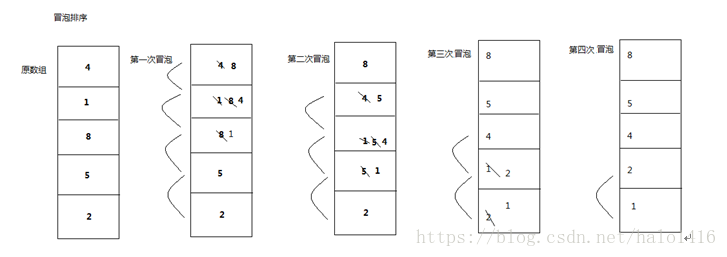
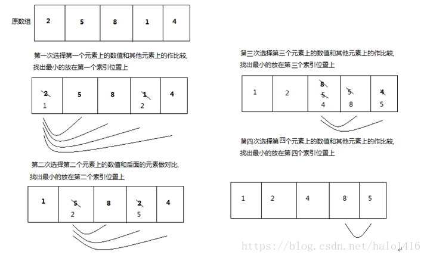

# <center>28.冒泡、选择、插入排序<center>
@[TOC](数据结构和算法)

具体代码请看：**[NDKPractice项目的datastructure28bubbkeselectsort](https://github.com/EastUp/NDKPractice/tree/master/datastructure28bubbkeselectsort)**

# 知识点：

## 1. 宏定义`Log`打印

```c++
#define TAG "TAG"
#define LOGE(...) __android_log_print(ANDROID_LOG_ERROR,TAG,__VA_ARGS__)
// 其他方法的定义 __android_log_print 取了一个别名（参数固定，可变）
```

## 2. rand() 随机

```c++
//  输出 0 到 49 之间的随机数
 rand() % 50
```

## 3. 冒泡排序

`思想`：相邻两个数进行比较，如果前面的比后面的打，就进行交换，否则不需要交换  
`复杂度`：时间复杂度和空间复杂度都是 O(n的平方) ，可以优化的

看图：


```c++
void bubbleSort(int arr[],int len){
    for (int i = 0; i < len - 1; ++i) { // 外循环代表循环次数 n - 1 步
        for (int j = 0; j < len - i - 1; ++j) { // 内循环代表一次循环对比的次数 n-1,n-2,n-3,1
            if(arr[j] > arr[j+1]){
                // 交换 一次交换是三次赋值
                swap(arr[j],arr[j+1]);
            }
        }
    }
}
```

## 4. 选择排序

`思想`： 遍历找出最小的位置，最后与第一个位置交换  
`复杂度`：空间复杂度是：O(1)，耗费的时间比上边未优化的冒泡排序要少很多

看图：


```c++
void selectSort(int arr[],int len){
    for (int i = 0; i < len - 1; ++i) { // 外循环代表循环次数 n - 1 步
        int min = i;
        for (int j = i+1; j < len; ++j) {  // 内循环代表一次循环对比的次数
            if(arr[min] > arr[j]){
                min = j;
            }
        }
        swap(arr[min],arr[i]);
    }
}
```


