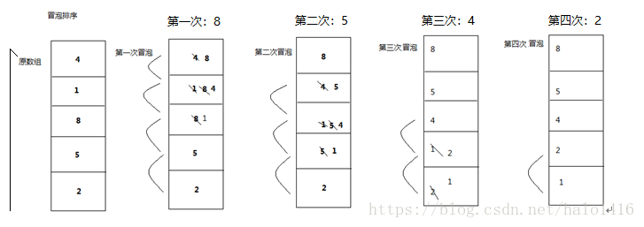
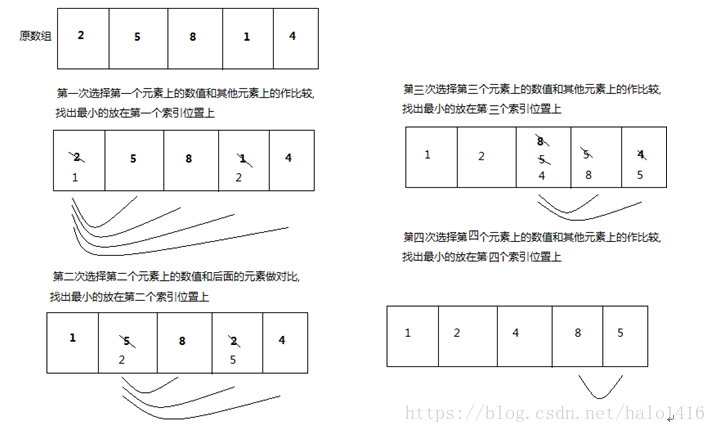
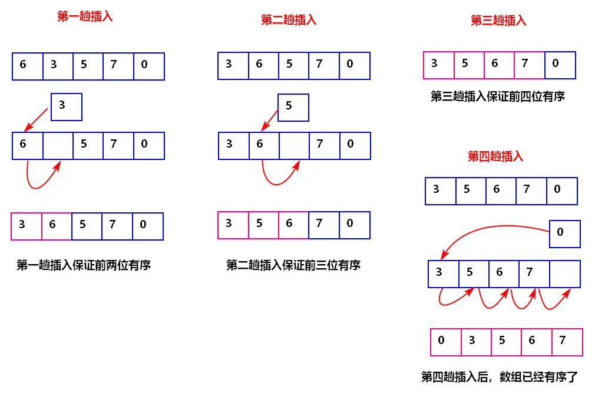

# <center>28.冒泡、选择、插入排序<center>

具体代码请看：**[NDKPractice项目的datastructure](https://github.com/EastUp/NDKPractice/tree/master/datastructure28bubbleselectsort)**

# 1. Ndk中，宏定义`Log`打印

```c++
#define TAG "TAG"
#define LOGE(...) __android_log_print(ANDROID_LOG_ERROR,TAG,__VA_ARGS__)
// 其他方法的定义 __android_log_print 取了一个别名（参数固定，可变）
```

# 2. c++ 中的rand() 随机

```c++
//  输出 0 到 49 之间的随机数
 rand() % 50
```

# 3. 冒泡排序

- `思想`：相邻两个数进行比较，如果前面的比后面的大，就进行交换，否则不需要交换。**`每次循环完毕都会在末尾选出一个最大的数`**  
- `时间复杂度`：**O($n^2$)**
- `空间复杂度`：**O(1)**

看图：


```c++
void bubbleSort(int arr[],int len){
    for (int i = 0; i < len - 1; ++i) { // 外循环代表循环次数 n - 1 步
        for (int j = 0; j < len - i - 1; ++j) { // 内循环代表一次循环对比的次数 n-1,n-2,n-3,1
            if(arr[j] > arr[j+1]){
                // 交换 一次交换是三次赋值
                swap(arr[j],arr[j+1]);
            }
        }
    }
}
```

# 4. 选择排序

- `思想`： 遍历找出最小的位置，最后与第一个位置交换。**`每次循环完毕都会在开始位置选出一个最小的数`**  
- `时间复杂度`：**O($n^2$)**
- `空间复杂度`：**O(1)**

耗费的时间比上边未优化的冒泡排序要少很多

看图：


```c++
void selectSort(int arr[],int len){
    for (int i = 0; i < len - 1; ++i) { // 外循环代表循环次数 n - 1 步
        int min = i;
        for (int j = i+1; j < len; ++j) {  // 内循环代表一次循环对比的次数
            if(arr[min] > arr[j]){
                min = j;
            }
        }
        swap(arr[min],arr[i]);
    }
}
```

# 5. 插入排序:



**像打扑克牌摸排后插入一样**

- `思想`： **`每次循环完毕index在(循环次数+1)前面的数都是排好序的`**  
- `时间复杂度`：最差情况：**O($n^2$)**，最好情况：**O(n)**
- `空间复杂度`：**O(1)**

特点：`适用于数组中大部分是排好序的数组`,如果大部分都没排好序，那么花费的时间比原来的冒泡排序还多

```c++
void insertSort(int arr[],int len){
    for (int i = 1; i < len; ++i) {
        for (int j = i; j >0 && arr[j] < arr[j-1] ; --j) {
            swap(arr[j],arr[j-1]);
        }
    }
}

void insertSort(int arr[],int len){
    for (int i = 1; i < len; ++i) {
        for (int j = i; j >0; --j) {
            if(arr[j] < arr[j-1] )
                swap(arr[j],arr[j-1]);
            else
                break;
        }
    }
}
```

# 6.两个整数交换不额外开辟新内存

有以下两种方法

```c++
void main(String[] args){
    int a = 100;
    int b = 200;
    // 交换

    a = a + b;// a = 300
    b = a - b;// b = 200
    a = a - b;// a = 100

    System.out.println("交换后ab的值分别是：%d,%d",a,b); // 交换后ab的值分别是：200,100
}

void main(String[] args){
    int a = 2;  // 二进制 10
    int b = 3;  // 二进制 11
    // 交换

    a = a ^ b; // 二进制：10 ^ 11 = 01 = a = 十进制：1
    b = a ^ b; // 二进制：01 ^ 11 = 10 = b = 十进制：2
    a = a ^ b; // 二进制：01 ^ 10 = 11 = a = 十进制：3

    System.out.println("交换后ab的值分别是：%d,%d",a,b); // 交换后ab的值分别是：3,2
}
```


