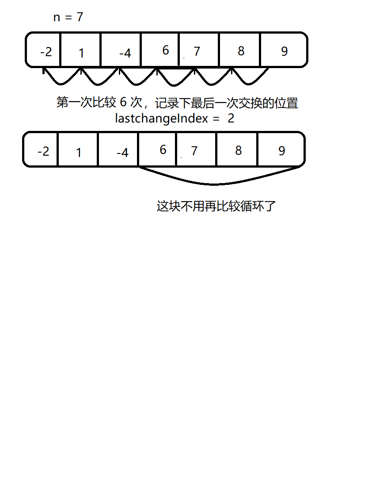

# <center>29.ndk调试、冒泡优化、插入和希尔排序<center>
@[TOC](数据结构和算法)

具体代码请看：**[NDKPractice项目的datastructure28bubbkeselectsort](https://github.com/EastUp/NDKPractice/tree/master/datastructure28bubbkeselectsort)**

# 知识点：

## 1. ndk的调试：

两种方法：

###  1.1 `ndk-stack` 调试

条件：配置 `adb` 和 `ndk` 的环境变量.  
命令：`adb logcat | ndk-stack -sym E:\AndroidStudioProjects\MyBintrayLib\NDKPractice\datastructure28bubbkeselectsort\build\intermediates\cmake\debu
g\obj\arm64-v8a` // 路径为有.so库的路径

### 1.2 `addr2line`
条件：配置addr2line的环境变量：  
`D:\AndroidSdk\ndk\21.2.6472646\toolchains\aarch64-linux-android-4.9\prebuilt\windows-x86_64\bin`

命令：  
`aarch64-linux-android-addr2line -e E:\AndroidStudioProjects\MyBintrayLib\NDKPractice\datastructure28bubbkeselectsort\build\intermediates\cmake\debu
g\obj\arm64-v8a\libnative-lib.so 000000000000fdb8 // 000000000000fdb8是(详细错误)
`

命令最后一位的地址编码请看：
```c++
2020-07-02 16:38:57.553 18029-18029/? A/DEBUG: backtrace:
2020-07-02 16:38:57.554 18029-18029/? A/DEBUG:     #00 pc 000000000006a784  /system/lib64/libc.so (tgkill+8)
2020-07-02 16:38:57.554 18029-18029/? A/DEBUG:     #01 pc 000000000001db50  /system/lib64/libc.so (abort+88)
2020-07-02 16:38:57.554 18029-18029/? A/DEBUG:     #02 pc 000000000002532c  /system/lib64/libc.so (__libc_fatal+116)
2020-07-02 16:38:57.554 18029-18029/? A/DEBUG:     #03 pc 0000000000091c6c  /system/lib64/libc.so (ifree+812)
2020-07-02 16:38:57.554 18029-18029/? A/DEBUG:     #04 pc 0000000000091eec  /system/lib64/libc.so (je_free+120)
// 主要是以下这行，复制他的地址编码到命令中
2020-07-02 16:38:57.554 18029-18029/? A/DEBUG:     #05 pc 000000000000fdb8  /data/app/com.east.datastructure28bubbkeselectsort-Rq_huZaLg_y9lQEFGFjFuw==/lib/arm64/libnative-lib.so (Java_com_east_datastructure28bubbkeselectsort_MainActivity_stringFromJNI+192)
2020-07-02 16:38:57.554 18029-18029/? A/DEBUG:     #06 pc 000000000000f09c  /data/app/com.east.datastructure28bubbkeselectsort-Rq_huZaLg_y9lQEFGFjFuw==/oat/arm64/base.odex (offset 0xf000)

```

坑: `如果addr2line的时候，报错 File format not recognized`

解决:  
　　1. <font color=red>addr2line的环境变量修改为 arm-linux-androideabi-4.9的：</font>`D:\AndroidSdk\ndk\21.2.6472646\toolchains\arm-linux-androideabi-4.9\prebuilt\windows-x86_64\bin`

　　2. 命令修改为：`arm-linux-androideabi-addr2line -e E:\AndroidStudioProjects\MyBintrayLib\NDKPractice\datastructure28bubbkeselectsort\build\intermediates\cmake\debu
g\obj\arm64-v8a\libnative-lib.so 000000000000fdb8 // 000000000000fdb8是(详细错误)`

## 2. 冒泡排序优化

思维：


特点：`适用于数组中大部分是排好序的数组`,如果大部分都没排好序，那么花费的时间比原来的冒泡排序还多

```c++
// 冒泡排序的优化（适用于数组中大部分是排好序的数组）
void optimizeBubbleSort(int arr[], int len){
    // 记录上一次最后遍历的位置
    int n = len;
    int lastchangeIndex = 0; //  最后交换的位置，控制位置
    do{
        lastchangeIndex = 0;
        for (int i = 1; i < n; ++i) {
            if(arr[i-1] > arr[i]){ // 后一个跟前一个对比
                swap(arr[i-1],arr[i]);
                // 记录交换的位置，
                lastchangeIndex = i;
            }
        }
        n = lastchangeIndex; // 记录最后一次交换的位置，证明了后面的不用交换，顺序是对的，可以避免下次循环的判断
    }while (n > 1);
}
```

## 3. 插入排序:

特点：`适用于数组中大部分是排好序的数组`,如果大部分都没排好序，那么花费的时间比原来的冒泡排序还多

```c++
void insertSort(int arr[],int len){
    for (int i = 1; i < len; ++i) {
        for (int j = i; j >0 && arr[j] < arr[j-1] ; --j) {
            swap(arr[j],arr[j-1]);
        }
    }
}

void insertSort(int arr[],int len){
    for (int i = 1; i < len; ++i) {
        for (int j = i; j >0; --j) {
            if(arr[j] < arr[j-1] )
                swap(arr[j],arr[j-1]);
            else
                break;
        }
    }
}
```

## 4. 插入排序优化

特点:`适用于数组中大部分是排好序的数组`,比选择排序快很多(时间复杂度上是 O(n)级别)

```c++
void insertSort(int arr[],int len){
    int temp,j,i;
    for (i = 1; i < len; ++i) {
        // 当前的位置
        temp = arr[i];
        for (j = i; j >0 && arr[j-1] >temp ; --j) {
            arr[j] = arr[j-1];
        }
        // 插入合适的位置 (这个时候的j 是 -- 了的哦 注意看循环的最后一个条件)
        arr[j] = temp;
    }
}

// 插入排序优化1(这样会跳出循环更快)
void insertSort1(int arr[],int len){
    int temp,j,i;
    for (i = 1; i < len; ++i) {
        // 当前的位置
        temp = arr[i];
        for (j = i; j >0; --j) {
            if(arr[j-1] >temp)
                arr[j] = arr[j-1];
            else
                break;
        }
        // 插入合适的位置 (这个时候的j 是 -- 了的哦 注意看循环的最后一个条件)
        arr[j] = temp;
    }
}
```

## 5.对比插入排序和选择排序

| | 最好情况 | 最坏情况 |
| --------- | --------- | ------------- |
| 选择排序 | 比较N*（N-1）/2次，交换0次 | 比较N*（N-1）/2次，交换N*（N-1）/2次，赋值N*（N-1）/2次 |
| 插入排序 | 比较N-1次，交换0次 | 比较N*（N-1）/2次，交换N*（N-1）/2次，赋值3*N*（N-1）/2次 |
| 改进插入排序 | 比较N-1次，交换0次 | 比较N*（N-1）/2次，交换N*（N-1）/2次，赋值N*（N-1）/2 + 2（N-1）次 |

## 6.希尔排序(插入排序优化的再次优化)

希尔排序在 `数据非常无序时`是`首选`,`数据很有序`的时候还是没有`改进插入排序` 快

思想: `分治`


```c++
// 希尔排序思想：对插入排序分组
void shellInsertSort(int arr[],int len){ // 8
    // 思考 ： 求算法的复杂度
    int increment = len / 2; // 4组
    int i, j ,k;
    while(increment >= 1){
        // 希尔排序
        for(i = 0; i < increment; ++i){ // i = 0, increment = 2
            for(j = i + increment; j < len; j += increment){
                int tmp = arr[j]; // 5
                // k = j = 6;
                for(k = j; k > i  && arr[k - increment] > tmp; k -= increment){
                    // 往后挪动
                    arr[k] = arr[k - increment];
                }
                arr[k] = tmp;
            }
        }
        increment /= 2;
    }
}
```


