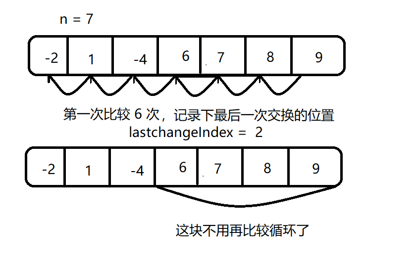
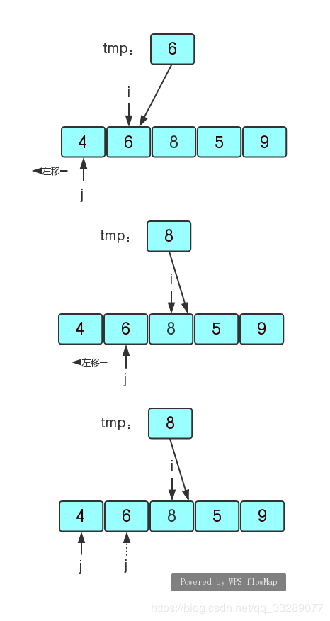

# <center>29.冒泡优化、插入优化和希尔排序<center>

具体代码请看：**[NDKPractice项目的datastructure](https://github.com/EastUp/NDKPractice/tree/master/datastructure28bubbleselectsort)**


# 1. 冒泡排序优化

引用个[冒泡排序优化](https://blog.csdn.net/hansionz/article/details/80822494) 的链接

思维：


特点：`适用于数组中大部分是排好序的数组`,如果大部分都没排好序，那么花费的时间比原来的冒泡排序还多

```c++
// 冒泡排序的优化（适用于数组中大部分是排好序的数组）
void optimizeBubbleSort(int arr[], int len){
    // 记录上一次最后遍历的位置
    int n = len;
    int lastchangeIndex = 0; //  最后交换的位置，控制位置
    do{
        lastchangeIndex = 0;
        for (int i = 1; i < n; ++i) {
            if(arr[i-1] > arr[i]){ // 后一个跟前一个对比
                swap(arr[i-1],arr[i]);
                // 记录交换的位置，
                lastchangeIndex = i;
            }
        }
        n = lastchangeIndex; // 记录最后一次交换的位置，证明了后面的不用交换，顺序是对的，可以避免下次循环的判断
    }while (n > 1);
}

void BubbleSort(int arr[], int len)
{
	int i = 0;
	int tmp = 0;
	int flag = 0;
	int pos = 0;//用来记录最后一次交换的位置
	int k = len - 1;
	for (i = 0; i < len - 1; i++)//确定排序趟数
	{
		pos = 0;
		int j = 0;
		flag = 0;
		for (j = 0; j < k; j++)//确定比较次数
		{
			if (arr[j]>arr[j + 1])
			{
				//交换
				swap(arr[j],arr[j+1]);
				flag = 1;//加入标记
				pos = j;//交换元素，记录最后一次交换的位置
			}
		}
		if (flag == 0)//如果没有交换过元素，则已经有序
		{
			return;
		}
		k = pos;//下一次比较到记录位置即可
	}
}


```

# 2. 插入排序优化



特点:`适用于数组中大部分是排好序的数组`,比选择排序快很多(时间复杂度上是 O(n)级别)

```c++
void insertSort(int arr[],int len){
    int temp,j,i;
    for (i = 1; i < len; ++i) {
        // 当前的位置
        temp = arr[i];
        for (j = i; j >0 && arr[j-1] >temp ; --j) {
            arr[j] = arr[j-1];
        }
        // 插入合适的位置 (这个时候的j 是 -- 了的哦 注意看循环的最后一个条件)
        arr[j] = temp;
    }
}

// 插入排序优化1(这样会跳出循环更快)
void insertSort1(int arr[],int len){
    int temp,j,i;
    for (i = 1; i < len; ++i) {
        // 当前的位置
        temp = arr[i];
        for (j = i; j >0; --j) {
            if(arr[j-1] >temp)
                arr[j] = arr[j-1];
            else
                break;
        }
        // 插入合适的位置 (这个时候的j 是 -- 了的哦 注意看循环的最后一个条件)
        arr[j] = temp;
    }
}
```

# 3.对比插入排序和选择排序

| | 最好情况 | 最坏情况 |
| --------- | --------- | ------------- |
| 选择排序 | 比较N*（N-1）/2次，交换0次 | 比较N*（N-1）/2次，交换N*（N-1）/2次，赋值N*（N-1）/2次 |
| 插入排序 | 比较N-1次，交换0次 | 比较N*（N-1）/2次，交换N*（N-1）/2次，赋值3*N*（N-1）/2次 |
| 改进插入排序 | 比较N-1次，交换0次 | 比较N*（N-1）/2次，交换N*（N-1）/2次，赋值N*（N-1）/2 + 2（N-1）次 |

# 4.希尔排序(插入排序优化的再次优化)

引用个[希尔排序链接]((https://www.cnblogs.com/chengxiao/p/6104371.html))

希尔排序在 `数据非常无序时`是`首选`,`数据很有序`的时候还是没有`改进插入排序` 快

思想: `分治`


```c++
// 希尔排序思想：对插入排序分组
void shellInsertSort(int arr[],int len){ // 8
    // 思考 ： 求算法的复杂度
    int increment = len / 2; // 4组
    int i, j ,k;
    while(increment >= 1){
        // 希尔排序
        for(i = 0; i < increment; ++i){ // i = 0, increment = 2
            for(j = i + increment; j < len; j += increment){
                int tmp = arr[j]; // 5
                // k = j = 6;
                for(k = j; k > i  && arr[k - increment] > tmp; k -= increment){
                    // 往后挪动
                    arr[k] = arr[k - increment];
                }
                arr[k] = tmp;
            }
        }
        increment /= 2;
    }
}


void shellInsertSort1(int arr[],int len){ // 8
    // 思考 ： 求算法的复杂度
    int i, j ;
    for(int increment = len / 2;increment >0;increment /= 2){ // 4组
        // 希尔排序
        for(i = increment; i < len; ++i){ // i = 0, increment = 2
            int tmp = arr[i]; // 5
            for(j = i ; j - increment >= 0 && tmp < arr[j - increment]; j -= increment){
                arr[j] = arr[j - increment];
            }
            arr[j] = tmp;
        }
    }
}

```


