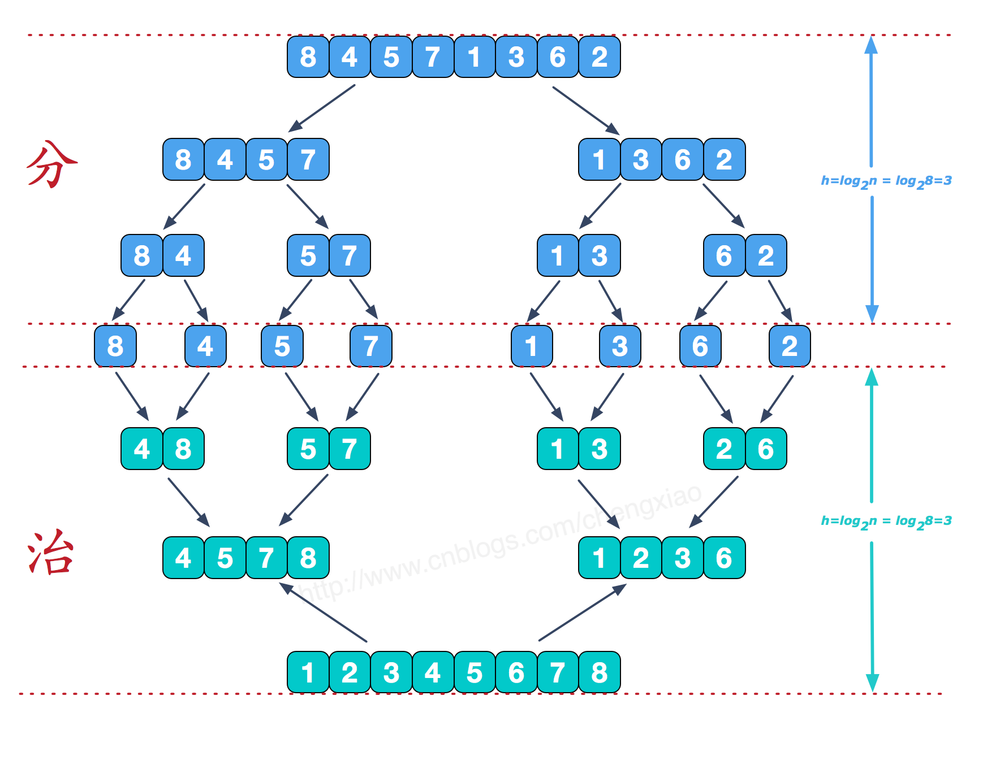
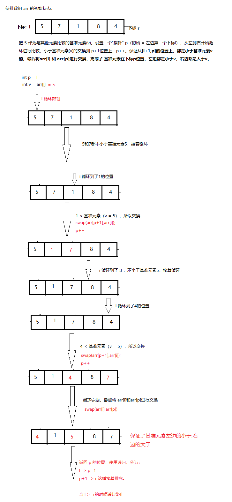

# <center>30. 稳定和不稳定排序、归并排序和快速排序、三路快排<center>

具体代码请看：**[NDKPractice项目的datastructure](https://github.com/EastUp/NDKPractice/tree/master/datastructure28bubbleselectsort)**


# 1. 稳定排序和不稳定排序：

稳定排序概念：`通俗地讲就是能保证排序前两个相等的数其在序列的前后位置顺序和排序后它们两个的前后位置顺序相同。在简单形式化一下，如果Ai = Aj，Ai原来在位置前，排序后Ai还是要在Aj位置前。`

代表：
- 稳定排序：`冒泡`、`插入`、`归并` 
- 不稳定排序：`选择`、`希尔`、`快速排序(可以做到稳定但是比较难)`、`堆排序`


# 2. [归并排序](https://www.cnblogs.com/chengxiao/p/6194356.html)

步骤：

1. 递归，分治的算法，每次都从中间分隔，然后排序。
2. 最后把分别排好序的两个子数组合并，利用一个临时数据作为中转。

- `思想`： **`每次循环完毕index在(循环次数+1)前面的数都是排好序的`**  
- `时间复杂度`：**O(N&#42;$\log_2 N$)**
- `空间复杂度`：**O(N)**

每次合并操作的平均时间复杂度为O(n)，而完全二叉树的深度为|log2n|。总的平均时间复杂度为O(nlogn)。而且，归并排序的最好，最坏，平均时间复杂度均为O(nlogn)。

思想：



```c++
// 对数组区间 [l,mid] 和 [mid+1,r] 进行归并
void merge_(int arr[],int l,int mid,int r){
    // 1. 对数组进行一次拷贝
    int temp[r - l + 1];
    for(int i = l ;i <= r; ++i){
        temp[i -l] = arr[i];
    }
    // 2. 确定好分析之后的变量
    int i = l;
    int j = mid + 1;
    int k = l;
    for (; k <= r; ++k) {
        if(i > mid){   // 左边的数组已经全部填充好了，那么剩下的应该填充右边的数组了
            arr[k] = temp[j - l];
            j++;
        }else if( j > r){ // 右边的数组已经全部填充好了，那么剩下的应该填充左边的数组了
            arr[k] = temp[i -l];
            i++;
        }else if(temp[i - l] < temp[j - l]){ // 临时数据里面的 i 位置和 j 位置去比较
            arr[k] = temp[i - l];
            i++;
        } else{
            arr[k] = temp[j - l];
            j++;
        }
    }
}

// 对数组的 [l,r] 区间进行归并排序
void mergeSort_(int arr[], int l, int r){
    // 递归到底的情况
    if(l >= r)
        return;
    int mid = ( l + r) >> 1;
    mergeSort_(arr,l,mid);//左边归并排序，使得左子序列有序
    mergeSort_(arr,mid + 1,r);//右边归并排序，使得右子序列有序
    // 优化要根据具体的场景去做（因为mid前面和后面都是排好序的！！）
    if(arr[mid] > arr[mid + 1]){
        merge_(arr, l, mid, r);//将两个有序子数组合并操作
    }
}

// 归并排序
void mergeSort(int arr[],int len){
    mergeSort_(arr,0,len - 1);
}
```

# 2. [快速排序](https://www.cnblogs.com/MOBIN/p/4681369.html)

以数组的第一个元素为基准元素(v)进行排序，`大于等于v的排在数组右边，小于v的排在数组左边`。最后返回v的下标，再次分为两个数组进行递归操作。

**如果>v，和<v 的左右规模接近，那么这个排序就类似归并排序，时间复杂度最优**

- `思想`： **`每次返回排序后基准元素在数组的下标，也就是说每次只排好了一个数。`**  
- `时间复杂度`：最差情况：**O($n^2$)**，最好情况（随机快排）：**O(N&#42;$\log_2 N$)**
- `空间复杂度`：最差情况：**O(n)**，最好情况（随机快排）：**O($\log_2 N$)**



```c++
// 对数组 arr 区间[l,r] 进行分割操作
int partition_(int arr[], int l, int r) {// 10 , 20
    // 优化，跟区间[l,r]随机位置进行比较。(如果数组本身就是有序的，那么每次都拿第一个数作为基准元素，算出来的p就是在头尾位置，小于区域和等于区域就不是接近等规模的，这样还要递归N次，复杂度就是O(n2))
    swap(arr[l], arr[rand() % (r - l + 1) + l]);
    int v = arr[l];
    // 以 p 为分割，[l+1,p]<v 和  [p+1,r] > v
    int p = l;
    for (int i = l; i <= r; ++i) {
        if (arr[i] < v) {
            // 只需要处理小于的情况
            swap(arr[p + 1], arr[i]);
            p++;
        }
    }
    swap(arr[l], arr[p]);
    return p;
}

// 对数组 arr 区间[l,r] 进行快速排序
void quickSort_(int arr[], int l, int r) {
    // 递归到底的情况
    if (l >= r) {
        return;
    }
    int p = partition_(arr, l, r);
    quickSort_(arr, l, p - 1); // 对基准元素左边的元素进行递归排序（如果，左边规模没有，那么这个递归就无效）
    quickSort_(arr, p + 1, r); // 对基准元素右边的进行递归排序（如果，右边规模没有，那么这个递归就无效）
}

// 快速排序
void quickSort(int arr[], int len) {
    srand(time(NULL)); // 初始化随机数发生器
    quickSort_(arr, 0, len - 1);
}
```


# 3. 三路快排

以数组的第一个元素为基准元素(v)进行排序，`大于v的排在数组右边，小于v的排在数组左边，剩下的=v在中间`。最后返回`=v的数组头尾下标`，再次分为两个数组进行递归操作。

- `思想`： **`每次返回排序后，=基准元素v在数组的头尾下标，也就是说每次只排好了所有=v的数`**  
- `时间复杂度`：最差情况：**O($n^2$)**，最好情况（随机快排）：**O(N&#42;$\log_2 N$)**
- `空间复杂度`：最差情况：**O(n)**，最好情况（随机快排）：**O($\log_2 N$)**

```java
public class Code_04_QuickSort {

	public static void quickSort(int[] arr) {
		if (arr == null || arr.length < 2) {
			return;
		}
		quickSort(arr, 0, arr.length - 1);
	}

	public static void quickSort(int[] arr, int l, int r) {
		if (l < r) {
			swap(arr, l + (int) (Math.random() * (r - l + 1)), r);
			int[] p = partition(arr, l, r);
			quickSort(arr, l, p[0] - 1);
			quickSort(arr, p[1] + 1, r);
		}
	}

	// 以最后一个元素为基准元素。
	public static int[] partition(int[] arr, int l, int r) {
		int less = l - 1; 
		int more = r;
		while (l < more) {
			if (arr[l] < arr[r]) {
				swap(arr, ++less, l++);
			} else if (arr[l] > arr[r]) {
				swap(arr, --more, l);
			} else {
				l++;
			}
		}
		swap(arr, more, r);
		return new int[] { less + 1, more };
	}
}
```


```c++
void quickSort3ways_(int arr[], int l, int r) {
    // 递归到底的情况
    if (l >= r) {
        return;
    }

    // 定义变量
    swap(arr[l], arr[rand() % (r - l + 1) + l]);
    int v = arr[l];

    int lt = l;// 左边指针 lt [l+1, lt] < v  
    int gt = r + 1;// 右边指针 gt [gt,r] >v
    int i = l + 1;// 循环开始位置 [lt + 1,i) = v

    while (gt > i) {
        if (arr[i] > v) {
            swap(arr[i], arr[gt - 1]);
            gt--;
        } else if (arr[i] < v) {
            swap(arr[i], arr[lt + 1]); // i左边的一定是小于或等于v的  
            i++;
            lt++;
        } else {
            i++;
        }
    }

    swap(arr[l], arr[lt]); // 交换完毕后 [l,lt-1] < v,[gt,r] > v
    quickSort3ways_(arr, l, lt - 1);
    quickSort3ways_(arr, gt, r);
}

void quickSort3ways(int arr[], int len) {
    srand(time(NULL)); // 初始化随机数发生器
    quickSort3ways_(arr, 0, len - 1);
}

```


