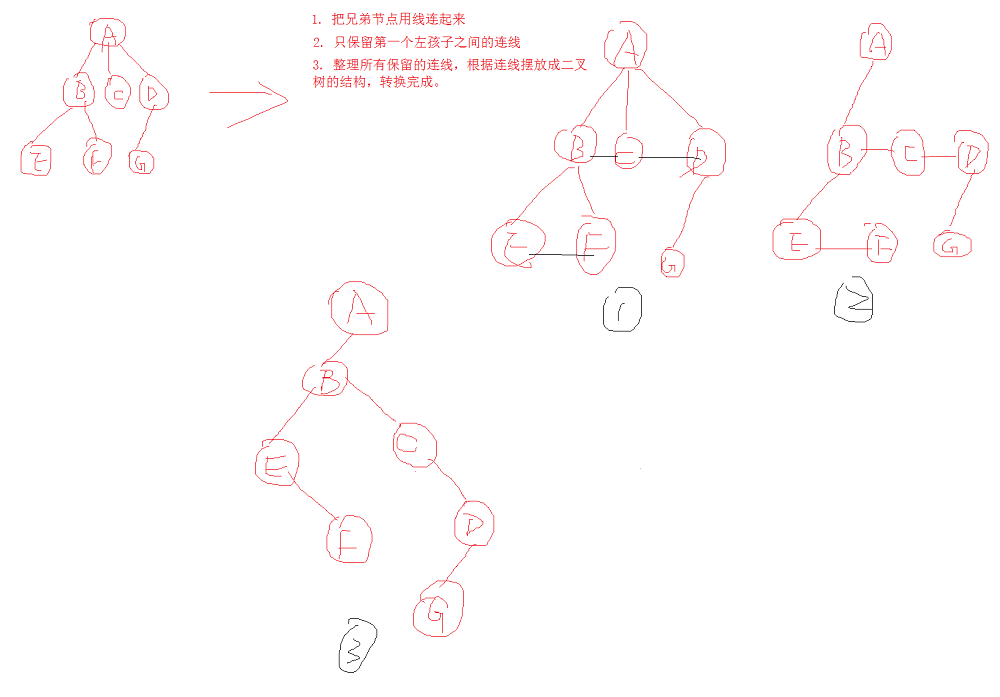
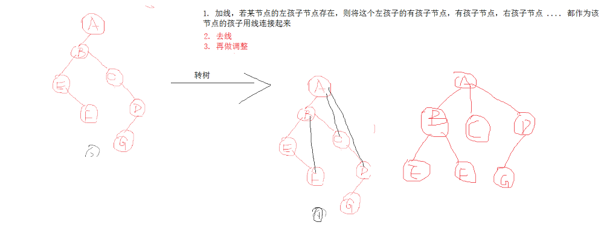
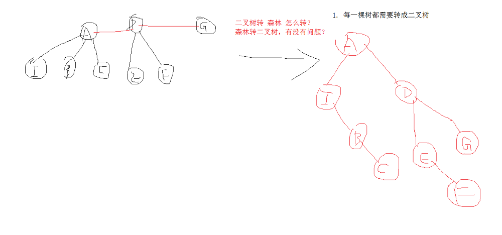

# 
34. 数、二叉树和森林

@[TOC](数据结构和算法)

# 知识点：

## 1. 工作中的一个小例子：登录后自动跳转到目标页面

需求例子：跳转到直播页，首先跳转到登录页，登录成功之后再跳转到直播页   
比较好的解决方案，随着业务逻辑越来越复杂的情况下，不需要去刻意的去修改原来的代码  

解决办法：
1、传参数和Intent（复杂）
2、使用路由：Arouter、Drouter
3、拦截 Activity 的 `startActivityForResult` 方法（最好），使用 aspectJ 面向切面

## 2. 树的定义

1. 有且只有一个根节点。
2. 有若干互不相交的子树，这些子树本身也是一棵树（所有：树的算法求解一般可以采用`递归`）

## 3. 树的名词解释

1. `双亲节点（父节点）`：有子节点的位置
2. `子节点`：有父节点
3. `兄弟节点`：同一个父类下有很多的子节点，他们互相成为兄弟节点
4. `度`：一个父节点下有多少个子节点
5. `叶子节点`：没有子节点的节点

## 4. 树的分类

1. `一般树`:任意一个节点的子节点都不受限制。
2. `二叉树`：任意一个节点的子节点最多`2`个，且子节点位置不能更改（左右子节点）。
3. `森林`：n 棵互补相交的树的集合。
    

## 5. 树的操作（树的存储）

树的存储：`顺序存储`、`链式存储`，总共有以下几种方法：

1. 双亲表示法（找父亲比较简单，找孩子比较麻烦）
2. 孩子表示法（找孩子比较简单，找父亲比较麻烦）
3. 孩子双亲表示法（找父亲和孩子都比较简单）
4. 二叉树表示法（一般树、森林与二叉树之间互转）

### 5.1 孩子双亲表示法

### 5.2 二叉树表示法（一般树、森林与二叉树之间互转）

#### 5.2.1一般树 转 二叉树

第一种方式：  
　　1. 左节点当做左节点  
　　2. `谁`的兄弟节点，就当做`谁`的右节点  

第二种方式：

#### 5.2.2 二叉树 转 树

#### 5.2.3 森林转二叉树

