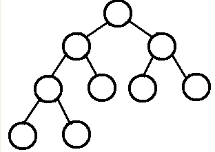
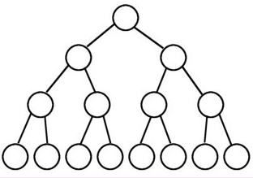
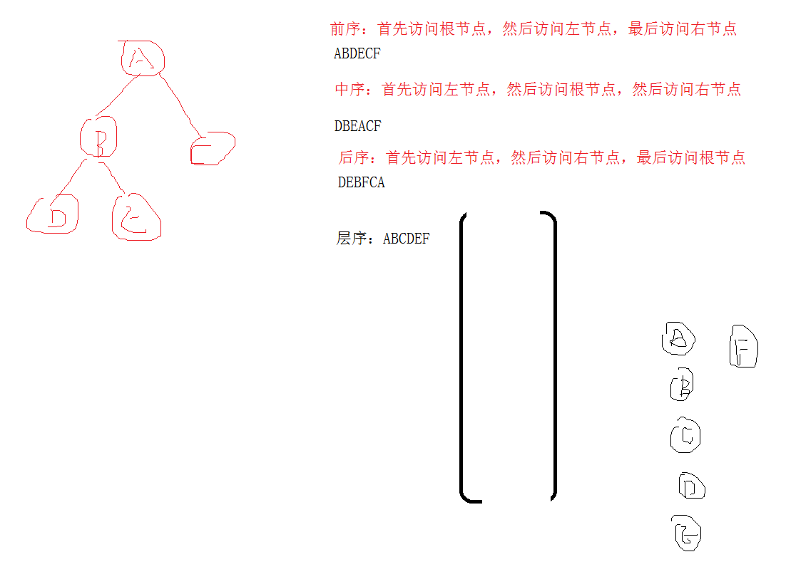
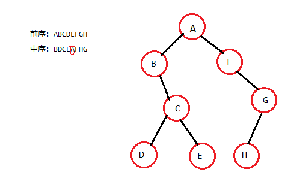

# <center>35. 二叉树常见操作、平衡二叉树<center>
@[TOC](数据结构和算法)

具体代码请看：**[NDKPractice项目的datastructure35binarytree](https://github.com/EastUp/NDKPractice/tree/master/datastructure35binarytree)**

# 知识点：


## 1. 二叉树分类

1. `普通二叉树`
2. `完全二叉树`
3. `满二叉树`

### `完全二叉树`：
概念：`叶结点只能出现在最底层的两层，且最底层叶结点均处于次底层叶结点的左侧。`  


### `满二叉树`：
概念：`所有叶结点同处于最底层（非底层结点均是内部结点），一个深度为k(>=-1)且有2^(k+1) - 1个结点`  


### 1.1 常用的操作树：

1. 二叉搜索树（Binary Search Tree）又称 B 树 （SQL）
2. 哈夫曼树
3. <font color = red>平衡二叉树(AVL树)：`可以是一棵空树，左右子树的高度差不会超过 1 ，并且左右两棵子树都是一棵平衡二叉树`</font>
4. 红黑树


## 2. 二叉树的遍历



```c++
void visit(char data){
    LOGE("%c",data);
}
```

### 2.1 前序遍历

```c++
template <class T>
void preOrderTraverse(TreeNode<T> *pNode,void(*visit)(T)){
    if(!pNode)
        return;

    // 先根节点
    visit(pNode->data);
    // 再左节点
    preOrderTraverse(pNode->left,visit);
    // 再右节点
    preOrderTraverse(pNode->right,visit);
}
```
### 2.2 中序遍历

```c++
template <class T>
void infixOrderTraverse(TreeNode<T> *pNode,void(*visit)(T)){
    if(!pNode)
        return;

    // 先左节点
    infixOrderTraverse(pNode->left,visit);
    // 再根节点
    visit(pNode->data);
    // 再右节点
    infixOrderTraverse(pNode->right,visit);
}
```

### 2.3 后序遍历

```c++
template <class T>
void afterOrderTraverse(TreeNode<T> *pNode,void(*visit)(T)){
    if(!pNode)
        return;

    // 先左节点
    afterOrderTraverse(pNode->left,visit);
    // 再右节点
    afterOrderTraverse(pNode->right,visit);
    // 再根节点
    visit(pNode->data);
}
```

### 2.4 层序遍历

```c++
template <class T>
void levelOrderTraverse(TreeNode<T> *pNode,void(*visit)(T)){
    if(!pNode)
        return;

    queue<TreeNode<T>*> queue;
    queue.push(pNode);
    while(!queue.empty()){
        TreeNode<T> *front = queue.front();
        queue.pop();
        visit(front->data);

        if(front->left)
            queue.push(front->left);

        if(front->right)
            queue.push(front->right);
    }
}
```


## 3. 根据`前序和中序遍历` 或 `后序和中序遍历`还原二叉树

中序遍历 和 前序或后序任一种都可还原二叉树

前序：ABCDEFGH
中序：BDCEAFHG



## 4. 二叉树的深度：

```c++
/**
 *  获取树的深度
 */
template <class T>
int getDepthTree(TreeNode<T> *pNode){
    if(!pNode)
        return 0;

    int left = getDepthTree(pNode->left);
    int right = getDepthTree(pNode->right);

    return max(left,right) + 1; // 需要加上自己
}
```

## 5. 判断是否是平衡二叉树
`可以是一棵空树，左右子树的高度差不会超过 1 ，并且左右两棵子树都是一棵平衡二叉树`


```c++
/**
 *  判断一棵树是否是平衡二叉树
 */
template <class T>
bool isBalanceTree(TreeNode<T> *pNode){
    // 可以是一棵空树，左右子树的高度差不会超过 1 ，并且左右两棵子树都是一棵平衡二叉树
    if(!pNode)
        return true;

    // 左右子树的高度差不会超过 1
    int left = getDepthTree(pNode->left);
    int right = getDepthTree(pNode->right);

    // 并且左右两棵子树都是一棵平衡二叉树
    return abs(left-right) <= 1 && isBalanceTree(pNode->left) && isBalanceTree(pNode->right);
}
```


