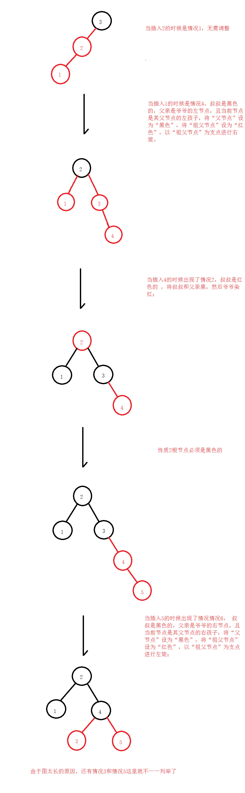
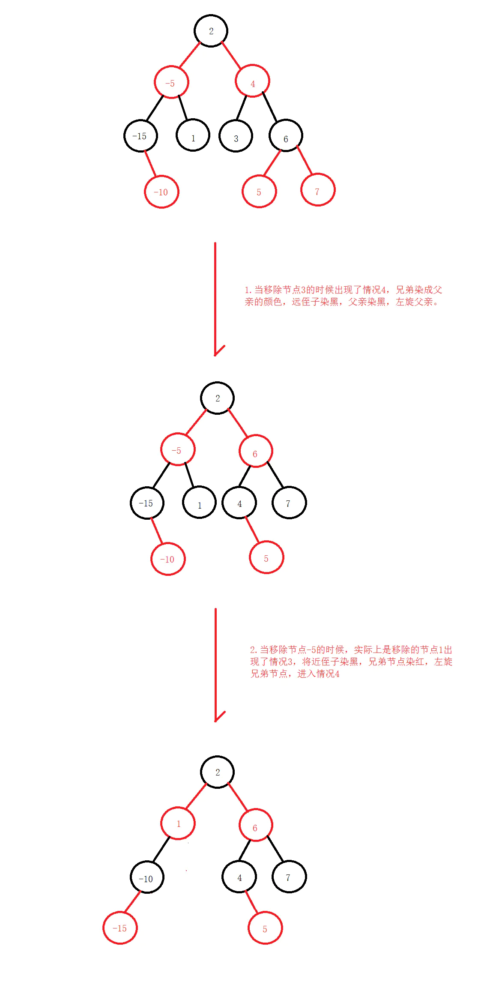

# 
40.41.红黑树

@[TOC](数据结构和算法)

具体代码请看：**[NDKPractice项目的datastructure40redblacktree](https://github.com/EastUp/NDKPractice/tree/master/datastructure40redblacktree)**

# 知识点：

## 1. 红黑树的定义：

1. 每个节点或者是黑色，或者是红色。
2. 根节点是黑色。
3. 每个叶子节点（NIL）是黑色。 [注意：这里叶子节点，是指为空(NIL或NULL)的叶子节点！]
4. 如果一个节点是红色的，则它的子节点必须是黑色的。
5. 从一个节点到该节点的子孙节点的所有路径上包含相同数目的黑节点。

## 2. 新增逻辑：

1. 如果没有出现双红现象，父亲是黑色的不需要修正；
2. 叔叔是红色的 ，将叔叔和父亲染黑，然后爷爷染红；指针回到爷爷
3. 叔叔是黑色的，父亲是爷爷的左节点，且当前节点是其父节点的右孩子，将“父节点”作为“新的当前节点”，以“新的当前节点”为支点进行左旋。然后将“父节点”设为“黑色”，将“祖父节点”设为“红色”，以“祖父节点”为支点进行右旋；
4. 叔叔是黑色的，父亲是爷爷的左节点，且当前节点是其父节点的左孩子，将“父节点”设为“黑色”，将“祖父节点”设为“红色”，以“祖父节点”为支点进行右旋；
5. 叔叔是黑色的，父亲是爷爷的右节点，且当前节点是其父节点的左孩子，将“父节点”作为“新的当前节点”，以“新的当前节点”为支点进行右旋。然后将“父节点”设为“黑色”，将“祖父节点”设为“红色”，以“祖父节点”为支点进行左旋；
6. 叔叔是黑色的，父亲是爷爷的右节点，且当前节点是其父节点的右孩子，将“父节点”设为“黑色”，将“祖父节点”设为“红色”，以“祖父节点”为支点进行左旋；

以 [3,2,1,4,5] 为例

## [3. 删除逻辑：](https://blog.csdn.net/a944750471/article/details/92384553)

讨论下：

1. 删除一个红色节点不影响；
2. 加入删除一个黑色节点那么肯定会破坏性质 5
3. 假设左右子树都不为空的情况下，需要找到后继节点来代替，其实删除的就是后继节点
4. 假设删除的左右两棵子树上有一颗不为空的情况，会找左右的一棵子树来代替

`左右子树不为null的情况下实际删除的是后继节点`

1. 如果兄弟节点是红色的，把兄弟节点染黑，父节点染红，左/右旋父节点；
2. 如果兄弟节点是黑色的，并且两个侄子节点都是黑色的，将兄弟节点染红，指针回溯至父亲节点；
3. 如果兄弟节点是黑色，的并且远侄子是黑色的，近侄子是红色的，将进侄子染黑，兄弟染红，左/右旋兄弟节点，进入下面情况 4 ；
4. 如果兄弟节点是黑色的，并且远侄子是红色的，近侄子随意，将兄弟节点染成父亲节点的颜色，父亲节点染黑，远侄子染黑，左/右旋父亲节点。

## 4.红黑树与 AVL 树的对比

AVL : 插入的思想，在插入的过程中不断去调整树，最坏的情况下可能每次回溯都需要调整（回溯到父亲节点）
红黑树：可能会出现双红现象，如果叔叔是黑色的只需要调整一次或者两次 ，最坏的情况下就是叔叔节点是红色，但每次回溯的时候是两层（回溯到爷爷节点）

新增：AVL 复杂度是 log(N)，红黑树复杂度是 Log(N) / 2
查找：AVL 复杂度是 log(N)，红黑树复杂度是 Log(2N)
删除：

