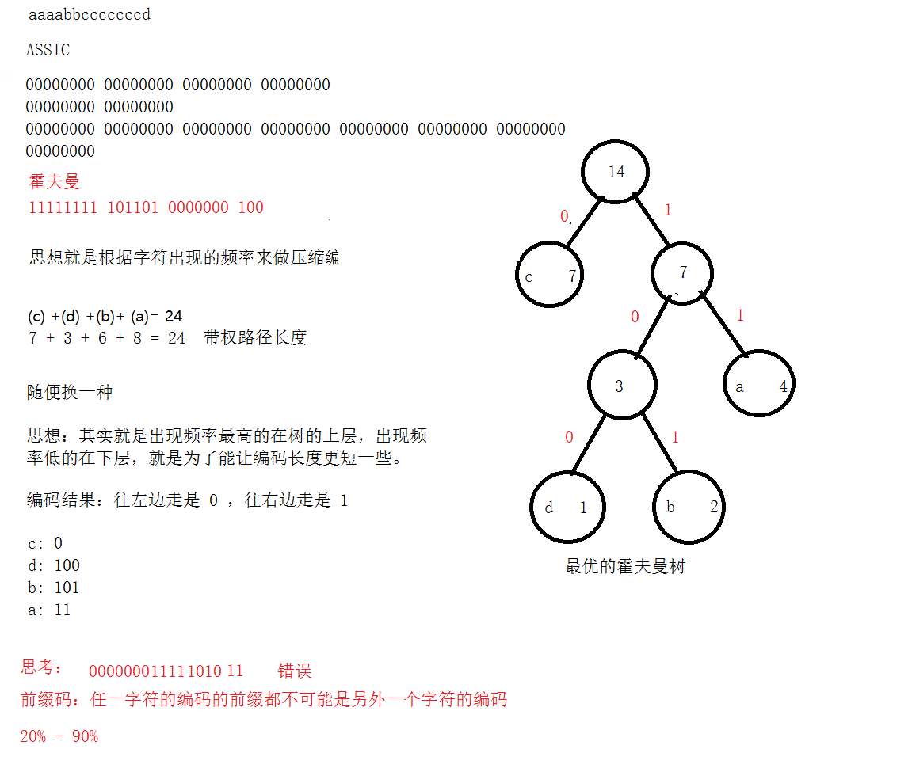

# 
42.哈夫曼编码

具体代码请看：**[NDKPractice项目的datastructure42huffman](https://github.com/EastUp/NDKPractice/tree/master/datastructure42huffman)**

- 定长编码： 1 字节 8 位代表一个字符   a
- 变长编码： utf   哈夫曼编码

# 1. 哈夫曼树定义：
哈夫曼树（霍夫曼树）：外国大学生发现的，主要用于压缩，变长的编码，最优的前缀码二叉树

- 路径长度：根节点到该节点的边的条数 = 节点个数 - 1
- 节点的权：出现的次数
- 带权路径长度：= 权（次数） * 路径的长度
- 树的带权路径长度（WLP）： = 所有节点的带权路径长度之和

# 2. 如何构建一棵最优的哈夫曼树

`怎样才是最优的？ 就是树的带权路径长度最小`

`aaaabbcccccccd`

## 2.1 统计字符出现的个数

a -> 4， d -> 1 , b -> 2 , c -> 7,

## 2.2 构建赫夫曼树

首先拿两个频率出现最低的出来，然后再拿两个出现频率最小的出来

a -> 4，  (d -> 1 , b->2) -> 3 , c -> 7,  
(d -> 1 , b->2, a->4) -> 7, c -> 7,

## 2.3. 前缀码

前缀编码 是指对字符集进行编码时，要求字符集中任一字符的编码都不是其它字符的编码的前缀。  
例如：设有abcd需要编码表示（其中，a=0、b=10、c=110、d=11,则表示110的前缀可以是c或者da，不唯一）

很多地方用到：图片，音视频 ，霍夫曼

## 2.4. 哈夫曼编码和解码实现
思想：
1. 统计字符出现的次数
2. 构建出这棵最优的前缀码二叉树
3. 统计字符的编码，生成映射表
4. 根据字符去映射表中查找生成最终的霍夫曼编码

