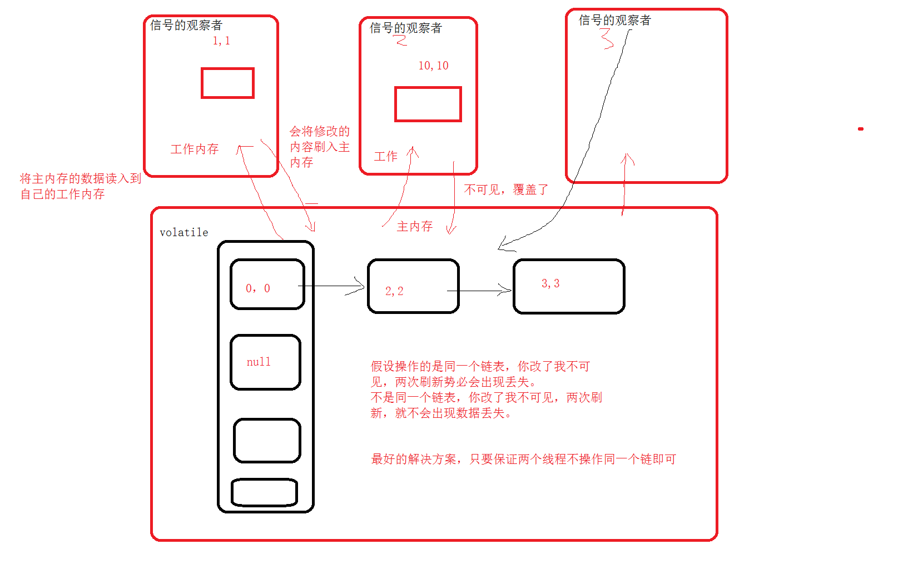
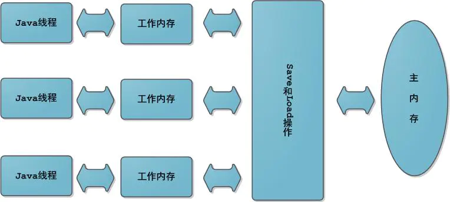
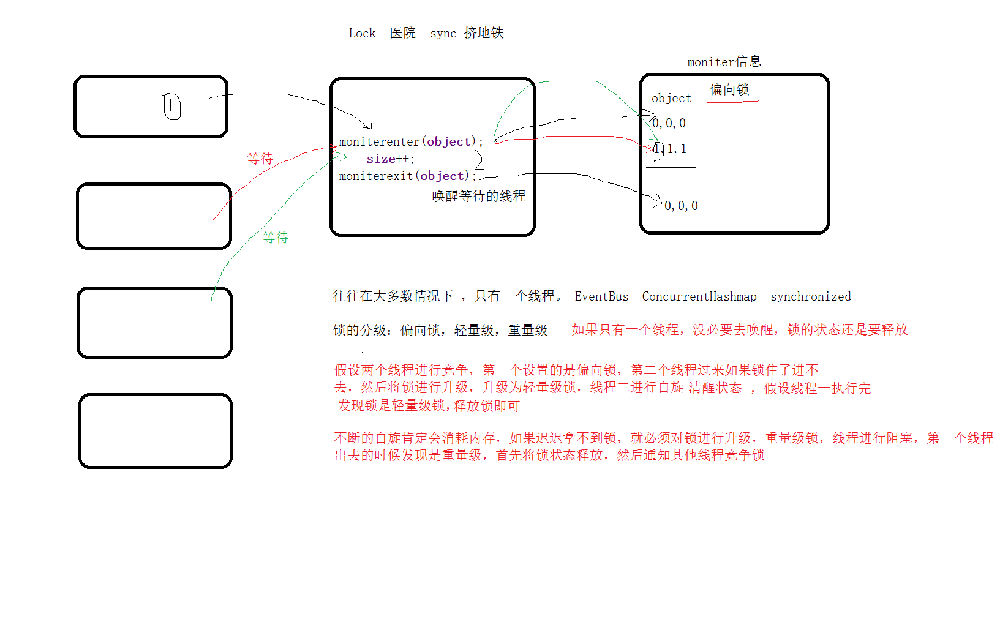

# <center>43.ConcurrentHashMap分析<center>

# 1. HashMap 5 个线程 put 数据会发生什么？ （阿里面试第一面）



`数据丢失`，`死循环 （扩容）`

解决方案：
1. hashTable
2. Collections.synchronizedMap()
3. ConcurrentHashMap

前两种是锁着整个方法，分段锁 Lock , 分段锁 （synchronized，CAS）  
先来分析一下 java的多线程内存模型

# 2. Java 多线程的内存模型



Java内存模型中规定了所有的变量都存储在主内存中，每条线程还有自己的工作内存，线程的工作内存中保存了该线程使用到的变量到主内存副本拷贝，线程对变量的所有操作（读取、赋值）都必须在工作内存中进行，
而不能直接读写主内存中的变量。不同线程之间无法直接访问对方工作内存中的变量，线程间变量值的传递均需要在主内存来完成，线程、主内存和工作内存的交互关系如上图所示。


现在我们来想象一下，假设线程 1 把数据读到了自己的工作内存中，在 tab 角标为 1 的链表头插入了一条新的数据，倘若这时还没来得及将新增的数据刷新到主内中。接着线程 2 就把数据读到了自己的工作内存中，在 tab 角标为 1 的链表头插入了一条新的数据。接着线程 1 把新增数据刷新到主内存中，
线程 2 也把数据新增数据刷新到主内存中，那么线程 2 就会覆盖线程 1 的新增数据，从而导致数据丢失的情况。这里需要注意的是，只有两个线程都是操作 tab 的同一个 index 链表才会导致数据丢失的情况，如果不是同一个 index 链表就不会有覆盖和丢失这一说。

# 3. synchronized 的底层实现原理



关于 HashMap 的线程不安全问题，Java 给我们提供了三种方案，第一种是 HashTable ，第二种是 Collections.synchronizedMap() ，第三种是 ConcurrentHashMap 。而第一种和第二种都是通过用 synchronized 同步方法来保证线程安全，性能上有所欠缺不推荐大家使用。  
ConcurrentHashMap 在 JDK 1.8 之前采用的是 Segment 分段锁来实现的，而 JDK 1.8 之后则采用 synchronized 和 CAS 来实现。

HashTable 通过锁住整个 put 和 get 方法来实现线程安全并不是很合理，因为一个线程在 put 的时候，另外一个线程不能再 put 和 get 必须进入等待状态。同理一个线程在 get 的时候，另外一个线程也不能再 get 和 put 。  
上面通过分析只有两个线程都是操作 tab 的同一个 index 链表才会导致数据丢失的情况，如果不是同一个 index 链表就不会有覆盖和丢失这一说。因此也没必要锁住整个方法，只需要锁住每个 tab 的 index 链即可。

ConcurrentHashMap 在 JDK 1.8 之前采用的是 Segment 继承自 ReentrantLock 来锁住 tab 的 index 链，而 JDK 1.8 之后则采用 synchronized 来实现

# 4. ConcurrentHashMap 源码分析

```c++
// volatile 保证可见性
transient volatile Node<K,V>[] table;

// 新增元素的方法
final V putVal(K key, V value, boolean onlyIfAbsent) {
        if (key == null || value == null) throw new NullPointerException();
        // 二次 hash 
        int hash = spread(key.hashCode());
        int binCount = 0;
        for (Node<K,V>[] tab = table;;) {
            Node<K,V> f; int n, i, fh;
            // 如果 tab 为空，初始化 tab
            if (tab == null || (n = tab.length) == 0){
                tab = initTable();
            }
            // 当前 tab 的 index 链表为 null
            else if ((f = tabAt(tab, i = (n - 1) & hash)) == null) {
                if (casTabAt(tab, i, null, new Node<K,V>(hash, key, value, null)))
                    break;                   // no lock when adding to empty bin
            }
            else if ((fh = f.hash) == MOVED)
                tab = helpTransfer(tab, f);
            else {
                V oldVal = null;
                // 锁住当前 tab 的 index 链表（分段锁）
                synchronized (f) {
                    if (tabAt(tab, i) == f) {
                        if (fh >= 0) {
                            binCount = 1;
                            // ......

public V get(Object key) {
        Node<K,V>[] tab; Node<K,V> e, p; int n, eh; K ek;
        int h = spread(key.hashCode());
        if ((tab = table) != null && (n = tab.length) > 0 &&
            // CAS 操作
            (e = tabAt(tab, (n - 1) & h)) != null) {
            if ((eh = e.hash) == h) {
                if ((ek = e.key) == key || (ek != null && key.equals(ek)))
                    return e.val;
            }
            else if (eh < 0)
                return (p = e.find(h, key)) != null ? p.val : null;
            // 遍历当前列表
            while ((e = e.next) != null) {
                if (e.hash == h &&
                    ((ek = e.key) == key || (ek != null && key.equals(ek))))
                    return e.val;
            }
        }
        return null;
    }
```


