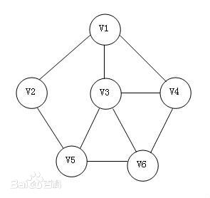
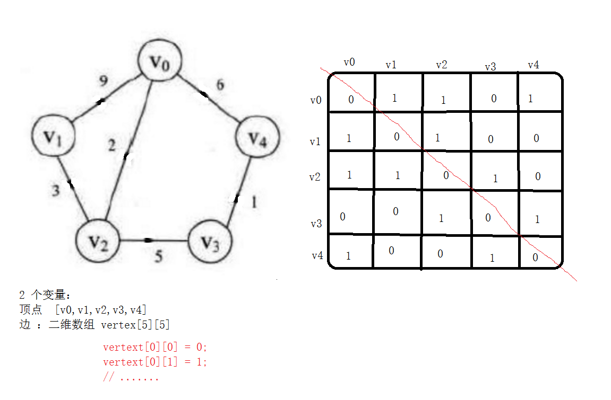
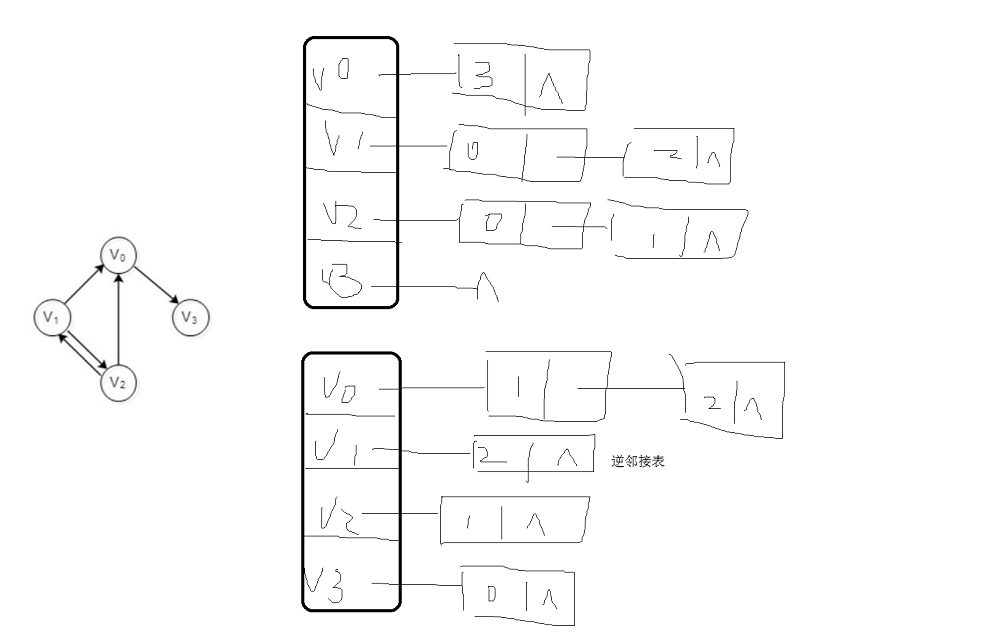
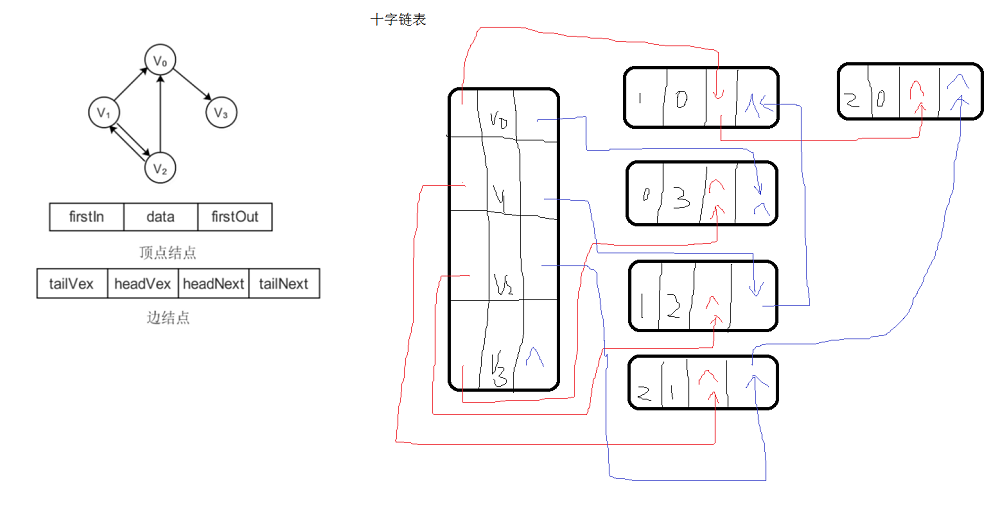

# <center>43.图<center>
@[TOC](数据结构和算法)

具体代码请看：**[NDKPractice项目的datastructure43graph](https://github.com/EastUp/NDKPractice/tree/master/datastructure43graph)**

# 知识点：

## 1. 图的基本概念：

图（Graph）是由顶点的有穷非空集合和顶点之间边的集合组成，通常表示为：G（V，E），其中，G表示一个图，V是图G中顶点的集合，E是图G中边的集合。

图就是由 点 和 边组成。

`注意：线性表中可以没有元素，称为空表。树中可以没有结点，叫做空树。但是在图中不允许没有顶点，可以没有边。`

## 2. 基本术语：
- 无向边：若顶点V1和V2之间的边没有方向，称这条边为无向边（Edge），用（V1，V2）来表示。

- 无向图（Undirected graphs）：图中任意两个顶点的边都是无向边。



- 有向边：若从顶点V1到V2的边有方向，称这条边为有向边，也称为弧（Arc），用<V2, V1>来表示，其中V1称为弧尾（Tail），V2称为弧头（Head）。

- 有向图（Directed graphs）：图中任意两个顶点的边都是有向边。


- 无向完全图：无向图中，任意两个顶点之间都存在边。

- 有向完全图：有向图中，任意两个顶点之间都存在方向相反的两条弧。

- 稀疏图；有很少条边或弧的图称为稀疏图 n*log(n)，反之称为稠密图。  相对的概念  （头发稀疏） 完全图肯定是稠密

- 权（Weight）：表示从图中一个顶点到另一个顶点的距离或耗费。

- 网：带有权重的图

- 度：与特定顶点相连接的边数；

- 出度、入度：有向图中的概念，出度表示以此顶点为起点的边的数目，入度表示以此顶点为终点的边的数目；

- 连通图：任意两个顶点都相互连通的图；

- 生成树：n个顶点，n-1条边 ，的图可以看成树 （生成树）

- 最小生成树：此生成树的边的权重之和是所有生成树中最小的；

## 3. 图的存储结构

### 3.1 无向边存储图如下：



### 3.2 有向边存储图如下：


### 3.3  邻接表



### 3.4 十字链表



## 4. 深度优先遍历和广度优先遍历


## 5. 最小生成树和最短路径

`普里姆算法` : 每次都找最近的，与它相连的考虑进去，边修路边淘汰

```
    // 最小生成树（普里姆算法）
    public void prim(){
        // 定义一个数组内存，当前修好村庄，lowcost = 0 代表已经修了
        int[] lowcost = new int[vertexSize];

        // 第一行的数据先放到 lowcost
        for (int i = 0; i < vertexSize; i++) {
            lowcost[i] = matrix[0][i];        // [0,1,5,max,max,max,max,max,max]
        }

        int sum = 0;

        for (int i = 1; i < vertexSize; i++) {
            int min = MAX_WEIGHT;
            int minId = 0;

            // 找最小的，之间是否连通
            for (int j = 1; j < vertexSize; j++) {
                if(lowcost[j] < min && lowcost[j] != 0){
                    min = lowcost[j];
                    minId = j;
                }
            }

            // min = 1, minId = 1;

            Log.e("TAG","找到村庄："+vertexs[minId] + ", 修路距离：" + min);
            lowcost[minId] = 0;
            sum += min;

            for (int k = 0; k < vertexSize; k++) {
                // 边考虑边淘汰
                if(matrix[minId][k] < lowcost[k] && lowcost[k] > 0){
                    lowcost[k] = matrix[minId][k];
                }
            }

//            for (int o = 0; o< vertexSize; o++){
//                Log.e("TAG","i = "+o+",  number = " + lowcost[o]); //[0,0,3,7,5,max,max,max,max]
//            }
//            Log.e("TAG","==================================== ");

        }

        Log.e("TAG","最短路径是：" + sum);

    }
```

`迪杰斯特拉算法`:

```java
    // 生成最短路径（迪杰斯特拉算法）
    public void dijstra() {
        // 有没找到最短路径
        boolean[] isPath = new boolean[vertexSize];
        // 存放每个村庄的最短路径
        int[] shortPath = new int[vertexSize];

        for (int i = 0; i <vertexSize; i++) {
            shortPath[i] = matrix[0][i];
        }

        shortPath[0] = 0;
        isPath[0] = true;

        for (int i = 1; i < vertexSize; i++) { // 外循环每次找到下一个村庄最短的路径
            int minId = 0;
            int min = MAX_WEIGHT;
            for (int j = 1; j < vertexSize; j++) {
                if(shortPath[j] < min && !isPath[j]){
                    min = shortPath[j];   // 1 4
                    minId = j;            // 1 2
                }
            }

            isPath[minId] = true; // 已经找到了最短的路径

            for (int k = 0; k < vertexSize; k++) {
                if(!isPath[k] && (matrix[minId][k] + min) < shortPath[k]){
                    shortPath[k] = matrix[minId][k] + min;
                }
            }

            for (int k = 0; k < vertexSize; k++) {
                Log.e("TAG", shortPath[k]+" ");
            }
            Log.e("TAG", "===================");
        }

        for (int i = 0; i < vertexSize; i++) {
            Log.e("TAG", "顶点 0 到顶点 " + i + " 的最短距离为：" + shortPath[i]);
        }

    }
```


