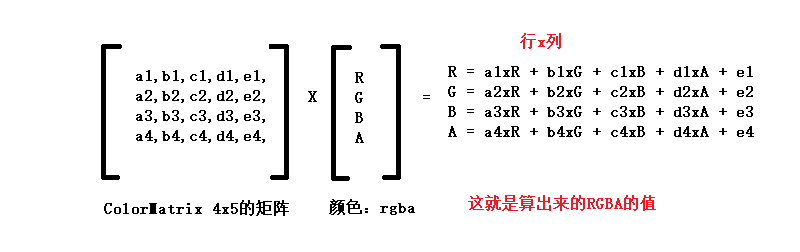

# <center>49.android滤镜(不用opencv来写)<center>
@[TOC](opencv)

具体代码请看：**[NDKPractice项目的datastructure43graph](https://github.com/EastUp/NDKPractice/tree/master/opencv49androidfiltereffects)**

# 知识点：

## 1. 使用ColorMatrix颜色矩阵：

看下如何运算的：


```
    @Nullable
    public static Bitmap gray(@Nullable Bitmap src) {

        Bitmap dst = Bitmap.createBitmap(src.getWidth(),src.getHeight(),src.getConfig());
        Canvas canvas = new Canvas(dst);

        // 通过 ColorMatrix 改变颜色矩阵
        Paint paint = new Paint();
        paint.setDither(true);
        paint.setAntiAlias(true);

        // ColorMatrix colorMatrix = new ColorMatrix();
        // colorMatrix.setSaturation(0); // 修改饱和度为0 也就是把颜色矩阵转成了灰度图,相当于下面的矩阵

        /*ColorMatrix colorMatrix = new ColorMatrix(new float[]{ // 灰度图效果
                0.213f,0.715f,0.072f,0,0,
                0.213f,0.715f,0.072f,0,0,
                0.213f,0.715f,0.072f,0,0,
                0,0,0,1,0
        });*/

        /*ColorMatrix colorMatrix = new ColorMatrix(new float[]{ // 原图效果
                1,0,0,0,0,
                0,1,0,0,0,
                0,0,1,0,0,
                0,0,0,1,0
        });*/

        /*ColorMatrix colorMatrix = new ColorMatrix(new float[]{ // 底片效果
                -1,0,0,0,255,
                0,-1,0,0,255,
                0,0,-1,0,255,
                0,0,0,1,0
        });*/

        ColorMatrix colorMatrix = new ColorMatrix(new float[]{ // 提高亮度
                1.2f,0,0,0,0,
                0,1.2f,0,0,0,
                0,0,1.2f,0,0,
                0,0,0,1,0
        });

        paint.setColorFilter(new ColorMatrixColorFilter(colorMatrix)); // 设置颜色矩阵
        
        canvas.drawBitmap(src,0,0,paint);
        return dst;
    }
```

## 2. 使用Bitmap的`getPixels()`和`setPixels`修改像素

如果需要修改Bitmap本身的像素，复用则需要做调整：

```
var options = BitmapFactory.Options()
options.inMutable = true // 是否能修改

var bitmap  = BitmapFactory.decodeResource(resources,R.mipmap.copy,options)
```

具体代码如下：

```
    public static Bitmap gray2(@Nullable Bitmap src) {
        // Bitmap dst = Bitmap.createBitmap(src.getWidth(), src.getHeight(), src.getConfig());

        // java层像素操作
        int[] pixels = new int[src.getWidth() * src.getHeight()];

        src.getPixels(pixels, 0, src.getWidth(), 0, 0, src.getWidth(), src.getHeight());

        for (int i = 0; i < pixels.length; i++) {
            int pixel = pixels[i];

            int a = pixel >> 24 & 0xFF;
            int r = pixel >> 16 & 0xFF;
            int g = pixel >> 8 & 0xFF;
            int b = pixel & 0xFF;

            // 灰色
            int gray = (int) (0.213f * r + 0.715f * g + 0.072f * b);
            // pixels[i] = a << 24 | gray << 16 | gray << 8 | gray;


            // 黑白
            int bw = (r + g + b) / 3 > 125 ? 255 : 0;
            pixels[i] = a << 24 | bw << 16 | bw << 8 | bw;
        }

        // dst.setPixels(pixels, 0, src.getWidth(), 0, 0, src.getWidth(), src.getHeight());
        // return dst;

        // 自己设置给自己，能复用不？,需要 BitmapFactory.Options.inMutable = true
        src.setPixels(pixels, 0, src.getWidth(), 0, 0, src.getWidth(), src.getHeight());
        return src;
    }
```

## 3. jni中操作（最好的方法）

BitmapFactory.Options可以修改图片的颜色属性

```
        var options = BitmapFactory.Options()
        options.inMutable = true // 是否能修改
        options.inPreferredConfig = Bitmap.Config.RGB_565 // 将图片转为 rgb_565格式
        // RGB_565 747  ARGB_8888 1494  1 倍
        // ARGB_8888 -> RGB 565 RGB 5位R 6位G 5位B   16位
        var src  = BitmapFactory.decodeResource(resources,R.mipmap.copy,options)
```

jni中修改图片为黑白或者灰度的代码：

```
Java_com_east_opencv49androidfiltereffects_BitmapUtils_gray3(JNIEnv *env, jclass clazz,
                                                             jobject src) {

    AndroidBitmapInfo info;

    int result = AndroidBitmap_getInfo(env,src,&info);
    if(result!=0)
        return -1;

    void *pixels;
    // 锁定画布
    AndroidBitmap_lockPixels(env,src,&pixels);

    if(info.format == ANDROID_BITMAP_FORMAT_RGBA_8888){
        uint32_t *pixels_p = reinterpret_cast<uint32_t*>(pixels);
        for (int i = 0; i < info.width*info.height; ++i) {
            if(i != 0)
                pixels_p+=1;

            int a = *pixels_p >> 24 & 0xFF;
            int r = *pixels_p >> 16 & 0xFF;
            int g = *pixels_p >> 8 & 0xFF;
            int b = *pixels_p & 0xFF;

            int gray = (int) (0.213f * r + 0.715f * g + 0.072f * b);

            *pixels_p = a<<24 | gray << 16 | gray << 8 | gray;
        }
    }else if(info.format == ANDROID_BITMAP_FORMAT_RGB_565){
        uint16_t *pixels_p = reinterpret_cast<uint16_t*>(pixels);
        for (int i = 0; i < info.width*info.height; ++i) {
            if(i != 0)
                pixels_p+=1;
            // 8888 -> 565
            int r = *pixels_p >> 11 << 3 & 0xFF;
            int g = *pixels_p >> 5 << 2 & 0xFF;
            int b = *pixels_p << 3 & 0xFF;

            // f = 0.213f * r + 0.715f * g + 0.072f * b  (32位来讲的  255,255,255),所以需要补齐8位
            int gray = (int) (0.213f * r + 0.715f * g + 0.072f * b);// 8位

            *pixels_p = gray >>3 << 11 | gray >>2 <<5 | gray >> 3;
        }
    }

    // 解锁画布
    AndroidBitmap_unlockPixels(env,src);

    return 1;
}
```


