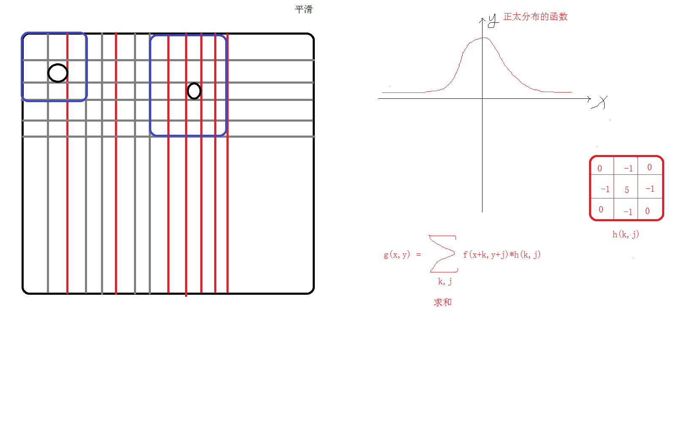

# <center>51.inline、define和图像的形状绘制和卷积掩膜操作<center>


# 1. inline 和 define

inline是内联函数，类似于 define 都可以做到`编译时替换`

区别：`define 并没有严格的检测,inline函数的参数有确切的类型所以会有严格的类型检测`

```c++
#define Max(a,b) a>b ? a :b 
// inline 内联函数，类似于 define 做到编译时替换
// 区别：define 并没有严格的检测,inline函数的参数有确切的类型所以会有严格的类型检测
// inline 使用场景：不涉及过于复杂的函数
inline int max1(int a, int b){
	return a > b ? a : b;
}

int main(){
    Mat src = imread("E:/test.jpg");
    
    cout << max1(2, 3) << endl;
    
    imshow("src", src);
    waitKey(0);
}
```


# 2.形状和文件绘制
- 线 line
- 椭圆 ellipse
- 矩形 rectangle
- 圆 cicle
- 填充 fillPloy
- 文字 putText 

```c++
int main(){
	Mat src = imread("E:/test.jpg");

	// 判断读取是否正确
	if (src.empty()){
		cout << "src read error" << endl;
		return -1;
	}

	// 2.1 绘制线
	// LINE_8: 8联通线（8-connected）,即下一个点连接上一个点的边或角
	// LINE_4: 下一个点和上一个点边相连（没有角了）
	line(src,Point(10,10),Point(300,300),Scalar(0,0,255),5,LINE_8);

	// 2.2 绘制矩形
	rectangle(src, Point(20, 20), Point(100, 100), Scalar(0, 0, 255), 5, LINE_8);
	rectangle(src, Rect(30,30,20,50), Scalar(0, 0, 255), 5, LINE_8);


	// 2.3 绘制椭圆
	// 第二个参数是：椭圆的中心点
	// 第三个参数: Size 第一个值是椭圆 x width 的半径， 第二个是 y height 的半径
	ellipse(src,Point(src.cols/2,src.rows/4),Size(src.cols/8,src.rows/4),180,0,360,Scalar(255,0,0),3,LINE_AA);

	// 2.4 园
	circle(src,Point(src.cols-500,src.rows-500),50,Scalar(0,255,255),5,LINE_AA);

	// 2.5 填充 fillpoly 多边形
	/*CV_EXPORTS void fillPoly(InputOutputArray img, const Point** pts,
		const int* npts, int ncontours,
		const Scalar& color, int lineType = LINE_8, int shift = 0,
		Point offset = Point());*/
	Point pots[] = { Point(100, 100), Point(100, 200), Point(200, 200), Point(100, 100) };

	const Point* potss[] = { pots };

	const int npts[] = { 4 };

	fillPoly(src, potss, npts, 1, Scalar(255, 0, 0), LINE_8);

	// 2,6 画文字
	// fontFace 字体
	// fontScale 缩放，大小
	putText(src, "HI，OpenCV", Point(100, 100), QT_FONT_BLACK,1,Scalar(255,0,255),1,LINE_AA);

	// 2.7 随机画 srand 画线
	// opencv 做随机 srand random 效果一样
	RNG rng(time(NULL));
	// 创建一张图片,与 src 的宽高和颜色通道一直，所有的点都是 0
	Mat dst = Mat::zeros(src.size(),src.type());

	for (int i = 0; i < 10; i++)
	{
		Point sp;
		sp.x = rng.uniform(0,dst.cols);
		sp.y = rng.uniform(0, dst.rows);
		Point ep;
		ep.x = rng.uniform(0, dst.cols);
		ep.y = rng.uniform(0, dst.rows);
		line(dst, sp, ep, Scalar(rng.uniform(0, 255), rng.uniform(0, 255),rng.uniform(0, 255)));
	}

	imshow("src", dst);
	waitKey(0);
}
```

# 3.图像卷积和滤波操作



## 3.1 图像矩阵掩膜操作 （可以过滤图像信息）

```c++
int main(){
	Mat src = imread("E:/copy.png");
	if (src.empty()){
		cout << "src read error" << endl;
		return -1;
	}

	// 下面是掩膜操作
	// 生成一个和源图像大小相等类型相同的全 0 矩阵
	/*Mat dst = Mat::zeros(src.size(),src.type());
	int rows = src.rows;
	int cols = src.cols;
	int channels = src.channels();
	for (int i = 1; i < rows - 1; i++)
	{
		// 上一行
		uchar* previous = src.ptr<uchar>(i-1);
		// 当前行
		uchar* current = src.ptr<uchar>(i);
		// 下一行
		uchar* next = src.ptr<uchar>(i+1);
		// 输出
		uchar* output = dst.ptr<uchar>(i);
		for (int j = channels; j < (cols-1)*channels; j++)
		{
			output[j] = saturate_cast<uchar>(5 * current[j] - (previous[j] + next[j] + current[j - channels] + current[j + channels]));
		}
	}*/


	// opencv 自带的掩膜操作
	Mat dst;
	Mat kernel = (Mat_<char>(3, 3) << 0, -1, 0, -1, 5, -1, 0, -1, 0);
	filter2D(src,dst,src.depth(),kernel);

	imshow("src", src);
	imshow("dst", dst);
	waitKey(0);
}
```


