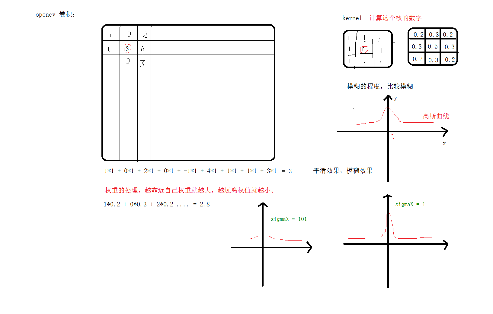

# <center>52.性能优化和高斯模糊<center>
@[TOC](opencv)

# 知识点：

## 1. Bitmap 占用内存分析及常见优化

分析工具：AS3.0以上使用 `Android Profile`,以下可以使用 `Android Device Monitor`

优化：  
1. 耗时操作可以通过 `Rxjava` 去切换到子线程处理
2. 如果涉及到高斯模糊，从网络上下载的大图，根据ui需求，通过 Glide 重新调整其大小（这样减少高斯模糊的计算时间）
3. 使用LruCache 缓存，根据不同机型分配 不同的缓存 大小

### 1.1 Lrucache 两个点记录
1. 记得重写 Lrucache 的 `sizeOf(K key, V value)`方法为缓存的单个大小，不然默认为 1
2. 内存大小可以根据不同手机等条件动态设置： 内存缓存 = 一屏幕图片 （widthPixels*heightPixels*4）* 2  

```c++
// 缓存图片
Lrucache cache = Lrucache(4*1024*1024); 

// 如果不重写 Lrucache 的 `sizeOf(K key, V value)`方法 ，则默认可以缓存 4*1024*1024 张图片
```

## 2. 图像模糊



### 2.1 均值模糊

操作：对当前像素点的周边半径，进行相加然后取平均值，赋值给当前像素点。

### 2.2 高斯模糊

操作： 对当前像素点的周边半径，求权重计算周边像素值，然后相加赋值给当前像素点。

<font color="red">每个像素点都要处理，还有就是要去计算我们的正太分布的值（卷积核）</font>  
<font color="red">如果半径越大，算法的复杂度越大，如果图片的宽高像素点越多，算法的复杂度也越大</font>

高斯和均值模糊的区别：`高斯保留了一些轮廓，毛玻璃的效果`

```c++
int main(){
	Mat src = imread("E:/copy.png");

	if (src.empty()){
		cout << "src read error" << endl;
	}
	imshow("src", src);

	// 均值模糊
	Mat dst;
	// Size（w,h）只能是基数，这样才能找到中心点
	// Point(-1,-1) 代表中心店
	blur(src,dst,Size(151,151),Point(-1,-1));
	imshow("dst", dst);

	// 高斯模糊
	Mat gaussian;
	// sigmaX sigmaY 代表 作用
	// sigmaY 不传代表和 sigmaX 一样
	// 如果 sigmaX <= 0 ,自己会计算 0.3*((ksize-1)*0.5 - 1) + 0.8
	// sigmaX 越小越没效果
	GaussianBlur(src, gaussian, Size(151, 151), 0);
	imshow("gaussian", gaussian);

	waitKey(0);
	return 0;
}
```


