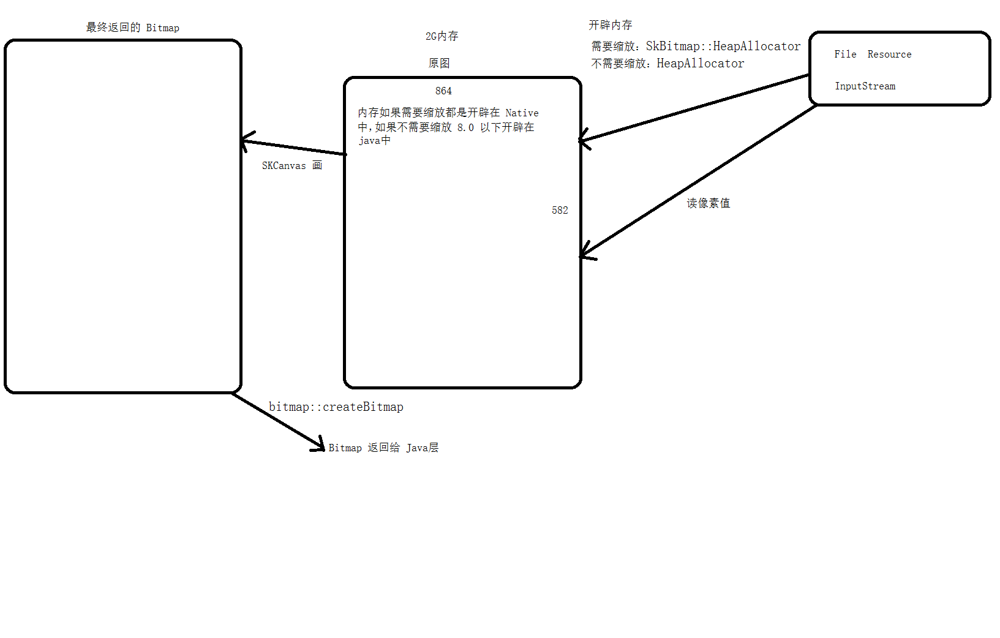

# <center>53.Bitmap全面解析<center>
@[TOC](opencv)

# 知识点：

## 1. dp dip  dpi  px

- dp、dip：Android 为了适配不同的设备弄出来的单位 1dp = dpi / 160
- dpi：像素密度  = px / 英寸
- px：像素

他们之间的换算：`屏幕的总 dp = px / (dpi/160)`


## 2. Bitmap 大小计算 看源码

以下是 java 层的源码

```
类:`BitmapFactory`.`decodeResource`(Resources res, int id)

-> 类:`BitmapFactory`.decodeResource(Resources res, int id, Options opts)

-> 类:`BitmapFactory`.decodeResourceStream(@Nullable Resources res, @Nullable TypedValue value,
            @Nullable InputStream is, @Nullable Rect pad, @Nullable Options opts){
                        if (opts == null) {
                            opts = new Options();
                        }
                
                        if (opts.inDensity == 0 && value != null) {
                            final int density = value.density;
                            if (density == TypedValue.DENSITY_DEFAULT) {
                                opts.inDensity = DisplayMetrics.DENSITY_DEFAULT;  // 根据放到哪个文件夹决定 density 的大小
                            } else if (density != TypedValue.DENSITY_NONE) {
                                opts.inDensity = density;
                            }
                        }
                        // 获取当前手机设备的 dpi 
                        if (opts.inTargetDensity == 0 && res != null) {
                            opts.inTargetDensity = res.getDisplayMetrics().densityDpi;
                        }
            }

-> 类:`BitmapFactory`.decodeStream(@Nullable InputStream is, @Nullable Rect outPadding,
            @Nullable Options opts)
            
-> 类:`BitmapFactory`.decodeStreamInternal(@NonNull InputStream is,
            @Nullable Rect outPadding, @Nullable Options opts)
            
   // 调用 native 层的方法解析图片
-> 类:`BitmapFactory`.nativeDecodeStream(InputStream is, byte[] storage,
            Rect padding, Options opts, long inBitmapHandle, long colorSpaceHandle)

            
private static native Bitmap nativeDecodeStream(InputStream is, byte[] storage,
            Rect padding, Options opts, long inBitmapHandle, long colorSpaceHandle);

```
<font color = red>
opts.inDensity = DisplayMetrics.DENSITY_DEFAULT;  // 根据放到哪个文件夹决定 density 的大小

- mdpi = 160
- hdpi = 240
- xhdpi = 320
- xxhdpi = 480
- xxxhdpi = 640

</font>


以下是 native 层的源码

```
类 `BitmapFactory.cpp`.nativeDecodeStream(JNIEnv* env, jobject clazz, jobject is, jbyteArray storage,
        jobject padding, jobject options, jlong inBitmapHandle, jlong colorSpaceHandle)

-> 类 `BitmapFactory.cpp`.doDecode(JNIEnv* env, std::unique_ptr<SkStreamRewindable> stream,
                        jobject padding, jobject options, jlong inBitmapHandle,
                        jlong colorSpaceHandle)
                        
// 分析下这个方法

static jobject doDecode(JNIEnv* env, std::unique_ptr<SkStreamRewindable> stream,
                        jobject padding, jobject options, jlong inBitmapHandle,
                        jlong colorSpaceHandle) {
    // Set default values for the options parameters.
    int sampleSize = 1;    // option里面要大小设置的参数，代表压缩几倍  BitmapFactory.Options. `inSampleSize`
    bool onlyDecodeSize = false;  // 是否只获取图片的大小 BitmapFactory.Options. `inJustDecodeBounds` 
    SkColorType prefColorType = kN32_SkColorType; 
    bool isHardware = false; // 是否硬件加速
    bool isMutable = false; // 是否可以服用
    float scale = 1.0f;  // 缩放
    bool requireUnpremultiplied = false;
    jobject javaBitmap = NULL;
    sk_sp<SkColorSpace> prefColorSpace = GraphicsJNI::getNativeColorSpace(colorSpaceHandle);
    
    // 获取 Options 里面的属性
    if (options != NULL) {
        sampleSize = env->GetIntField(options, gOptions_sampleSizeFieldID);
        // Correct a non-positive sampleSize.  sampleSize defaults to zero within the
        // options object, which is strange.
        if (sampleSize <= 0) {
            sampleSize = 1;
        }

        if (env->GetBooleanField(options, gOptions_justBoundsFieldID)) {
            onlyDecodeSize = true;
        }

        // initialize these, in case we fail later on
        env->SetIntField(options, gOptions_widthFieldID, -1);
        env->SetIntField(options, gOptions_heightFieldID, -1);
        env->SetObjectField(options, gOptions_mimeFieldID, 0);
        env->SetObjectField(options, gOptions_outConfigFieldID, 0);
        env->SetObjectField(options, gOptions_outColorSpaceFieldID, 0);

        jobject jconfig = env->GetObjectField(options, gOptions_configFieldID);
        prefColorType = GraphicsJNI::getNativeBitmapColorType(env, jconfig);
        isHardware = GraphicsJNI::isHardwareConfig(env, jconfig);
        isMutable = env->GetBooleanField(options, gOptions_mutableFieldID);
        requireUnpremultiplied = !env->GetBooleanField(options, gOptions_premultipliedFieldID);
        javaBitmap = env->GetObjectField(options, gOptions_bitmapFieldID);

        if (env->GetBooleanField(options, gOptions_scaledField  ID)) {
            const int density = env->GetIntField(options, gOptions_densityFieldID);
            const int targetDensity = env->GetIntField(options, gOptions_targetDensityFieldID);
            const int screenDensity = env->GetIntField(options, gOptions_screenDensityFieldID);
            if (density != 0 && targetDensity != 0 && density != screenDensity) {
                // 获取 scale 图片存放的文件夹不一样 scale 的值就不一样
                scale = (float) targetDensity / density;   // scale = 420/480 = 0.875
            }
        }
    }
    
    SkISize size = codec->getSampledDimensions(sampleSize);
    int scaledWidth = size.width();  // 864
    int scaledHeight = size.height(); // 582
    bool willScale = false;
    
    // Apply a fine scaling step if necessary. 如果 sampleSize != 1 的话就会进入到这个方法中 进行尺寸压缩
    if (needsFineScale(codec->getInfo().dimensions(), size, sampleSize)) {
        willScale = true;
        scaledWidth = codec->getInfo().width() / sampleSize;
        scaledHeight = codec->getInfo().height() / sampleSize;
    }

    
    // Scale is necessary due to density differences.  scale = 420/480 = 0.875
    if (scale != 1.0f) { // 0.833333  
        willScale = true;
        // 0.5f 是很重要的
        scaledWidth = static_cast<int>(scaledWidth * scale + 0.5f); // 756
        scaledHeight = static_cast<int>(scaledHeight * scale + 0.5f); // 509 
    }
    
    ...

}
```



## 3. Bitmap 的内存开辟

内存申请因为版本不同而有所区别：

Bitmap 的内存申请不同版本间有些许差异，在 `3.0-7.0` 的 bitmap 像素内存都是存放在 `Java heap` 中的，而 `8.0` 以后则是放在 `Native heap` 中的

看下面代码

```
    @Override
    protected void onCreate(Bundle savedInstanceState) {
        super.onCreate(savedInstanceState);
        setContentView(R.layout.activity_main);

        logMemory();

        Bitmap bitmap = Bitmap.createBitmap(1024, 1024 * 500, Bitmap.Config.ARGB_8888);

        logMemory();
    }
    
    private void logMemory() {
        ActivityManager activityManager = (ActivityManager) getSystemService(Context.ACTIVITY_SERVICE);
        ActivityManager.MemoryInfo memoryInfo = new ActivityManager.MemoryInfo();
        activityManager.getMemoryInfo(memoryInfo);
        Log.e("TAG", "AvailMem :" + memoryInfo.availMem / 1024 / 1024);
        Log.e("TAG", "lowMemory：" + memoryInfo.lowMemory);
        Log.e("TAG", "NativeHeapAllocatedSize :" + Debug.getNativeHeapAllocatedSize() / 1024 / 1024);
    }
```

上面我们创建了一张 2G 大小的 bitmap 我们在 8.0 以下的版本运行是会 OOM 的，而我们在 8.0 以上的版本运行是完全没问题，但 Native 内存多了 2G 的内存。

```
E/TAG: AvailMem :1654
E/TAG: lowMemory：false
E/TAG: NativeHeapAllocatedSize :4

E/TAG: AvailMem :1656
E/TAG: lowMemory：false
E/TAG: NativeHeapAllocatedSize :2052
```

通过之前的源码分析可知 bitmap 的内存创建都是通过 `tryAllocPixels` 方法来申请的

8.0 以上像素内存在 Native 内存中

```
auto wrapper = alloc(size, info, rowBytes, ctable);
```

看一下源码（8.0以上）：

```
类 `BitmapFactory.cpp`.doDecode(JNIEnv* env, std::unique_ptr<SkStreamRewindable> stream,
                        jobject padding, jobject options, jlong inBitmapHandle,
                        jlong colorSpaceHandle)

static jobject doDecode(JNIEnv* env, std::unique_ptr<SkStreamRewindable> stream,
                        jobject padding, jobject options, jlong inBitmapHandle,
                        jlong colorSpaceHandle) {
    
    // 原图
    SkBitmap decodingBitmap;
    if (!decodingBitmap.setInfo(bitmapInfo) ||
            !decodingBitmap.tryAllocPixels(decodeAllocator)) { // tryAllocPixels 原图加载在了 native 层
        // SkAndroidCodec should recommend a valid SkImageInfo, so setInfo()
        // should only only fail if the calculated value for rowBytes is too
        // large.
        // tryAllocPixels() can fail due to OOM on the Java heap, OOM on the
        // native heap, or the recycled javaBitmap being too small to reuse.
        return nullptr;
    }

    // Use SkAndroidCodec to perform the decode.
    SkAndroidCodec::AndroidOptions codecOptions;
    codecOptions.fZeroInitialized = decodeAllocator == &defaultAllocator ?
            SkCodec::kYes_ZeroInitialized : SkCodec::kNo_ZeroInitialized;
    codecOptions.fSampleSize = sampleSize;
    SkCodec::Result result = codec->getAndroidPixels(decodeInfo, decodingBitmap.getPixels(),
            decodingBitmap.rowBytes(), &codecOptions);
    switch (result) {
        case SkCodec::kSuccess:
        case SkCodec::kIncompleteInput:
            break;
        default:
            return nullObjectReturn("codec->getAndroidPixels() failed.");
    }
    
    ...
    
    // 返回的图片
    SkBitmap outputBitmap;
    if (willScale) { // 如果有压缩
        // Set the allocator for the outputBitmap.
        SkBitmap::Allocator* outputAllocator;
        if (javaBitmap != nullptr) {
            outputAllocator = &recyclingAllocator;
        } else {
            outputAllocator = &defaultAllocator;
        }

        SkColorType scaledColorType = decodingBitmap.colorType();
        // FIXME: If the alphaType is kUnpremul and the image has alpha, the
        // colors may not be correct, since Skia does not yet support drawing
        // to/from unpremultiplied bitmaps.
        outputBitmap.setInfo(
                bitmapInfo.makeWH(scaledWidth, scaledHeight).makeColorType(scaledColorType));
        if (!outputBitmap.tryAllocPixels(outputAllocator)) { // 输出的图片加载在 navtive 层
            // This should only fail on OOM.  The recyclingAllocator should have
            // enough memory since we check this before decoding using the
            // scaleCheckingAllocator.
            return nullObjectReturn("allocation failed for scaled bitmap");
        }

        SkPaint paint;
        // kSrc_Mode instructs us to overwrite the uninitialized pixels in
        // outputBitmap.  Otherwise we would blend by default, which is not
        // what we want.
        paint.setBlendMode(SkBlendMode::kSrc);
        paint.setFilterQuality(kLow_SkFilterQuality); // bilinear filtering

        SkCanvas canvas(outputBitmap, SkCanvas::ColorBehavior::kLegacy);
        canvas.scale(scaleX, scaleY);
        canvas.drawBitmap(decodingBitmap, 0.0f, 0.0f, &paint);
    } else {
        outputBitmap.swap(decodingBitmap); // 否则返回原图的复制对象，也是 native 层
    }
       
}
```

## 4. Bitmap 内存的回收

### 4.1 recycle 方法

如果是 `8.0` 我们手动调用 `recycle` 方法，`数据是会立即释放的`，因为像素数据本身就是在 Native 层开辟的。但如果是在 `8.0 以下`，就算我们手动调用 recycle 方法，`数据也是不会立即释放的`，
而是 DeleteWeakGlobalRef `交由 Java GC 来回收`。建议大家翻译一下 recycle 方法注释。注意：以上的所说的`释放数据仅代表释放像素数据`，并未释放 Native 层的 Bitmap 对象。

### 4.2 不手动调用 recycle 方法时Native 层的 Bitmap 是怎么回收

- Android M（6.0） 版本及以前的版本, Bitmap 的内存回收主要是通过 BitmapFinalizer 来完成的(类似于 GC 时 Object 的finalize()方法)
- Android M（6.0） 以上版本 虽然没有了 BitmapFinalizer 类,但在 new Bitmap 时会注册 native 的 Finalizer 方法

总结：其实无论是 Android M 前还是之后，释放 Native 层的 Bitmap 对象的思想都是去监听 Java 层的 Bitmap 是否被释放，一旦当 Java 层的 Bitmap 对象被释放则立即去释放 Native 层的 Bitmap 。只不过 Android M 前是基于 Java 的 GC 机制，而 Android M 后是注册 native 的 Finalizer 方法。


### 5.Bitmap 的内存复用

内存复用好处：`防止反复的去开辟和释放内存，内存抖动 -> GC -> 卡顿`

Bitmap 绝对是我们 Android 开发中最容易引起 OOM 的对象之一，因为其占用的像素数据内存比较大，而加载图片又是很常见的操作。如果不断反复的去开辟和销毁 Bitmap 数据内存，势必可能会引起应用的内存抖动，因此 Google 的开发者也为我们想了一些办法，那就是允许 Bitmap 内存复用，具体如下：

- 被复用的 Bitmap 必须为 Mutable（通过 BitmapFactory.Options 设置）
- 4.4 之前，将要解码的图像（无论是资源还是流）必须是 jpeg 或 png 格式且和被复用的 Bitmap 大小一样，其中BitmapFactory.Options#inSampleSize 字段必须设置为 1，要求比较严苛
- 4.4 以后，将要解码的图像的内存需要小于等于要复用的 Bitmap 的内存

```
  // 不复用的写法，消耗内存 32 M
  logMemory();
  Bitmap bitmap1 = BitmapFactory.decodeResource(getResources(), R.drawable.test2);
  Bitmap bitmap2 = BitmapFactory.decodeResource(getResources(), R.drawable.test2);
  logMemory();
  // 复用的写法，消耗内存 16 M
  logMemory();
  BitmapFactory.Options options = new BitmapFactory.Options();
  options.inMutable = true;
  Bitmap bitmap1 = BitmapFactory.decodeResource(getResources(), R.drawable.test2, options);
  options.inBitmap = bitmap1;
  Bitmap bitmap2 = BitmapFactory.decodeResource(getResources(), R.drawable.test2, options);
  logMemory();
```

## 6. xh，xxh，xxxh 放哪个文件夹更高效

- 放当前主流的  xxh , native 源码中只会开辟一次内存

## 7.Bitmap 的内存优化与适配

做效果的时候，最好按比例去计算


