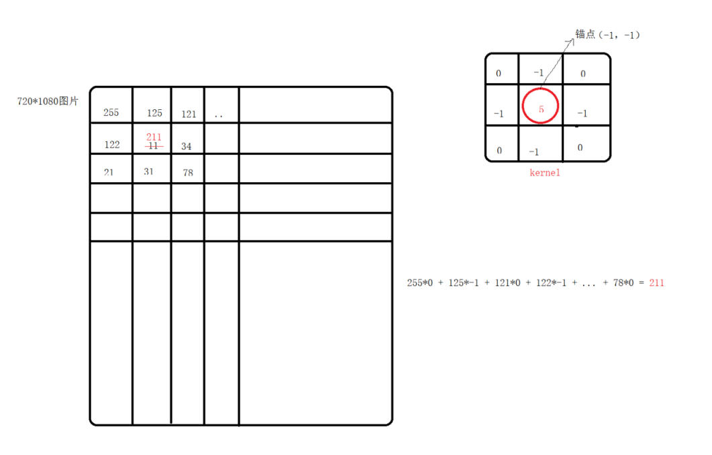
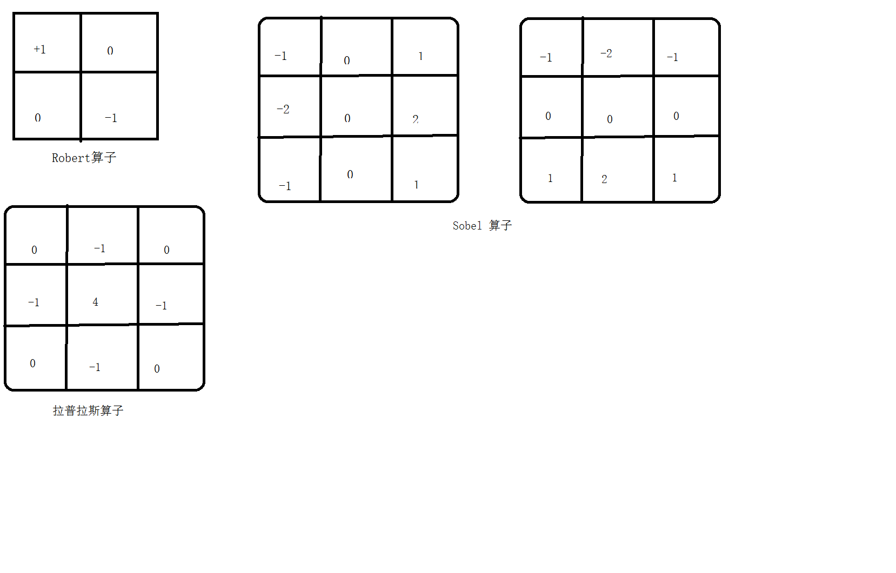

# <center>56.边缘类型、自定义线性滤波、阈值<center>

# 1. 了解下卷积操作

概念：`把kernel（卷积核）放到我们图像的矩阵之上，求锚点周围覆盖的像素乘积之和（包括锚点），用来计算锚点的像素值覆盖图片下面的像素值，称之为卷积操作。`



# 2. 处理边缘类型

`copyMakeBorder(src,dst,src.rows/8,src.rows/8,src.cols/8,src.cols/8,BORDER_DEFAULT);`

- BORDER_DEFAULT：用周边边缘区域来填充
- BORDER_WRAP：用对边来填充
- BORDER_REPLICATE: 用周边像素来填充
- BORDER_CONSTANT: 用一个指定颜色来填充，默认是黑色。

# 3. 自定义线性滤波与图片模糊(算子也叫作 核)
介绍几种算子

- Robert 算子：`Mat kernelRobert = (Mat_<int>(2, 2) << 1, 0, 0, -1);`
- Sobel 算子：x方向：`(Mat_<int>(3, 3) << -1, 0, 1, -2,0,2,-1,0,1);`，y方向：`(Mat_<int>(3, 3) << -1, -2, -1, 0, 0, 0, 1, 2, 1);`
- 拉普拉斯算子：它对图片的要求比较高 `Mat kernelLpls= (Mat_<int>(3, 3) << 0, -1, 0, -1, 4, -1, 0, -1, 0);`



depth:（opencv中的概念）  
　　矩阵中元素的一个通道的数据类型，这个值和type是相关的。例如 type为 CV_16SC2，一个2通道的16位的有符号整数。那么，depth则是CV_16S。depth也是一系列的预定义值， 
将type的预定义值去掉通道信息就是depth值: 0 - 6 , type 的精度的层度  
　　CV_8U 0  CV_8S 1 CV_16U 2 CV_16S 3 CV_32S 4 CV_32F 5 CV_64F 6

图像深度：像素的 bit 位数

`自定义模糊：`

```c++
	// 自定义模糊
	int size = 15;
	Mat kernel = Mat::ones(size,size,CV_32F)/(size*size);

	Mat dst;
	filter2D(src,dst,src.depth(),kernel);
	imshow("dst",dst);
```

# 4.阈值（图像二值化）

`threshold(gray,dst,100,255,type);`

`当使用了THRESH_OTSU和THRESH_TRIANGLE两个标志时，输入图像必须为单通道。`

type 有以下值：

- THRESH_BINARY：当前像素点超过 thresh = 100 ,当前像素取 maxValue = 255 , 否则取最小值 0
- THRESH_BINARY_INV：当前像素点超过 thresh = 100 ,当前像素取 0 , 否则取最大值 maxValue = 255
- THRESH_TRUNC：当前像素点超过 thresh = 100 ,当前像素取 maxValue = 255 , 否则取原来的值
- THRESH_TOZERO：当前像素点超过 thresh = 100 ,当前像素取原来的值，否则取最小值 0
- THRESH_TOZERO_INV：当前像素点超过 thresh = 100，当前像素取 0 ，否则取原来的值
- THRESH_OTSU：自动阈值：取每个像素点（整个图像）计算一个 thresh 值
- THRESH_TRIANGLE：自动阈值：取每个像素点（整个图像）计算一个 thresh 值


