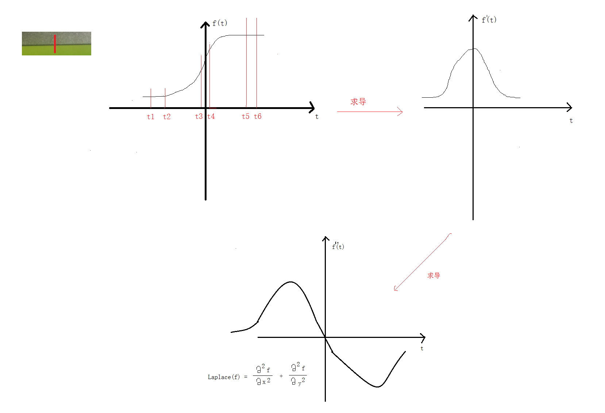

# <center>57.图片边缘检测<center>
@[TOC](opencv)

# 知识点：

## 1. Sobel 算子 检测图片边缘

先来看下微积分求导:



上代码：

```c++
int main(){
	Mat src = imread("E:/card1.png");

	if (!src.data){
		cout << "read error" << endl;
		return -1;
	}

	imshow("src", src);

	//Mat kernel = (Mat_<int>(3, 3) << -1, 0, 1, -2, 0, 2, -1, 0, 1); 
	//Mat dst;
	//filter2D(src,dst,src.depth(),kernel);

	// 1. 降噪高斯
	Mat gaussian;
	GaussianBlur(src,gaussian,Size(3,3),0);
	// 2. 转灰度
	Mat gray;
	cvtColor(gaussian, gray, COLOR_BGR2GRAY);
	// 3. 求梯度
	// 参数 ：delta -> 在计算结果的基础上再加上 delta
	// ddepth : -1代表与 gray.depth()相同的值，但是应该传比 gray 精度更高的值(1 / 3=0,1f/3 = 0.3333)
	// x y ，求梯度一般不用索贝尔，Scharr 增强
	Mat sobel_x, sobel_y;
	Sobel(gray, sobel_x, CV_32F, 1, 0, 3);
	Sobel(gray, sobel_y, CV_32F, 0, 1, 3);

	// 4. 求绝对值 (因为有的像素值求出来为负数)
	convertScaleAbs(sobel_x, sobel_x);
	convertScaleAbs(sobel_y, sobel_y);

	// 5. 合并两个方向的图片
	Mat sobel;
	addWeighted(sobel_x,0.5,sobel_y,0.5,0,sobel);

	imshow("sobel_x", sobel_x);
	imshow("sobel_y", sobel_y);
	imshow("sobel", sobel);

	waitKey(0);
	return 0;
}
```

sobel x y方向两张图的合并


## 2. Scharr 增强求边缘

除了求梯度那儿跟 `sobel` 不一样以外其它代码都类似。下面着重上`求梯度`的代码

```c++
	// 3. 求梯度
	// 参数 ：delta -> 在计算结果的基础上再加上 delta
	// ddepth : -1代表与 gray.depth()相同的值，但是应该传比 gray 精度更高的值(1 / 3=0,1f/3 = 0.3333)
	// x y ，求梯度一般不用索贝尔，Scharr 增强
	Mat scharr_x, scharr_y;
	Scharr(gray, scharr_x, CV_32F, 1, 0, 3);
	Scharr(gray, scharr_y, CV_32F, 0, 1, 3);
```

## 3. Laplance 图片边缘检测

这用到了二阶导数，所以只处理一次图片，不需要像 `sobel` 那样处理两次图片再合并

```c++
int main(){
	Mat src = imread("E:/card1.png");

	if (!src.data){
		cout << "read error" << endl;
		return -1;
	}

	imshow("src", src);

	//Mat kernel = (Mat_<int>(3, 3) << -1, 0, 1, -2, 0, 2, -1, 0, 1);
	//Mat dst;
	//filter2D(src,dst,src.depth(),kernel);

	// 1. 降噪高斯
	Mat gaussian;
	GaussianBlur(src, gaussian, Size(3, 3), 0);
	// 2. 转灰度
	Mat gray;
	cvtColor(gaussian, gray, COLOR_BGR2GRAY);
	// 3. laplance
	Mat lpls;
	Laplacian(gray, lpls, CV_16S, 5);

	// 4.求绝对值
	convertScaleAbs(lpls, lpls);

	// 5. 二值化
	Mat thresh;
	threshold(lpls,thresh,0,255,THRESH_BINARY|THRESH_OTSU);


	imshow("lpls", lpls);

	waitKey(0);
	return 0;
}
```

## 4.Canny 图片边缘检测

```c++
int main(){
	Mat src = imread("E:/card1.png");

	if (!src.data){
		cout << "read error" << endl;
		return -1;
	}

	imshow("src", src);

	// Canny 的原理
	// 1. 高斯去噪声 
	// 2. 灰度转换
	// 3. 计算梯度 Sobel/Scharr
	// 4. 非最大信号抑制
	// 5. 高低阈值输出二值图像（0,255） threshold1 低阈值 threshold2 高阈值

	Mat dst;

	// 参数：threshold1 - threshold2 ，在 threshold1 - threshold2 之间，取最大值 255，否则取 0  尽量 1 ：2  1 ：3   30-60  30-90  50-100 50-150
	// 参数：L2gradient  falsee类似于:绝对值相加，true类似于:开根号(sobel_x^2 + soble_y^2)
	Canny(src,dst,30,90,3,true);


	imshow("dst", dst);

	waitKey(0);
	return 0;
}
```