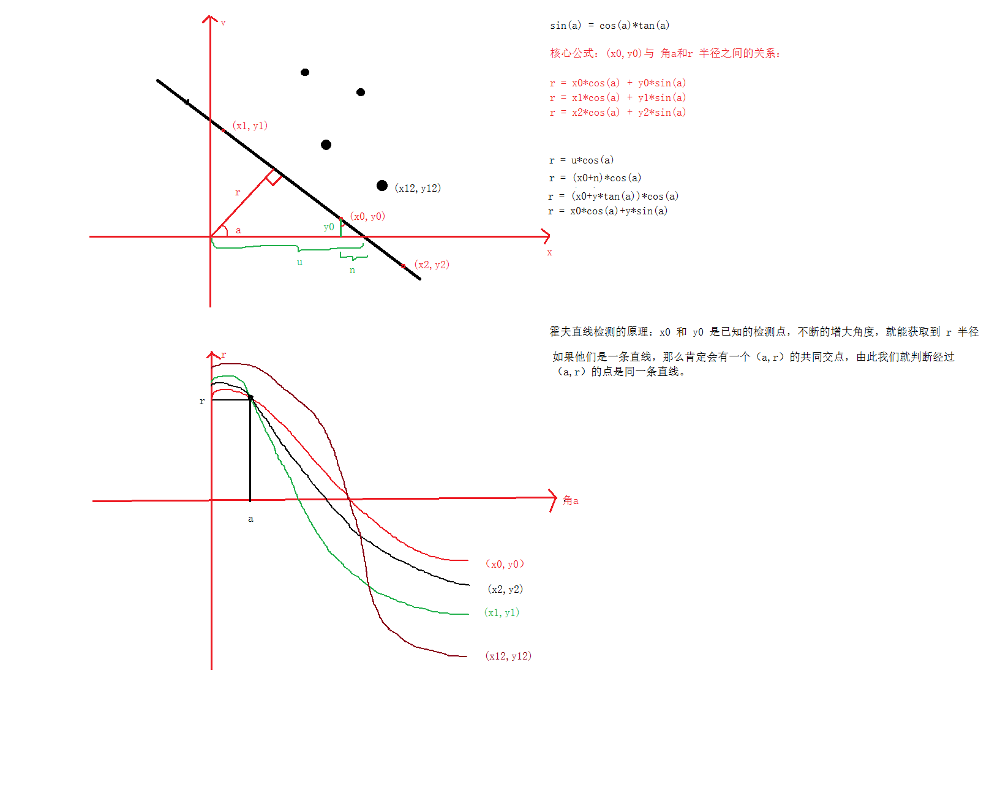
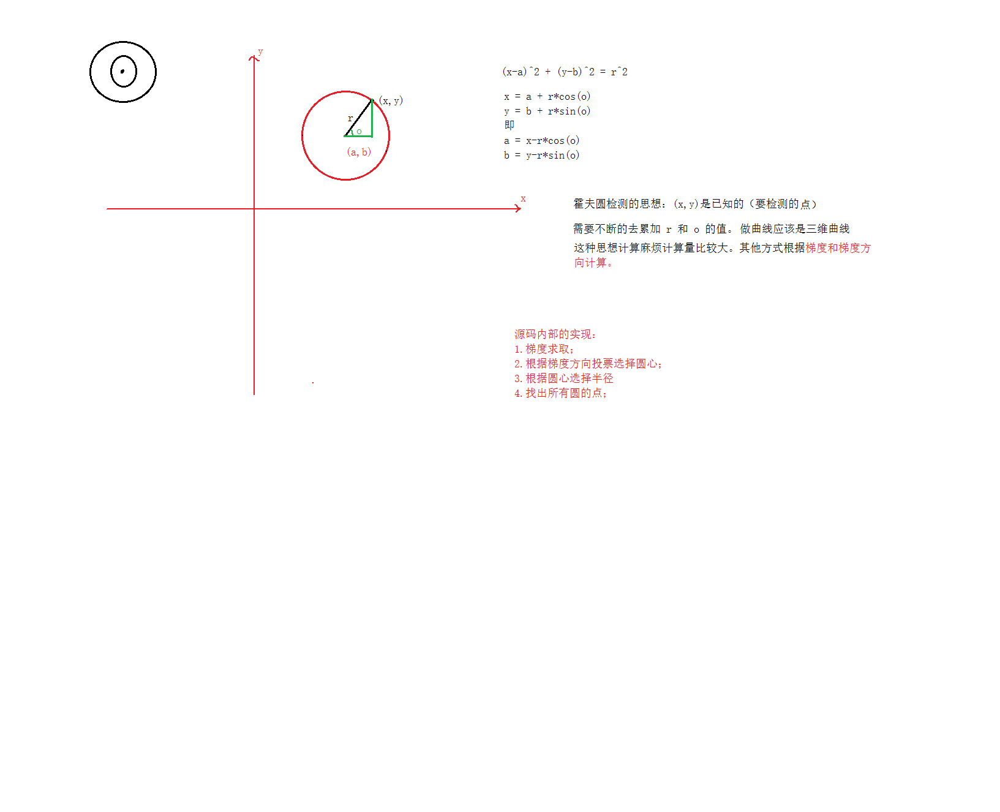

# <center>58.霍夫检测与重映射<center>

# 知识点：

## 1. 霍夫直线检测

先来看下原理图：  


再来看下`opencv`中的代码

```c++
int main(){
	Mat src = imread("E:/houghLine.jpg");

	if (!src.data){
		cout << "read error" << endl;
		return -1;
	}

	imshow("src",src);

	// 1. Canny 边缘检测
	Mat gray;
	cvtColor(src,gray,COLOR_BGR2GRAY);

	Mat cannyImage;
	Canny(gray,cannyImage,200,250,3);
	imshow("cannyImage", cannyImage);

	// 2. HoughLineP
	vector<Vec4f> plines;
	// lines 信息里面包含多条直线，每条直线两个点
	// rho 像素间隙扫描
	// theta 每次增加的角度 CV_PI / 180 = 1度
	// threshold 低阈值
	// minLineLength 线的最小长度
	// maxLineGap 线点之间的间隙
	HoughLinesP(cannyImage, plines, 1, CV_PI / 360, 170, 30, 15);

	for (int i = 0; i < plines.size(); i++)
	{
		Vec4f pline = plines[i];

		line(src, Point(pline[0], pline[1]), Point(pline[1], pline[2]), Scalar(0,0,255));
	}

	imshow("result",src);


	//HoughLines
	waitKey(0);
	return 0;
}
```

## 2. 霍夫圆检测

先来看下原理图：  


解释：  
- 梯度的求取：类似于 x、y 轴的垂直，梯度求取就是`取各个点各个方向直线的垂直线` ，投票将 相交的次数大于多少的才算作圆

```c++
int main(){
	Mat src = imread("E:/HoughCircle.jpg");

	if (!src.data){
		cout << "read error" << endl;
		return -1;
	}

	imshow("src", src);

	// 1. 转灰度图
	Mat gray;
	cvtColor(src, gray, COLOR_BGR2GRAY);


	// 2. HoughLineP
	vector<Vec3f> circles;
	// minDist:10 两个圆之间的最小距离 越大越能减少同心圆的现象
	// param1:100 投票累加结果超过多少才能算圆
	// params2:30 低阈值
	// minRadius: 5 最小的半径
	// maxRadius: 50 最大的半径
	HoughCircles(gray, circles, HOUGH_GRADIENT, 1, 40, 100, 30,5,50);

	for (int i = 0; i < circles.size(); i++)
	{
		Vec3f cc = circles[i];
		circle(src, Point(cc[0], cc[1]), cc[2], Scalar(0, 0, 255),1,LINE_AA);
	}

	imshow("result", src);


	//HoughLines
	waitKey(0);
	return 0;
}
```

## 3.重映射

remap 根据原图按照新定的满足一定规律重新赋值的操作。
g(x,y) = f(h(x,y))  g 新的图片 = h 原图 ， f 函数，

可用于`镜像翻转`

```c++
int main(){
	Mat src = imread("E:/copy.png");

	if (!src.data){
		cout << "read error" << endl;
		return -1;
	}

	imshow("src", src);

	Mat map_x(src.size(),CV_32F);
	Mat map_y(src.size(), CV_32F);

	for (int row = 0; row < src.rows; row++)
	{
		for (int col = 0; col < src.cols; col++)
		{
			// x 轴的翻转
			//map_x.at<float>(row, col) = src.cols - col - 1;
			//map_y.at<float>(row, col) = row;

			// y 轴的翻转
			map_x.at<float>(row, col) = col;
			map_y.at<float>(row, col) = src.rows - row;
		}
	}

	Mat dst;
	remap(src, dst, map_x, map_y, 1);

	imshow("dst", dst);


	//HoughLines
	waitKey(0);
	return 0;
}
```


