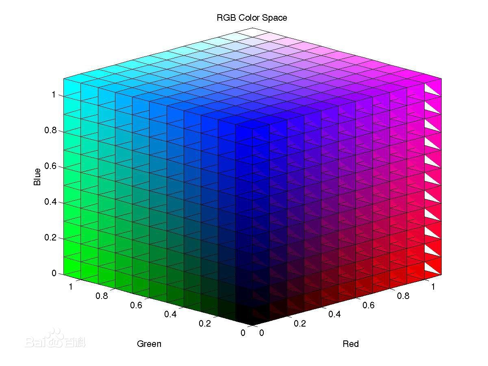
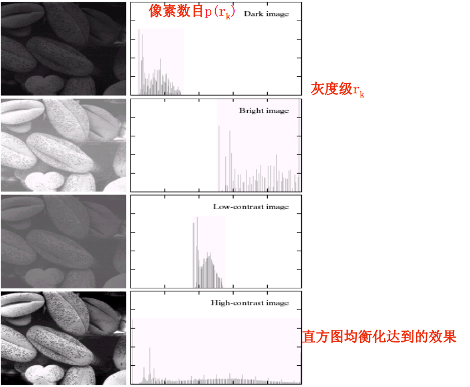

# <center>59.色彩空间与直方图<center>

# 知识点：

## 1. RGB与HSV
    
rgb请看下图:



HSV 分析：  
- H ： Hue 色相 色调，色度 0~360度  360种
- S ：Saturation 饱和度
- V ：Value 亮度


作用：证件照背景替换，扣头发等等

## 2.归一化 normalize

归一化：就是把需要处理的数据经过处理后，限制在你需要的一定范围内。例如`假设我们把训练数据的第一个属性从[-10,+10]缩放到[-1,+1],那么如果测试数据的第一个属性属于区间[-11,+8],我们必须将测试数据转变为[-1.1,+0.8]`


## 3.直方图均衡化 equalizeHistogram

`单通道的图片`，统计其每个像素值的个数。


概念：直方图均衡化是一种简单有效的图像增强技术，通过改变图像的直方图来改变图像中各像素的灰度，主要用于增强动态范围偏小的图像的对比度。
把原始图像的直方图变换为均匀分布（均衡）的形式，这样就增加了像素之间灰度值差别的动态范围，从而达到增强图像整体对比度的效果



```c++

// 单通道均衡化
int main(){
	Mat src = imread("E:/2_04.png");
	if (!src.data){
		cout << "read error" << endl;
		return -1;
	}

	Mat gray;
	cvtColor(src,gray,COLOR_BGR2GRAY);

	imshow("src",src);

	// Histogram 直方图
	Mat dst;
	equalizeHist(gray, dst);
	imshow("dst", dst);

	waitKey(0);
	return 0;
}

// 彩色图均衡化
int main(){
	Mat src = imread("E:/2_05.jpg");
	if (!src.data){
		cout << "read error" << endl;
		return -1;
	}

	imshow("src",src);
	
	vector<Mat> channels;
	split(src,channels);

	Mat blue, green, red;
	blue = channels.at(0);
	green = channels.at(1);
	red = channels.at(2);

	// 直方均衡
	equalizeHist(blue, blue);
	equalizeHist(green, green);
	equalizeHist(red, red);

	Mat dst;
	merge(channels,dst);

	imshow("dst",dst);

	waitKey(0);
	return 0;
}
```


## 4.直方图的计算和绘制


```c++
int main(){
	Mat src = imread("E:/copy.png");
	if (!src.data){
		cout << "read error" << endl;
		return -1;
	}
	imshow("src", src);

	// 获取直方图，B G R 每个都单独分离出来（自己写个代码去分离）
	vector<Mat> bgr_s;
	split(src,bgr_s);

	// b 通道，但为什么不是 蓝色，而是一个灰度图 ?   
	// imshow("bgr_s", bgr_s[0]);

	// 计算获得直方图的数据
	// images 输入的图像
	// nimages 输入图像的个数 
	// channels 第几通道
	// mask 掩模
	// dims 需要统计的通道个数
	// histSize 等级的个数  0-255
	// ranges 数据的范围  0-255
	// uniform true 是否对得到的图片进行归一化处理
	// accumulate 在多个图像时，是否累计计算像素值的个数 false
	/*calcHist(const Mat* images, int nimages,
	const int* channels, InputArray mask,
	OutputArray hist, int dims, const int* histSize,
	const float** ranges, bool uniform = true, bool accumulate = false);*/

	int histSize = 256;
	float range[] = { 0, 256 };
	const float * ranges = { range };
	Mat hist_b, hist_g, hist_r;

	calcHist(&bgr_s[0], 1, 0, Mat(), hist_b, 1, &histSize, &ranges, true, false);
	calcHist(&bgr_s[1], 1, 0, Mat(), hist_g, 1, &histSize, &ranges, true, false);
	calcHist(&bgr_s[2], 1, 0, Mat(), hist_r, 1, &histSize, &ranges, true, false);

	// Mat 存的是像素值，不一定，存任意值
	// 画出来，hist_b 存的是什么？存的是各个灰度值的个数，hist_b 最小值 0 ，最大值 图片的宽*高

	// 归一化
	int hist_h = 400;
	int hist_w = 512; // 256 * 2
	int bin_w = hist_w / histSize; // 画笔大小
	// alpha 最小值 
	/*normalize(InputArray src, InputOutputArray dst, double alpha = 1, double beta = 0,
	int norm_type = NORM_L2, int dtype = -1, InputArray mask = noArray());*/
	// NORM_MINMAX 缩放到一定区域
	normalize(hist_b, hist_b, 0, hist_h, NORM_MINMAX, -1, Mat());
	normalize(hist_g, hist_g, 0, hist_h, NORM_MINMAX, -1, Mat());
	normalize(hist_r, hist_r, 0, hist_h, NORM_MINMAX, -1, Mat());

	// 画到一张图中
	Mat histImage(hist_h, hist_w, CV_8SC4, Scalar()); 
	for (int i = 0; i < histSize; i++)
	{
		// 开始点，结束点 255
		line(
			histImage,
			Point((i - 1)*bin_w, hist_h - hist_b.at<float>(i - 1)),
			Point(i*bin_w, hist_h - hist_b.at<float>(i)),
			Scalar(255, 0, 0), bin_w, LINE_AA);
		line(
			histImage,
			Point((i - 1)*bin_w, hist_h - hist_g.at<float>(i - 1)),
			Point(i*bin_w, hist_h - hist_g.at<float>(i)),
			Scalar(0, 255, 0), bin_w, LINE_AA);
		line(
			histImage,
			Point((i - 1)*bin_w, hist_h - hist_r.at<float>(i - 1)),
			Point(i*bin_w, hist_h - hist_r.at<float>(i)),
			Scalar(0, 0, 255), bin_w, LINE_AA);
	}

	imshow("histImage", histImage);

	waitKey(0);
	return 0;
}
```


