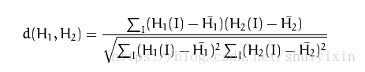
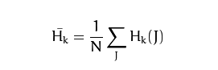
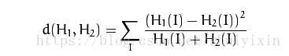
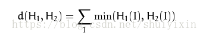
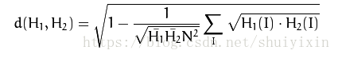

# <center>60.直方图比较和匹配<center>


# 1. 直方图比较 （compareHist 2组数据去对比）

`compareHist( const SparseMat& H1, const SparseMat& H2, int method )`

## 1.1 相关性比较 HISTCMP_CORREL （多少的时候是最好的  1）  N bins  直方图的等级
  
 
## 1.2 卡方比较 HISTCMP_CHISQR    (多少的时候是最好的  0)


## 1.3 十字交叉性 HISTCMP_INTERSECT

 
## 1.4 巴氏距离 CV_COMP_BHATTACHARYYA  (多少的时候是最好的  0)


```c++
int main(){
	// 三张图
	Mat src1 = imread("E:/test.jpg");
	Mat src2 = imread("E:/copy.png");
	Mat src3 = imread("E:/test3.jpg");

	if (!src1.data || !src2.data || !src3.data){
		cout << "read error" << endl;
		return -1;
	}

	// RGB -> HSV , 计算 HS 直方图3
	Mat hsv1, hsv2, hsv3;
	cvtColor(src1, hsv1, COLOR_BGR2HSV);
	cvtColor(src2, hsv2, COLOR_BGR2HSV);
	cvtColor(src3, hsv3, COLOR_BGR2HSV);

	// 计算直方图3（取 h 和 s 两个）
	int channels[] = { 0, 1 };
	// 复数（h的直方图放一个  s的直方图放一个）
	MatND hist1, hist2, hist3;
	int h_bins = 50; // h 的等级个数 
	int s_bins = 50; // s 的等级个数
	int hist_size[] = { h_bins, s_bins };
	float h_rangs[] = { 0, 180 };// h 通道 最大不会超过 180
	float s_rangs[] = { 0, 255 };// s 通过 最大不超过 255
	const float *rangs[] = { h_rangs, s_rangs };
	calcHist(&hsv1, 1, channels, Mat(), hist1, 2, hist_size, rangs);
	calcHist(&hsv2, 1, channels, Mat(), hist2, 2, hist_size, rangs);
	calcHist(&hsv3, 1, channels, Mat(), hist3, 2, hist_size, rangs);

	// 归一化  0 - 1
	normalize(hist1, hist1, 0, 1, NORM_MINMAX);
	normalize(hist2, hist2, 0, 1, NORM_MINMAX);
	normalize(hist2, hist2, 0, 1, NORM_MINMAX);

	// 两个直方图比较
	// compareHist( const SparseMat& H1, const SparseMat& H2, int method )
	double hist1_hist1 = compareHist(hist1, hist1, HISTCMP_CORREL); // 最好的
	double hist1_hist2 = compareHist(hist1, hist2, HISTCMP_CORREL); // 接近于 1
	double hist1_hist3 = compareHist(hist1, hist3, HISTCMP_CORREL); // < 0.8

	cout << hist1_hist1 << endl;
	cout << hist1_hist2 << endl;
	cout << hist1_hist3 << endl;

	imshow("src1", src1);
	imshow("src2", src2);
	imshow("src3", src3);

	waitKey(0);
	return 0;
}
```

# 2. 直方图反向投射 (反射投影的次数 （不是像素值）)
`可用于截取`

```c++
calcBackProject(const Mat* images, int nimages,
		const int* channels, InputArray hist,
		OutputArray backProject, const float** ranges,
		double scale = 1, bool uniform = true);
```

```c++
Mat hueImage;
int bins = 2;
int max_bins = 180;

void hist_backprojection(int, void*){
	// 直方图反向投影到 Mat
	// calcBackProject
	//calcBackProject(const Mat* images, int nimages,
	//	const int* channels, InputArray hist,
	//	OutputArray backProject, const float** ranges,
	//	double scale = 1, bool uniform = true);

	Mat hist;
	int hist_size = MAX(bins,2);
	float hue_rang[] = { 0, 180 };
	const float *ranges[] = { hue_rang };
	calcHist(&hueImage, 1, 0, Mat(), hist, 1, &hist_size, ranges);
	normalize(hist, hist, 0, 255, NORM_MINMAX);

	// 反射投影的次数 （不是像素值）
	Mat backProject;
	calcBackProject(&hueImage, 1, 0, hist, backProject, ranges);

	imshow("BackProject", backProject);
}

int main()
{
	Mat src = imread("C:/Users/hcDarren/Desktop/android/hand.png");

	if (!src.data){
		cout << "读取文件出错" << endl;
	}

	Mat hsv;
	cvtColor(src, hsv, COLOR_BGR2HSV);
	// 作业，明天讲
	vector<Mat> hsv_s;
	split(hsv, hsv_s);
	hueImage = hsv_s[0];

	// 创建一个窗口
	namedWindow("BackProject");
	createTrackbar("backprojection", "BackProject", &bins, max_bins, hist_backprojection);
	hist_backprojection(bins, 0);

	imshow("src", src);

	waitKey(0);
	return 0;
}
```

# 3.[直方图模板匹配](http://www.opencv.org.cn/opencvdoc/2.3.2/html/doc/tutorials/imgproc/histograms/template_matching/template_matching.html)

`用于找寻相似的部分`

`matchTemplate(InputArray image, InputArray templ,
 		OutputArray result, int method, InputArray mask = noArray());`
 		
- TM_SQDIFF : 平方差匹配。这类方法利用平方差来进行匹配,最好匹配为0.匹配越差,匹配值越大.
- TM_SQDIFF_NORMED：标准平方差匹配
- TM_CCORR：相关匹配。这类方法采用模板和图像间的乘法操作,所以较大的数表示匹配程度较高,0标识最坏的匹配效果.
- TM_CCORR_NORMED：标准相关匹配
- TM_CCOEFF：相关匹配。这类方法将模版对其均值的相对值与图像对其均值的相关值进行匹配,1表示完美匹配,-1表示糟糕的匹配,0表示没有任何相关性(随机序列).
- TM_CCOEFF_NORMED：标准相关匹配。

 		
`CV_EXPORTS_W void minMaxLoc(InputArray src, CV_OUT double* minVal,
 		CV_OUT double* maxVal = 0, CV_OUT Point* minLoc = 0,
 		CV_OUT Point* maxLoc = 0, InputArray mask = noArray());`

```c++
int main()
{
	Mat src = imread("C:/Users/hcDarren/Desktop/android/qd.jpg");
	Mat tmpl = imread("C:/Users/hcDarren/Desktop/android/template.png");
	if (!src.data){
		cout << "读取文件出错" << endl;
	}

	/*matchTemplate(InputArray image, InputArray templ,
		OutputArray result, int method, InputArray mask = noArray());*/

	Mat result(src.rows - tmpl.rows + 1, src.cols - tmpl.cols + 1, CV_32FC1);
	// 模板匹配   result  匹配计算的结果 ， 大小应该是多少 image.cols image.rows
	matchTemplate(src, tmpl, result, TM_CCORR_NORMED);

	// 从结果里面去找最小值，for , 找到那个最小值的点 Point， for 去找 
	CV_EXPORTS_W void minMaxLoc(InputArray src, CV_OUT double* minVal,
		CV_OUT double* maxVal = 0, CV_OUT Point* minLoc = 0,
		CV_OUT Point* maxLoc = 0, InputArray mask = noArray());
	// 传出参数：minVal 在函数中通过指针赋值，当做返回值用
	double minVal = 0;
	double maxVal = 0;
	Point minLoc = 0;
	Point maxLoc = 0;
	minMaxLoc(result, &minVal, &maxVal, &minLoc, &maxLoc);

	cout << maxVal << endl;

	// 画出来
	rectangle(src, maxLoc, Point(maxLoc.x + tmpl.cols, maxLoc.y + tmpl.rows), Scalar(0, 0, 255), 2, 8);

	imshow("src", src);

	waitKey(0);
	return 0;
}
```


