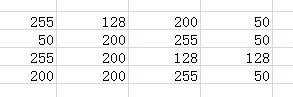
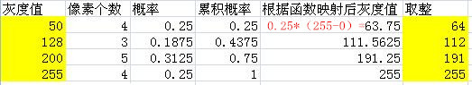
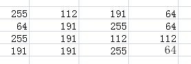

# <center>65.手写直方图和直方均衡<center>

# 知识点：

## 1.亮度增强(线性方式)
```c++
int main(){
	Mat src = imread("E:/2_05.jpg");
	if (!src.data){
		cout << "read error" << endl;
		return -1;
	}

	imshow("src",src);

	cout << src.channels() << endl;

	Mat dst = src.clone();
	for (int row = 0; row < src.rows; row++)
	{
		for (int col = 0; col < src.cols; col++)
		{
			Vec3b pixels = src.at<Vec3b>(row,col);
			dst.at<Vec3b>(row, col)[0] = saturate_cast<uchar>(pixels[0] + 30);
			dst.at<Vec3b>(row, col)[1] = saturate_cast<uchar>(pixels[1] + 30);
			dst.at<Vec3b>(row, col)[2] = saturate_cast<uchar>(pixels[2] + 30);
		}
	}

	imshow("dst",dst);

	waitKey(0);
	return 0;
}
```

## 2.直方均衡，提升对比度

```c++
int main(){
	Mat src = imread("E:/2_05.jpg");
	if (!src.data){
		cout << "read error" << endl;
		return -1;
	}

	imshow("src", src);

	Mat hsv;
	cvtColor(src,hsv,COLOR_BGR2HSV);

	vector<Mat> hsv_s;
	split(hsv,hsv_s);

	equalizeHist(hsv_s[2],hsv_s[2]);
	merge(hsv_s,hsv);
	cvtColor(hsv,src,COLOR_HSV2BGR);

	imshow("dst",src);

	waitKey(0);
	return 0;
}
```


## 3. 手写直方图计算源码

```c++
// 手写直方图计算源码
void calcHist(const Mat &mat,Mat &hist){
	// int 存
	hist.create(1, 256, CV_32S);
	for (int i = 0; i < hist.cols; i++)
	{
		hist.at<int>(0, i) = 0;
	}

	for (int row = 0; row < mat.rows; row++)
	{
		for (int col = 0; col < mat.cols; col++)
		{
			// 灰度等级的角标
			int index = mat.at<uchar>(row, col);
			hist.at<int>(0, index) += 1;
		}
	}
}

void normalize(const Mat &src, Mat &dst, int n_max){
	// 0 ~ n_max;
	int max_value = 0;
	for (int row = 0; row < src.rows; row++)
	{
		for (int col = 0; col < src.cols; col++)
		{
			int value = src.at<int>(row, col);
			max_value = max(value, max_value);
		}
	}

	dst.create(src.size(),src.type());
	for (int row = 0; row < src.rows; row++)
	{
		for (int col = 0; col < src.cols; col++)
		{
			int value = src.at<int>(row, col);
			dst.at<int>(row, col) = 1.0 * value / max_value * n_max;
		}
	}
}

// 3. 手写直方图计算源码
int main(){
	Mat src = imread("E:/2_05.jpg");
	if (!src.data){
		cout << "read error" << endl;
		return -1;
	}

	imshow("src", src);

	Mat gray;
	cvtColor(src,gray,COLOR_BGR2GRAY);
	imshow("gray",gray);

	// hist 没有宽高，是生成了一个空的数组
	Mat hist;
	calcHist(gray,hist);
	cout << hist << endl;

	// 画直方图，归一化
	normalize(hist,hist,255);
	cout << hist << endl;

	// 画直方图
	int bin_w = 2;
	int grad = 256;
	Mat hist_mat(grad,bin_w * 256,CV_8UC3);
	for (int i = 0; i < grad; i++)
	{
		Point start(i*bin_w, hist_mat.rows);
		Point end(i*bin_w, hist_mat.rows - hist.at<int>(0,i));
		line(hist_mat, start, end, Scalar(255, 0, 255), bin_w, LINE_AA);
	}

	imshow("hist_mat",hist_mat);

	waitKey(0);
	return 0;
}
```


##  4. 手写直方图均衡

假设有如下图像：
  


得图像的统计信息如下图所示，并根据统计信息完成灰度值映射:  



映射后的图像如下所示：  




```c++
// 4.1 直方图的统计
// 4.2 计算直方图中像素的概率
// 4.3 生成一张映射表(255 * 累加概率)
// 4.4 从映射表中查找赋值
void equalizeHist(Mat &src,Mat &dst){
	Mat hist;
	// 1.直方图的统计
	calcHist(src,hist);
	// 2.计算直方图中像素的概率
	Mat prob_mat(hist.size(),CV_32FC1);

	float image_size = 0;
	for (int i = 0; i < hist.cols; i++)
	{
		image_size += hist.at<int>(0, i);
	}

	for (int i = 0; i < hist.cols; i++)
	{
		int times = hist.at<int>(0, i);
		float prob = times / image_size;
		prob_mat.at<float>(0, i) = prob;
	}
	// 3. 计算累加概率 256 （可读）
	float prob_sum = 0;
	for (int i = 0; i < hist.cols; i++)
	{
		prob_sum += prob_mat.at<float>(0, i);
		prob_mat.at<float>(0, i) = prob_sum;
	}
	// 生成映射表
	Mat map(hist.size(), CV_32FC1);
	for (int i = 0; i < prob_mat.cols; i++)
	{
		map.at<float>(0, i) = 255 * prob_mat.at<float>(0, i); // 255 * 概率
	}

	dst.create(src.size(), src.type());
	for (int row = 0; row < src.rows; row++)
	{
		for (int col = 0; col < src.cols; col++)
		{
			uchar pixels = src.at<uchar>(row, col);
			dst.at<uchar>(row, col) = map.at<float>(0,pixels);
		}
	}
}


int main(){
	Mat src = imread("E:/2_05.jpg");
	if (!src.data){
		cout << "read error" << endl;
		return -1;
	}

	imshow("src", src);

	Mat gray;
	cvtColor(src, gray, COLOR_BGR2GRAY);
	imshow("gray", gray);
	equalizeHist(gray,gray);
	imshow("dst",gray);
	
	//vector<Mat> channels;
	//split(src,channels);

	//Mat blue = channels.at(0);
	//Mat green = channels.at(0);
	//Mat red = channels.at(0);

	//equalizeHist(blue, blue);
	//equalizeHist(green, green);
	//equalizeHist(red, red);

	//Mat dst;
	//merge(channels, dst);

	//imshow("dst", dst);

	waitKey(0);
	return 0;
}
```


