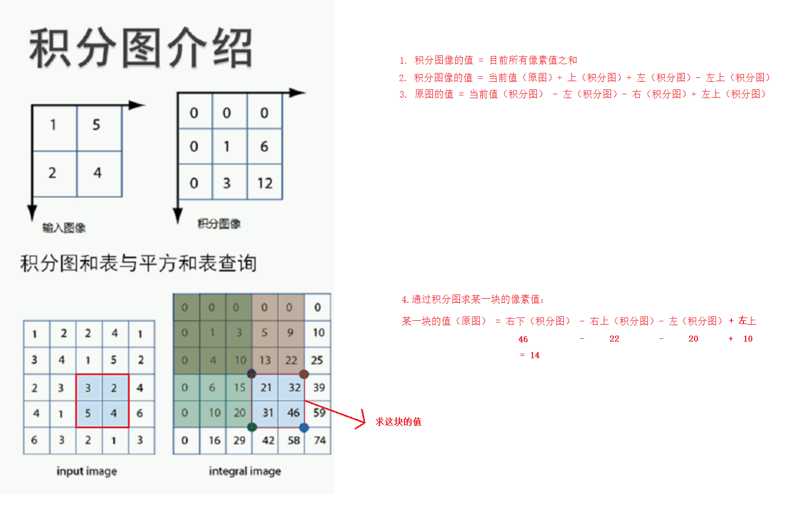
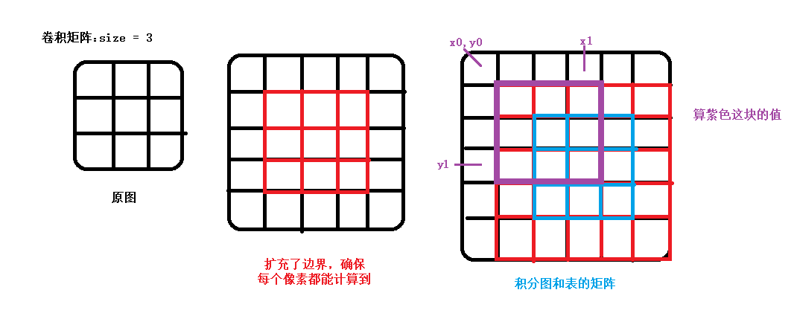
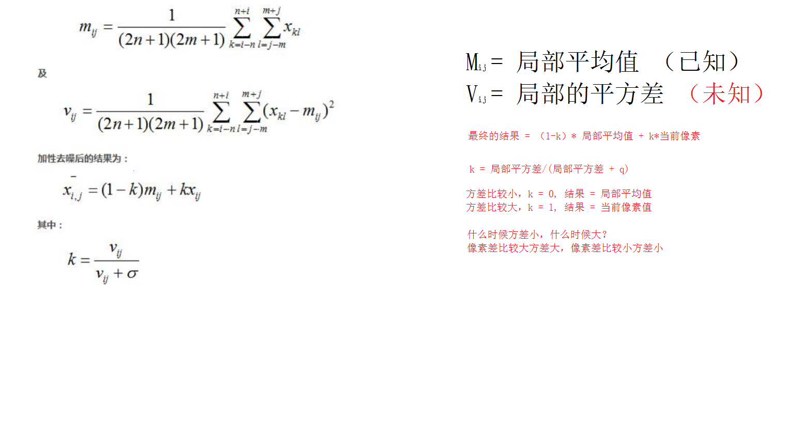
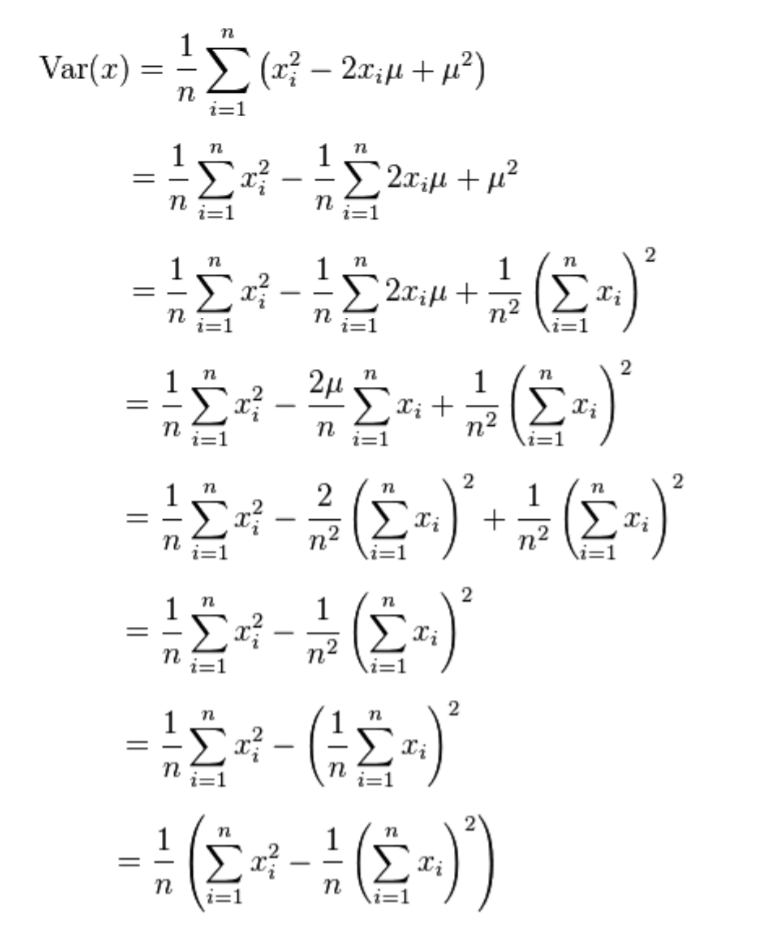

# <center>66.人脸美容效果-积分图<center>

# 1. 双边滤波美容
```c++
int main(){
	Mat src = imread("E:/meirong.jpg");

	if (!src.data){
		cout << "read error" << endl;
		return -1;
	}

	imshow("src",src);

	Mat dst;
	bilateralFilter(src,dst,0,100,5);
	imshow("dst", dst);

	waitKey(0);
	return 0;
}
```

# 2.卷积模糊算法，时间复杂度分析

`时间复杂度 = src.rows * src.cols * size * size`

```c++
int main(){
	Mat src = imread("E:/meirong.jpg");

	if (!src.data){
		cout << "read error" << endl;
		return -1;
	}

	imshow("src", src);

	// 高斯（模糊），计算高斯卷积核，卷积操作，考虑像素之间的差值（更好的保留图像的边缘）

	Mat dst;

	int size = 10000;
	Mat kernel = Mat::ones(size, size, CV_32FC1) / (size * size);

	long st = clock();
	filter2D(src,dst,src.depth(),kernel);
	long et = clock();
	double time = static_cast<double>((et - st) / CLOCKS_PER_SEC);
	cout << "time = " << time << endl;

	//时间复杂度 = src.rows * src.cols * size * size

	imshow("dst", dst);

	waitKey(0);
	return 0;
}
```


# 3. 积分图算法介绍

看图更明白些：




#  4. 使用积分图算法对卷积模糊进行优化

使用到的 api

```c++
// @param sum ：积分和表
// @param sqsum ：平方和表
// @param sdepth ：积分和表的深度
// @param sqdepth ：平方和表的深度 如果是：CV_32F，计算的时候就以 float 计算
CV_EXPORTS_AS(integral2) void integral( InputArray src, OutputArray sum,
                                        OutputArray sqsum, int sdepth = -1, int sqdepth = -1 );
```



`Vec3b:vector<uchar, 3> 不能超过 255`

`Vec3i:vector<int, 3>`

```c++
void meanBlur(Mat &src, Mat &dst, int size){
	// 卷积的 size 必须确保为基数 size % 2 == 1
	// 填充周围，方便计算
	Mat mat;
	int radius = size / 2;
	copyMakeBorder(src,mat,radius,radius,radius,radius,BORDER_DEFAULT);
	// 求积分图
	Mat sum_mat, sqsum_mat;
	integral(mat,sum_mat,sqsum_mat,CV_32S,CV_32S);

	dst.create(src.size(),src.type());
	int channels = src.channels();
	int area = size * size;
	// 求四个点，左上，左下，右上，右下
	int x0 = 0, x1 = 0, y0 = 0, y1 = 0;
	for (int row = 0; row < src.rows; row++)
	{	
		y0 = row;
		y1 = y0 + size;
		for (int col = 0; col < src.cols; col++)
		{
			x0 = col;
			x1 = x0 + size;
			for (int i = 0; i < channels; i++)
			{
				// 获取四个点的值
				int lt = sum_mat.at<Vec3i>(y0, x0)[i];
				int lb = sum_mat.at<Vec3i>(y1, x0)[i];
				int rt = sum_mat.at<Vec3i>(y0, x1)[i];
				int rb = sum_mat.at<Vec3i>(y1, x1)[i];

				// 区块的合
				int sum = rb - lb - rt + lt;
				dst.at<Vec3b>(row, col)[i] = sum / area;
			}
		}
	}
}


int main(){
	Mat src = imread("E:/meirong.jpg");

	if (!src.data){
		cout << "read error" << endl;
		return -1;
	}

	imshow("src", src);

	// 高斯（模糊），计算高斯卷积核，卷积操作，考虑像素之间的差值（更好的保留图像的边缘）

	Mat dst;
	int size = 15; // size == 10001 时 time = 1 秒
	long st = clock();
	meanBlur(src,dst,size);
	long et = clock();
	double time = static_cast<double>((et - st) / CLOCKS_PER_SEC);
	cout << "time = " << time << endl;

	imshow("dst", dst);

	waitKey(0);
	return 0;
}
```

# 5.快速边缘保留算法

先看两张图：





具体的请看[67.人脸美容效果2-边缘处理](https://github.com/EastUp/CPractice/blob/master/markdown/67.OpenCV-%E4%BA%BA%E8%84%B8%E7%BE%8E%E5%AE%B9%E6%95%88%E6%9E%9C2-%E8%BE%B9%E7%BC%98%E5%A4%84%E7%90%86.md)


