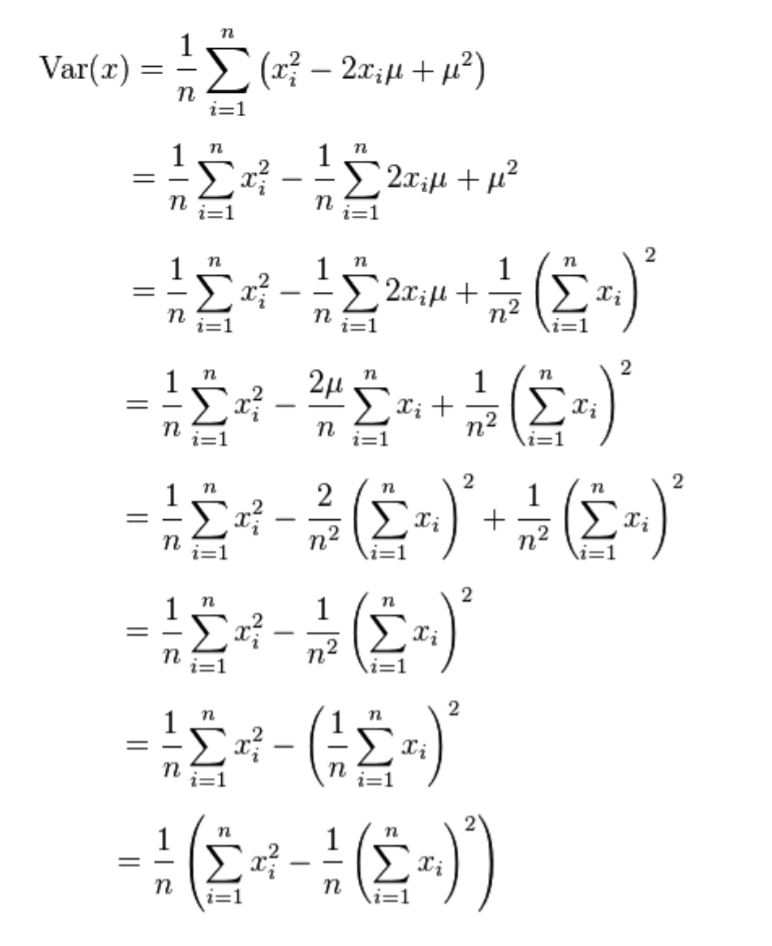

# <center>67.人脸美容效果2-边缘处理<center>

# 1.快速边缘保留算法

先看两张图：




具体代码

```c++
// 1. 快速边缘保留

#include<opencv2/opencv.hpp>
#include<iostream>

using namespace cv;
using namespace std;


// 1. 快速边缘保留

int getBlockSum(Mat &sum_mat,int x0,int y0,int x1,int y1,int ch){
    // 获取四个点的值（因为肯定会超过 255 所以需要用Vec3i 来装）
    int lt = sum_mat.at<Vec3i>(y0, x0)[ch];
    int lb = sum_mat.at<Vec3i>(y1, x0)[ch];
    int rt = sum_mat.at<Vec3i>(y0, x1)[ch];
    int rb = sum_mat.at<Vec3i>(y1, x1)[ch];

    // 区块的合
    int sum = rb - lb - rt + lt;
    return sum;
}

float getBlockSqSum(Mat &sqsum_mat, int x0, int y0, int x1, int y1, int ch){
    // 获取四个点的值（因为肯定会超过 255 所以需要用Vec3f 来装）
    float lt = sqsum_mat.at<Vec3f>(y0, x0)[ch];
    float lb = sqsum_mat.at<Vec3f>(y1, x0)[ch];
    float rt = sqsum_mat.at<Vec3f>(y0, x1)[ch];
    float rb = sqsum_mat.at<Vec3f>(y1, x1)[ch];

    // 区块的合
    float sqsum = rb - lb - rt + lt;
    return sqsum;
}

// 积分图的模糊算法 size 模糊的直径
void fastBlateralBlur(Mat &src, Mat &dst, int size,int sigma){
    // 卷积的 size 必须确保为基数 size % 2 == 1
    // 填充周围，方便计算
    Mat mat;
    int radius = size / 2;
    copyMakeBorder(src,mat,radius,radius,radius,radius,BORDER_DEFAULT);
    // 求积分图
    Mat sum_mat, sqsum_mat;
    integral(mat,sum_mat,sqsum_mat,CV_32S,CV_32F);

    dst.create(src.size(),src.type());
    int channels = src.channels();
    int area = size * size;
    // 求四个点，左上，左下，右上，右下
    int x0 = 0, x1 = 0, y0 = 0, y1 = 0;
    for (int row = 0; row < src.rows; row++)
    {
        y0 = row;
        y1 = y0 + size;
        for (int col = 0; col < src.cols; col++)
        {
            x0 = col;
            x1 = x0 + size;
            for (int i = 0; i < channels; i++)
            {
                // 区块的合
                int sum = getBlockSum(sum_mat,x0,y0,x1,y1,i);
                float sqsum = getBlockSqSum(sqsum_mat, x0, y0, x1, y1, i);

                float diff_sq = (sqsum - (sum*sum) / area) / area;
                float k = diff_sq / (diff_sq + sigma);

                int pixels = src.at<Vec3b>(row, col)[i];
                pixels = (1 - k)*(sum / area) + k * pixels;

                dst.at<Vec3b>(row, col)[i] = pixels;
            }
        }
    }
}

void skinDetect(Mat &src, Mat &skinMask){
    skinMask.create(src.size(),CV_8UC1);
    int rows = src.rows;
    int cols = src.cols;

    Mat ycrcb;
    cvtColor(src,ycrcb,COLOR_BGR2YCrCb);
    for (int row = 0; row < rows; row++)
    {
        for (int col = 0; col < cols; col++)
        {
            Vec3b pixels = ycrcb.at<Vec3b>(row, col);
            uchar y = pixels[0];
            uchar cr = pixels[1];
            uchar cb = pixels[2];

            if (y>80 && 85 < cb < 135 && 135 < cr < 180){
                // 255 代表人脸区域
                skinMask.at<uchar>(row,col) = 255;
            }
            else{
                skinMask.at<uchar>(row, col) = 0;
            }
        }
    }
}

void fuseSkin(Mat &src,Mat &blur_mat, Mat &dst, Mat &skinMask){
    // 融合
    dst.create(src.size(),src.type());
    // 处理一些区域，平滑点(所以有些地方的数值就不是0 或者 255了)
    GaussianBlur(skinMask, skinMask, Size(3, 3), 0.0);

    Mat skinMask_f;
    skinMask.convertTo(skinMask_f, CV_32F);
	
    normalize(skinMask_f, skinMask_f, 0.0, 1.0, NORM_MINMAX);

    int rows = src.rows;
    int cols = src.cols;
    int ch = src.channels();
    for (int row = 0; row < rows; row++)
    {
        for (int col = 0; col < cols; col++)
        {
            // 有的区域还是有可能不够平滑
            /*uchar mask_pixels = skinMask.at<uchar>(row, col);
            // 皮肤位置
            if (mask_pixels == 255){
                dst.at<Vec3b>(row, col) = blur_mat.at<Vec3b>(row,col);
            }
            else{
                dst.at<Vec3b>(row, col) = src.at<Vec3b>(row, col);
            }*/

            // src ，通过指针去获取， 指针 -> Vec3b -> 获取
            uchar b_src = src.at<Vec3b>(row, col)[0];
            uchar g_src = src.at<Vec3b>(row, col)[1];
            uchar r_src = src.at<Vec3b>(row, col)[2];

            // blur_mat
            uchar b_blur = blur_mat.at<Vec3b>(row, col)[0];
            uchar g_blur = blur_mat.at<Vec3b>(row, col)[1];
            uchar r_blur = blur_mat.at<Vec3b>(row, col)[2];

            float k = skinMask_f.at<float>(row, col); // k == 1的时候，人脸区域需要取b_blur，否则取b_src

            dst.at<Vec3b>(row, col)[0] = b_blur*k + (1 - k)*b_src;
            dst.at<Vec3b>(row, col)[1] = g_blur*k + (1 - k)*g_src;
            dst.at<Vec3b>(row, col)[2] = r_blur*k + (1 - k)*r_src;
        }
    }

}


int main(){
    Mat src = imread("E:/meirong.jpg");

    if (!src.data){
        cout << "read error" << endl;
        return -1;
    }

    imshow("src", src);

    // 高斯（模糊），计算高斯卷积核，卷积操作，考虑像素之间的差值（更好的保留图像的边缘）

    Mat blur_mat;
    int size = 12; // size == 10001 时 time = 1 秒
    fastBlateralBlur(src, blur_mat, size, size*size);
    imshow("fastBlateralBlur", blur_mat);

    // 皮肤区域检测
    Mat skinMask;
    skinDetect(src, skinMask);
    imshow("skinDetect", skinMask);

    //皮肤区域融合
    Mat fuseDst;
    fuseSkin(src, blur_mat, fuseDst, skinMask);
    imshow("fuseSkin", fuseDst);

    // 边缘的提升（可有可无）
    Mat cannyMask;
    Canny(src,cannyMask,150,300,3,false);
    imshow("cannyMask", cannyMask);

    // 相当于 & 运算
    bitwise_and(src,src,fuseDst,cannyMask);
    imshow("bitwise_and", fuseDst);

    // 稍微提升一下对比度（亮度）
    add(fuseDst,Scalar(10,10,10),fuseDst);
    imshow("add", fuseDst);

    waitKey(0);
    return 0;
}
```


