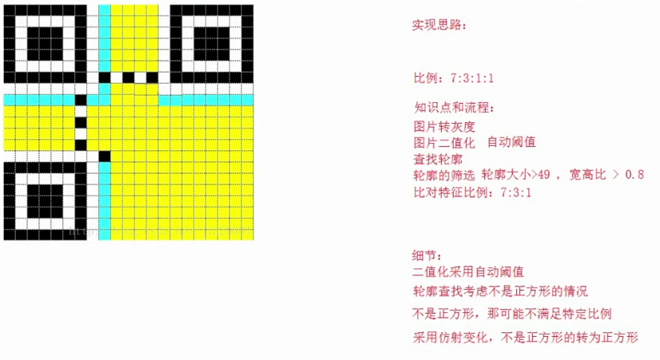

# <center>68.二维码检测<center>

# 1.二维码检测

思路：



代码：

```c++
// 如果是倾斜的 变换菱形 放正
Mat wrapTransfrom(const Mat &gray,const RotatedRect &rect){
	int width = rect.size.width;
	int height = rect.size.height;
	Mat result(Size(width,height),gray.type());

	// 矩阵怎么获取
	vector<Point> srcPoints;
	Point2f pts[4];
	rect.points(pts);
	for (int i = 0; i < 4; i++)
	{
		srcPoints.push_back(pts[i]);
	}
	vector<Point> dstPoints;
	dstPoints.push_back(Point(0,0));
	dstPoints.push_back(Point(width, 0));
	dstPoints.push_back(Point(width, height));
	dstPoints.push_back(Point(0, height));
	
	Mat M = findHomography(srcPoints,dstPoints);
	warpPerspective(gray,result,M,result.size());

	return result;
}

bool isXCorner(const Mat &qrROI){
	// 四个值
	//cb:中心的黑色块数量
	//lw:左边的白色块数量
	//rw:右边的白色块数量
	//lb:左边的黑色块数量
	//rb:右边的黑色块数量
	int cb = 0, lw = 0, rw = 0, lb = 0, rb = 0;

	int width = qrROI.cols; //36
	int height = qrROI.rows; //36
	int cx = width / 2;  // 18
	int cy = height / 2; // 18
	uchar pixels = qrROI.at<uchar>(cy, cx);
	if (pixels == 255){ // 中间肯定是黑色的色块
		return false;
	}

	// 求中心黑色
	int start = 0, end = 0, offset = 0;
	bool findleft = false, findright = false;
	while (true){
		offset++;
		if (offset >= cx)
			break;

		// 中心点往左边扫
		pixels = qrROI.at<uchar>(cy, cx - offset);
		if (!findleft && pixels == 255){
			start = cx - offset; // 左边白色的像素位置 12
			findleft = true;
		}

		// 中心点往右边扫
		pixels = qrROI.at<uchar>(cy, cx + offset);
		if (!findright && pixels == 255){
			end = cx + offset; // 右边白色的像素位置  25
			findright = true;
		}

		if (findleft && findright)
			break;
	}

	if (start == 0 || end == 0)
		return false;
	cb = end - start;
	// 相间的白色
	for (int col = end; col < width - 1; col++)
	{
		pixels = qrROI.at<uchar>(cy, col);
		if (pixels == 0)
			break;
		rw++;  // 5
	}

	for (int col = start; col > 0; col--)
	{
		pixels = qrROI.at<uchar>(cy, col);
		if (pixels == 0)
			break;
		lw++;  // 6
	}
	if (rw == 0 || lw == 0)
		return false;

	

	// 两边的黑色
	for (int col = end+rw; col < width - 1; col++)
	{
		pixels = qrROI.at<uchar>(cy, col);
		if (pixels == 255)
			break;
		rb++;
	}

	for (int col = start - lw; col > 0; col--)
	{
		pixels = qrROI.at<uchar>(cy, col);
		if (pixels == 255)
			break;
		lb++;
	}

	if (rb == 0 || lb == 0)
		return false;

	float sum = cb + lb + rb + lw + rw;

	cout << "cx = " << cx << ",,,cy =" << cy << ",,,width = " << width << ",,,height =" << height << endl;
	cout << "start = " << start << ",,,end =" << end << ",,,cb =" << cb << ",,,lw = " << lw << ",,,rw =" << rw << ",,,lb =" << lb << ",,,rb =" << rb << ",,,sum =" << sum << endl;

	// 求比例 3:1:1:1:1
	cb = (cb / sum)*7.0 + 0.5;
	lb = (lb / sum)*7.0 + 0.5;
	rb = (rb / sum)*7.0 + 0.5;
	lw = (lw / sum)*7.0 + 0.5;
	rw = (rw / sum)*7.0 + 0.5;
	cout << "start = " << start << ",,,end =" << end << ",,,cb =" << cb << ",,,lw = " << lw << ",,,rw =" << rw << ",,,lb =" << lb << ",,,rb =" << rb << ",,,sum =" << sum << endl;

	if ((cb == 3 || cb == 4) && (lw == rw) && (lb == rb) && (lw == 1)){
		// 3:1:1:1:1 或 4:1:1:1:1
		return true;
	}

	return false;
}


// 最好还是加上
bool isYCorner(const Mat& qrROI){
	// 统计白色像素点和黑色像素点
	int bp = 0, wp = 0;
	int width = qrROI.cols;
	int height = qrROI.rows;
	int cx = width / 2;  // 3

	// 中心点是黑色
	int pv = 0;
	for (int row = 0; row < height; row++)
	{
		pv = qrROI.at<uchar>(row, cx);
		if (pv == 0){
			bp++;
		}
		else if(pv == 255){
			wp++;
		}
	}

	if (bp == 0 || wp == 0)
		return false;

	if (wp * 2 > bp || bp > 4 * wp){
		return false;
	}

	return true;
}


int main(){
	Mat src = imread("E:/qcode1.jpg");
	if (!src.data){
		cout << "read error" << endl;
		return -1;
	}
	imshow("src",src);

	// 1.对图像进行灰度图处理
	Mat gray;
	cvtColor(src,gray,COLOR_BGR2GRAY);
	// 2. 二值化处理
	threshold(gray,gray,0,255,THRESH_BINARY | THRESH_OTSU);
	imshow("threshold", gray);
	// 轮廓发现
	vector<vector<Point>> contours;
	findContours(gray,contours,RETR_LIST,CHAIN_APPROX_SIMPLE);

	for (int i = 0; i < contours.size(); i++)
	{
		// 过滤面积
		double area = contourArea(contours[i]);
		if (area < 49)
			continue;

		// 过滤宽高比和宽高大小
		RotatedRect rRect = minAreaRect(contours[i]);
		float w = rRect.size.width;
		float h = rRect.size.height;
		float ratio = min(w,h) / max(w,h);
		if (ratio > 0.9 && w < gray.cols / 2 && h < gray.rows / 2){
			// 去分析，找到满足宽高比的，满足宽高大小的
			Mat qrROI = wrapTransfrom(gray, rRect);
			if (isYCorner(qrROI) && isXCorner(qrROI)){
				drawContours(src, contours, i, Scalar(0, 0, 255), 4);
			}
		}
	}

	imshow("dstsrc",src);

	waitKey(0);
	return 0;
}
```


