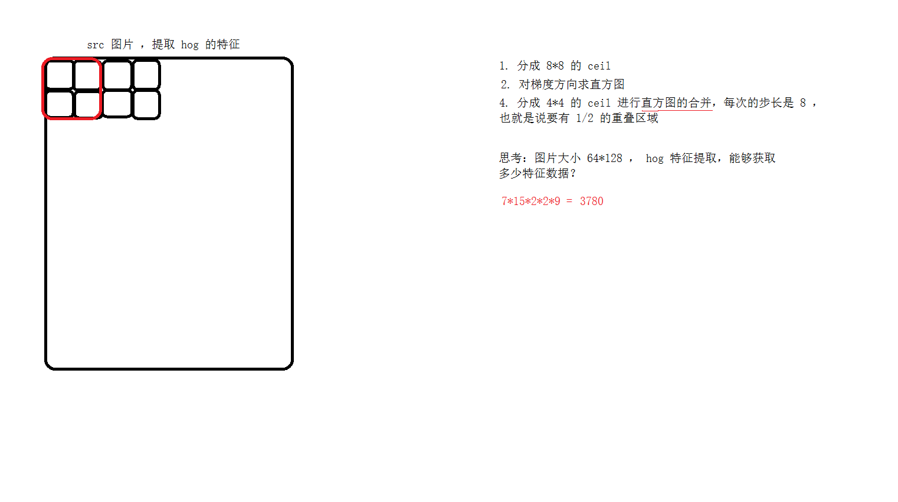
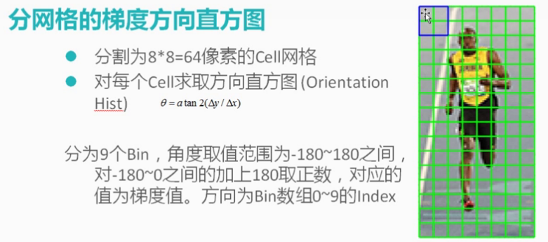
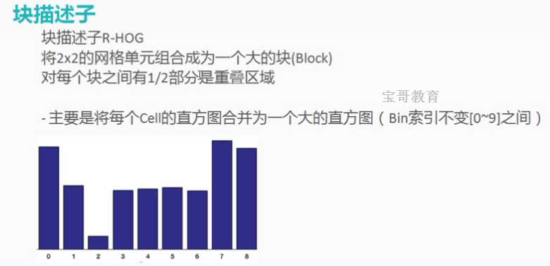
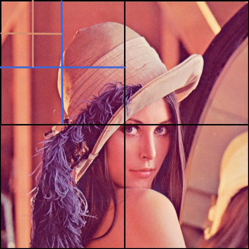
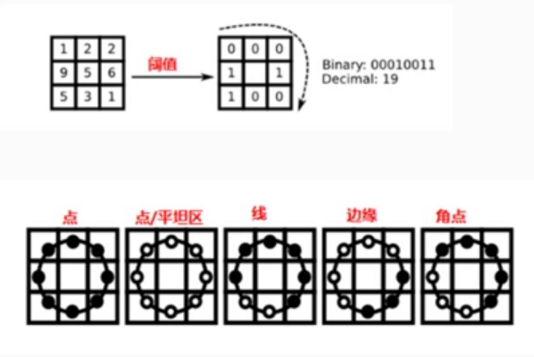
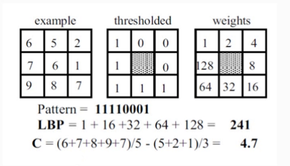
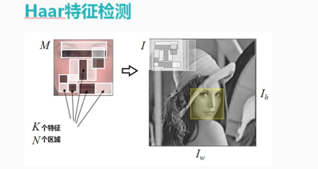

# <center>69.人脸识别 - HOG 和 LBP 特征检测<center>

具体代码请看：**[NDKPractice项目的opencv64](https://github.com/EastUp/NDKPractice/tree/master/opencv64)**

# 知识点：

人脸检测分为以下几步

1. 特征提取：边缘，角点，点，线，平坦区
2. 训练样本：正向样，负向样本 （xml文件）
3. 特征匹配：DDM , detection (发现)  description (描述)  matching (匹配) 

## 1. HOG(Histogram of Oriented Gradient) 特征检测的实现原理





HOG特征提取流程可分为5个部分：检测窗口、归一化图像、计算梯度、统计直方图、梯度直方图归一化、得到HOG特征向量，以下介绍下检测窗口

### 1.1 检测窗口：
HOG通过窗口（window)和块(block)将图像进行分割。通过以细胞(cell)为单位，对图像某一区域的像素值进行数学计算处理。在此先介绍窗口(window)、块(block)和细胞（cell）的概念及之间的联系。

- 窗口(window)：将图像按一定大小分割成多个相同的窗口，滑动。
- 块（block)：将每个窗口按一定大小分割成多个相同的块，滑动。
- 细胞（cell)：将每个窗口按一定大小分割成多个相同的细胞，属于特征提取的单元，静止不动。
- 图像(image)->检测窗口(win)->图像块(block)->细胞单元(cell)



## 2. 实现行人检测

```c++
    // 实现行人检测
    // 训练样本，直接拿过来用
    Mat bgr; // 只能用 bgr 格式的
    cvtColor(src,bgr,COLOR_BGRA2BGR);
    HOGDescriptor descriptor;
    descriptor.setSVMDetector(descriptor.getDefaultPeopleDetector());
    vector<Rect> foundLocations;
    descriptor.detectMultiScale(bgr,foundLocations,0,Size(12,12));
    for (int i = 0; i < foundLocations.size(); ++i) {
        rectangle(src,foundLocations[i],Scalar(255,0,0),2,LINE_AA);
    }
```

## 3.LBP （Local Binary Patterns）特征介绍





## 4.手写 LBP 特征算法实现


```c++
Java_com_east_opencv69_MainActivity_lbpBitmap(JNIEnv *env, jobject thiz, jobject bitmap) {
    // 自己手写 两套 3*3 考虑步长和角度
    Mat src;
    cv_helper::bitmap2mat(env,bitmap,src);
    Mat gray;
    cvtColor(src,gray,COLOR_BGRA2GRAY);
    // 3*3 lbp 计算的特征数据
    Mat result = Mat::zeros(Size(src.cols - 2,src.rows - 2),CV_8UC1);

    // 有点类似卷积操作
    for (int row = 0; row < gray.rows - 1; ++row) {
        for (int col = 0; col < gray.cols - 1; ++col) {
            uchar pixels = gray.at<uchar>(row,col); // 中心点
            int rPixels = 0;
            rPixels |= (pixels <= gray.at<uchar>(row-1,col-1)) << 0;
            rPixels |= (pixels <= gray.at<uchar>(row-1,col)) << 1;
            rPixels |= (pixels <= gray.at<uchar>(row-1,col+1)) << 2;
            rPixels |= (pixels <= gray.at<uchar>(row,col-1)) << 7;
            rPixels |= (pixels <= gray.at<uchar>(row,col+1)) << 3;
            rPixels |= (pixels <= gray.at<uchar>(row+1,col-1)) << 6;
            rPixels |= (pixels <= gray.at<uchar>(row+1,col)) << 5;
            rPixels |= (pixels <= gray.at<uchar>(row+1,col+1)) << 4;

            result.at<uchar>(row-1,col-1) = rPixels;
        }
    }
    jobject  resBitmap = cv_helper::createBitmap(env,result.cols,result.rows,src.type());
    cv_helper::mat2bitmap(env,result,resBitmap);
    return resBitmap;
}
```

## 5.haar 特征介绍




