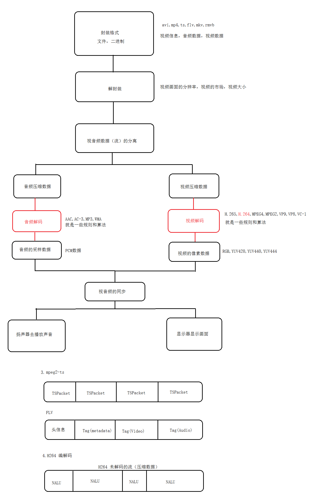

# 
72.音视频技术学习-启动篇

# 1. 音视频学习

- 视音频播放器（华为视频，腾讯视频，喜马拉雅，QQ音乐）
- 短视频（抖音，小火山，微视）
- 视音频的直播（有信，QQ音乐的电台，视频直播）+ OpengGl 

[雷霄骅](https://blog.csdn.net/leixiaohua1020)

Android + NDK　　FFmpeg + SurfaceView + AudioTrack 

# 2. 音视频编解码

先来看下视频的播放流程：

- RGB：8字节，24字节，32字节（RGBA）
- YUV：Y黑白电视，亮度；U 色度，V 饱和度  ， YUV440，YUV420，YUV444 

YUV：发现比例可以不一样，为什么可以，人脸对亮度比较敏感，对色度没这么敏感

YUV444 : Y：U：V 比例 1:1:1，YUV420 比例 2:1:0   

H264 编解码码的思想，认为每一帧每一帧都有相同的数据，就充分利用这个特性  

涉计到的算法：熵编码，帧内预测，帧间预测，环形滤波... 
 
补充：H264码流怎么存？一个一个的 `NALU` 存起来的，大小是不固定的，一个  `NALU` 代表的是一帧画面，区分每个 `NALU` 的办法就是设置两个标志位 

PCM 采样：麦克风，  
- 声道　　　　　: 2声道 （左右声道，立体声） 5point1 环绕声
- 采样率　　　　: 48.0 KHz      1秒钟采样多少个点 48*1000 ， 44100HZ 人耳
- 位深度　　　　: 16位              16byte 存的   最大值？   8 位   

# 3. FFmpeg

- ijkplayer ： ffmpeg ， libyuv ， opensl es , 自己代码
- 微视：基于这个 ffmpeg 
- 音视频通话：基于 webrtc

 ffmpeg 是一个 c 库，要用你的编译 so , 自己去编译，你可以按需加载，减少so库的体积  
 shell 脚本，cmake 语法，linux ， 买最便宜，ubuntu ，mac 可以不用买，终端 -> shell   
 inux 内核基础，android 底层基于 linux 内核 mmap() 等等  

