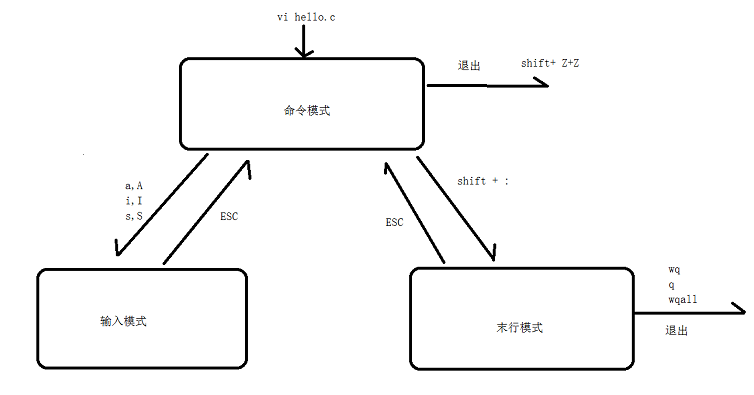
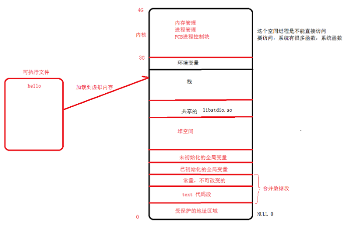

# <center>74.linux系统-文档编辑、应用编译运行<center>


# 知识点：

注意：`未做说明以下都是在命令模式下进行`

编辑过程中遇到的问题：

误按了：`ctrl + z` ： 可以将一个正在前台执行的命令放到后台，并且暂停

再次打开就变成了以下这样

```
E325: 注意
发现交换文件 ".t.txt.swp"
            所有者: root    日期: Sun Aug 25 23:27:33 2019
            文件名: ~root/test/t.txt
            修改过: 否
            用户名: root      主机名: master
           进程 ID: 4803 (仍在运行)
正在打开文件 "t.txt"
              日期: Sun Aug 25 22:17:30 2019

(1) Another program may be editing the same file.  If this is the case,
    be careful not to end up with two different instances of the same
    file when making changes.  Quit, or continue with caution.
(2) An edit session for this file crashed.
    如果是这样，请用 ":recover" 或 "vim -r t.txt"
    恢复修改的内容 (请见 ":help recovery")。
    如果你已经进行了恢复，请删除交换文件 ".t.txt.swp"
    以避免再看到此消息。

交换文件 ".t.txt.swp" 已存在！
以只读方式打开([O]), 直接编辑((E)), 恢复((R)), 退出((Q)), 中止((A)):
```

解决办法：

使用 `fg` :将后台中的命令调至前台继续运行
         

## 1. vim 工作模式



- `gcc hello.c -o a`：编译成可执行文件 `a`
- `./a`：运行可执行文件 a

## 2 vim 命令模式进入输入模式的快捷键
- `i`: 输入,光标前面
- `I`: 输入,光标前面
- `a`: 输入,光标会逻动一个位置
- `A`:输入,光标会逻动到最后
- `o`:输入,光标会逻动到下一行
- `O`:输入,光标会逻动到上一行
- `s`:输入,会删除光标所在字符
- `S`: 输入,会删除光标所在行

- `h`: 向左移动光标
- `l`: 向右移动光标
- `j`: 向下移动光标
- `k`: 向上移动光标

### 2.1.跳转和删除

- `5G`：跳转到第 5 行
- `5回车`或者`G`：跳转到末行行首
- `gg`: 跳转到首行行首
- `$`: 跳转到当行行尾
- `0`: 跳转到当行行首
- `gg=G`: 格式化代码

- `dw`：删除单词从光标到单词结束的地方
- `x`: 删除某个字母
- `d0`: 删除光标至行首
- `v+h/j/k/l+d` 或者 `v+上/下/左/右+d`：删除选中区域
- `dd`: 剪切整行，可以当删除
- `3dd`: 从当前行剪切 3 行，可以当删除

### 2.2. 复制、粘贴
- `yy`: 复制当前行
- `3yy`: 从当前行复制 3 行
- `p`: 粘贴到当前行的`下一行`
- `P`: 粘贴到当前行的`上一行`
- `dd`: 剪切整行
- `3dd`: 从当前行剪切 3 行

### 2.3 查找替换
- `/ + '要查找的内容' +回车`:  查找 , ‘*’或‘n’ 跳转到下一个， ‘N’ 是查看上一个
- `r + '要替换的字符'`：把当前光标字符替换成 ‘要替换的字符’
- `:s /printf/println` : 将当前光标所在行中的`第一个`printf替换成println
- `:%s /printf/println` : 将每一行中的`第一个`printf替换成println
- `:s /printf/println/g` ：将这一行的所有printf替换成println
- `:%s /printf/println/g` : 将所有地方的printf替换成println
- `:1,3s /printf/println/g`: 将1-3行的所有printf替换成println

### 2.4.其它命令
- `u`: 撤销
- `ctrl+r`: 反撤销
- `:sp`: 上下分屏
- `:vsp`: 左右分屏
- `ctrl + ww` : 切换分屏
- `wqall`: 保存退出所有
- `3+K或2+K`: 跳转到光标所指向的函数声明

## 3. gcc 编译的四个步骤
.c 文件 -> 可执行文件，经历了四个步骤

### 3.1 预处理阶段

`将所有的宏定义的替换，类似于 java 的 final`,展开include的文件 

`gcc -E -o hello.i hello.c`: 将 hello.c 文件预处理成 hello.i 文件

### 3.2 预编译阶段

在这个阶段，GCC 才会去检测你代码的规范性，语法是否有错误，gcc 会把代码翻译成汇编

`gcc -S -o hello.s hello.i`:将 hello.i 文件预编译成 hello.i 文件

### 3.3 汇编阶段
把 .s 文件翻译成二进制.o文件（机器的指令）,文本打开的是乱码

`gcc -c -o hello.o hello.s`:将 hello.s 汇编成 hello.o 文件

### 3.4 链接阶段
计算逻辑地址，合并数据段，有些函数是在另外一个 so 库文件中的。

`gcc -o hello hello.o`：这个时候就可以执行`hello`了

## 4.动态库和静态库
`静态库`：其实是内容的拷贝(代码)，运行阶段`没有 .a 文件`了也是可以执行的。
`动态库`：不会拷贝内容，运行阶段起的作用（加载），生成 so 的时候要生成与位置无关的代码，没有 so 不能运行。

### 4.1 静态库的生成:
#### 4.1.1 将 c 生成 .o 

```c++
gcc -c add.c -o add.o  // 将 add.c 文件输出为 .o文件
```

#### 4.1.2. 使用 ar 工具制作静态库

```c++
ar rcs libmath.a add.o xxx.o // 将 add.o 和 xxx.o 文件制作到 libmath.a 中
```

#### 4.1.3. 编译静态库到可执行文件

```c++
gcc a.c libmath.a -o hello // 将 a.c 和 libmath.a 输出到可执行文件 hello 中
```


### 4.2 动态库生成

#### 4.2.1 将 c 生成 .o （要生成与位置无关的代码）

```c++
gcc -c add.c -o add.o -fPIC  // // 将 add.c 文件输出为 .o文件 要加 -fPIC
```

#### 4.2.2 使用 gcc -shared 制作动态库

```c++
gcc -shared -o libmath.so add.o xxx.o // // 将 add.o 和 xxx.o 文件制作到 libmath.so 中
```

#### 4.2.3 编译动态库到可执行文件，需要指定动态库的名称 -l , 指定库路径 -L

```c++
gcc a.c -o a -lmath -L./   // libmath.so 要写成math， ./ 代表当前文件夹
```

## 5.虚拟内存与物理内存

`虚拟内存` 是为了缓解`物理内存`的压力而创建的，他们之间是通过`映射`来进行的联系

每个进程都有4G的虚拟地址空间，其中3G用户空间，1G内核空间（linux），每个进程共享内核空间，独立的用户空间：



