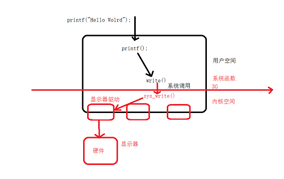
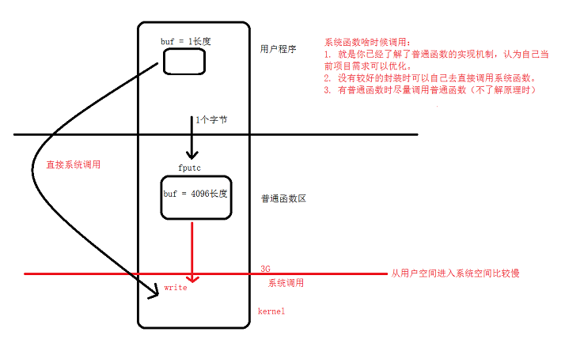
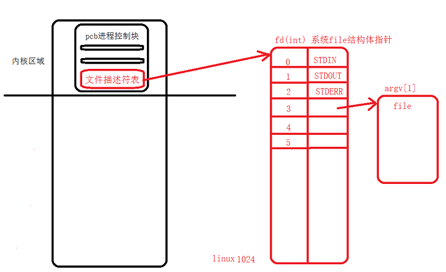

# <center>75.linux系统-内核编程，文件IO与文件描述符<center>


# 1. 系统内核调用

3-4G 是系统的空间（`内核空间`），这部分是由操作系统来管理，那么如果我们要操作这部分数据，只能借助系统提供的一些函数（系统函数），用户调用这些函数就称之为系统调用。



# 2.普通函数与内核函数

系统函数：`open , close , write , read  `

`man 2 ‘系统函数’`：查看系统函数  
`man 3 ‘普通函数’`：查看系统函数

```
// open
int open(const char *pathname, int flags, mode_t mode);
pathname : 文件的路径  
flags : O_APPEND 追加，O_CREAT 没有的时候会创建，O_TRUNC 会截断（清空文件）  
mode：就是创建时的文件权限 ， 只是当前用户可读可写，S_IRUSR|S_IWUSR  
返回的是一个文件句柄 fd , 我们直接通过 fd 去做操作  


int close(int fd); 关闭文件

//  read
ssize_t read(int fd, void *buf, size_t count);
fd：文件句柄
void *buf：读入的缓冲区
count：每次读多少字节数
ssize_t ：返回的是读到真实个数

ssize_t write(int fd, const void *buf, size_t count);
fd：文件句柄
void *buf：写入的缓冲区
count：每次写入的字节数
ssize_t ：返回的是写入真实个数
```

文件操作的错误怎么提示？会有一个宏定义 errno  , 通过 strerror(errno) 获取错误信息，需要打印错误快捷的方式 perror 
void perror(const char *s); s 代表的是错误信息的描述 s: strerror(errno)

普通函数：`fopen，fclose ， fread/fputc ，fwrite/fgetc`

# 3.普通函数和系统函数拷贝文件的区别

fputc 和 fgetc 内部是封装了 read , wirte , 如果拷贝文件，速度区别如下：

- 系统函数每次只读取一个 Byte，速度很慢
- 普通函数每次读取 4096 个 byte，所以很快

Java write 数据，需要 flush 的原理一样，数据还在缓冲区(数据不会自动发送出去)，需要flush一起给到内核空间，在内核空间中调用 write.



# 4.文件描述符（文件句柄）



# 5.lseek 与 fseek
用来获取偏移量 SEEK_SET , SEEK_END, SEEK_CUR   
lseek 他的偏移量，读和写是同一个

# 6.stat 和 lstat
Inode: 370887 ， 文件的权限，盘符的位置。  
硬链接计数就充分的利用了 inode  
硬链接：文件快捷键  
软链接：类似于文件的快捷键，但是你操作任何一个都会被改变  

软连接和硬链接的特点：

软链接：

- 软链接是存放另一个文件的路径的形式存在。
- 软链接可以 跨文件系统 ，硬链接不可以。
- 软链接可以对一个不存在的文件名进行链接，硬链接必须要有源文件。
- 软链接可以对目录进行链接。

硬链接：

- 硬链接，以文件副本的形式存在。但不占用实际空间。
- 不允许给目录创建硬链接。
- 硬链接只有在同一个文件系统中才能创建。
- 删除其中一个硬链接文件并不影响其他有相同 inode 号的文件。
 

不论是硬链接或软链接都不会将原本的档案复制一份，只会占用非常少量的磁碟空间。

```
int stat(const char *pathname, struct stat *buf);
pathname：文件路径

struct stat *buf：stat 结构体指针

作业：stat 获取文件的属性，获取文件的大小就可以


stat 和 lstat 有什么区别？stat 是会穿透的，lstat 不会穿透，穿透软连接

ln -s f_read_write f_read_write.soft ： 创建软连接
```

# 7.目录操作
递归操作

```c++
#include <stdio.h>
#include <errno.h>
#include <dirent.h>
#include <stat.h>

bool isdir(const char* fileName){
    // int stat(const char *pathname,struct stat *buf);
    struct stat* buf; // 作为传入参数
    stat(fileName,&buf);
    mode_t st_mode = buf.st_mode;
    return S_ISDIR(st_mode);
}

int main(int argc, char *argv[]){
    // 打开目录
    DIR *dir = opendir(argv[1]);
    if(dir == NULL){
        perror("open dir fail");
        return -1;
    }

    // struct dirent *readdir(DIR *dirp);
    struct dirent *dirp;
    while((dirp = readdir(dir)) != NULL){
        // printf("%s\t",dirp->d_name);
        // 一个递归
    }
    printf("\n");
    return 0;
}
```
