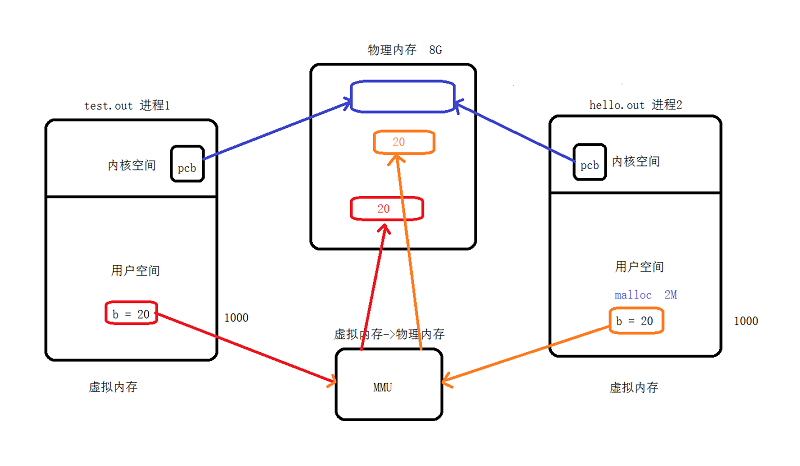
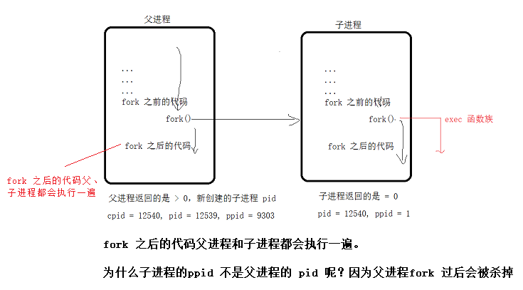

# <center>76.linux系统-进程创建和进程管理<center>

# 1.pcb(process control block)进程控制块

结构体的路径：`~/usr/src/linux-headers-3.5.0-23/include/linux/sched.h`

结构体：

```
struct task_struct {
        // ......

        进程 id

        文件描述符

        进程的状态：初始态，就绪态，运行态，挂起态，终止态

        进程工作目录

        信号相关信息资源

        用户id组id

        进程工作目录

}
```

# **<font color = red>2.内存映射（重点）</font>**

由于应用程序不能直接操作设备硬件地址，所以操作系统提供了这样的一种机制——内存映射，把设备地址映射到进程虚拟地址，`mmap`就是实现内存映射的接口。

`mmap`的好处是，mmap`把设备内存映射到虚拟内存，则用户操作虚拟内存相当于直接操作设备了，省去了用户空间到内核空间的复制过程，相对IO操作来说，增加了数据的吞吐量`。

用户空间映射时，会映射到不同的区域，内核空间映射时，会映射到同一区域的不同地方（共享！！）

每个进程都有4G的虚拟地址空间，其中3G用户空间，1G内核空间（linux），每个进程共享内核空间，独立的用户空间



# **<font color = red>3.fork 创建子进程（重点）</font>**

```c++
#include <stdio.h>
#include <unistd.h>

int main(int argc.const  char* argv[]){
    printf("fork before\n");
    printf("fork before\n");
    printf("fork before\n");
    printf("fork before\n");
    printf("fork before\n");

    pid_t pid = fork();
    
    if(pid == -1){
        printf("fork error!\n");
    }else if(pid == 0){
        printf("i am child process!,pid = %d,ppid = %d\n",getpid(),getppid());
    }else{
        printf("I am parent,cpid = %d,pid = %d,ppid = %d" ,pid,getpid(),getppid());
    } 
    
    printf("fork after\n");
    return 0;
}
```




# **<font color = red>4.父子进程共享（重点）</font>**

## 4.1 父子进程相同：
刚 fork 后，data 段，text 段，堆，栈，环境变量，全局变量，进程工作目录，信号处理方式。（0-3G 部分是共享的）

## 4.2 父子进程不同的：
进程 id ，返回值，各自的父进程，进程创建时间，闹钟，未决信号集 

## 4.3 父子进程共享：
map 映射区，读时共享，写时复制。

# 5. 进程回收

回收的就是残留在内核中的 3-4G 的数据（pcb 进程控制块）

- 孤儿进程：父进程先于子进程结束，则子进程会成为孤儿进程，子进程的父进程成为 init 进程，有 init 进程（进程孤儿院）来回收进程。
- 僵尸进程：子进程结束，父进程尚未回收，该子进程会变成僵尸进程

wait, waitpid 
wait功能：

1. 阻塞等待子线程退出
2. 回收子进程残留的资源
3. 获取子进程退出的状态（怎么死掉的）

```c++
int state;
wait(&state);
```

# 6.监听 APP 应用被卸载

1. fork 一个子进程
2. 监听文件是否被删除了，data/data/xxx包名
3. execl 函数族去执行某些命令（打开浏览器收集用户反馈）  

```c++
// 可以执行自己写好的程序，path 是路径，arg 是可变参数
int execl(const char *path, const char *arg, ...
                       /* (char  *) NULL */);


// 可以执行系统的命令程序，file 是命令的名称，arg 是可变参数
int execlp(const char *file, const char *arg, ...
                       /* (char  *) NULL */);
```

 <font color=red>execl 不会走 fork 之后的 text 代码段，而是会去执行 exec 函数族的命令或者程序</font>
 
 ```c++
 #include <stdio.h>
 #include <unistd.h>
 
 int main(int argc.const  char* argv[]){ // 获取 参数 -l ，[1]才是，[0]是程序本身
     printf("fork before\n");
     printf("fork before\n");
     printf("fork before\n");
     printf("fork before\n");
     printf("fork before\n");
 
     pid_t pid = fork();
     
     if(pid == -1){
         printf("fork error!\n");
     }else if(pid == 0){
         printf("i am child process!,pid = %d,ppid = %d\n",getpid(),getppid());
         execl("ls","ls","-l",NULL); // NULL 代表可变参数的结尾
     }else{
         printf("I am parent,cpid = %d,pid = %d,ppid = %d" ,pid,getpid(),getppid());
     } 
     
     printf("fork after\n");
     return 0;
 }
 ```
