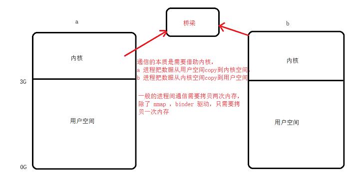
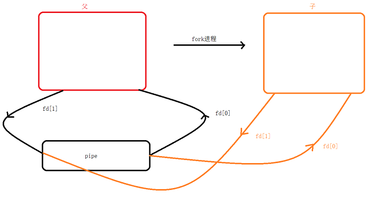
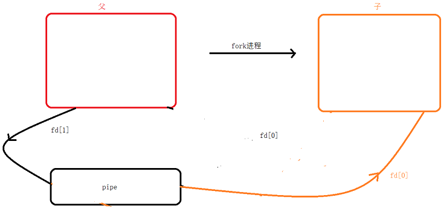
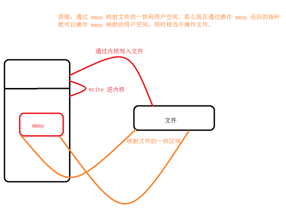

# <center>77.linux系统-IPC进程间通信<center>

# 知识点：

## 1.进程间通信的方式

文件，管道，信号、信号量，共享映射区（共享内存），消息队列，管道，套接字（socket）

着重讲下：

- 管道（使用简单）
- 信号（开销比较小）
- <font color=red>共享映射区</font>
- 套接字（低速稳定）

一般都是通过内核共享空间进行通信



## 2.管道(pipe)




1. 无名管道，<font color=red>半双工的通信方式(数据流向固定：只能 a 的数据写给 b ，或者 b 的数据写给 a )</font>
2. 管道大家可以简单的理解为一种特殊的文件形式，我们可以用文件的读写方法，不是一种简单的文件，只会占用内存。
3. 管道只能是有血缘关系的进程间通信
4. 数据不能自己写自己读
5. 数据一旦读走，不能再次读

```c++
#include <stdio.h>
#include <unistd.h>

int main(){
    int fd[2];
    pid_t  pid;
    char buf[20];
    // 创建管道
    int ret = pipe(pipefd);
    if(ret != 0){
        printf("create pipe error!\n");
    }

    
    pid = fork();
    if(pid < 0){
        printf("fork error!\n");
    }else if(pid == 0){
        // 子进程
        close(fd[1]); // 关闭写端
        // 等等在读
        sleep(1);
        read(fd[0],buf,11);
        // 没有其它读写操作了可以关闭 fd[0]
        printf("pipe read : %s",buf);
    }else{
        // 父进程
        close(fd[0]); // 关闭读端
        write(fd[1],"hello pipe\n",11);
        // 没有其它读写操作了可以关闭 fd[1]
    }

    return 0;
}
```

非法操作：
1. 读管道：  
    1.1 管道中有数据，read 返回实际读到的数据

    1.2 管道中无数据：    

        1.2.1 管道写端被关闭，read 返回 0
    
        1.2.2 管道写端如果没有被关闭，会阻塞等待

2. 写管道：  
    2.1 读端被关闭，异常终止（信号导致）

    2.2 读端未关闭：

        2.2.1 管道数据已满，阻塞等待写入数据（其他人读走）
    
        2.2.2 管道未满，直接将数据写入


## <font color=red>3.共享映射区</font>



binder 驱动，腾讯 MMKV，xlog （日志库）中都会有 `mmap`函数

mmap 注意事项  
1. 指定映射区的大小，必须要小于文件大小
2. 映射区大小必须要大于 0 ，否则会异常
3. 创建映射区需要 read 权限，mmap 的读写权限应该 <= 文件的权限
4. 文件可以先关闭
5. 偏移量必须是 4k 的整数倍
6. MAP_PRIVATE 只会对内存进行修改，不会反应到磁盘上


mmap 万能调用方法：  
open(O_RDWR);  
mmap(NULL, 有效大小，PROT_READ|PROT_WRITE,MAP_SHARED,fd,0)  

```c++
#include <stdio.h>
#include <stdlib.h>
#include <string.h>
#include <unistd.h>
#include <errno.h>
#include <sys/mman.h>
#include <fcntl.h>

void sys_err(const char * msg){
    perror(msg);
    exit(0);
}

int main(){

   /*void *mmap(void *addr, size_t length, int prot, int flags,
              int fd, off_t offset);
   int munmap(void *addr, size_t length);*/
    
    /*
     *  addr：地址，一般可以不传（NULL），传入传出参数
     *  length：内存大小
     *  prot：
     *       PROT_EXEC 内容可以被执行
     *       PROT_READ 内容可以被读取
     *       PROT_WRITE 内容可以被写
     *       PROT_NONE 内容不可访问
     *  flags:
     *       MAP_SHARED 共享
     *       MAP_PRIVATE 私有f
     *       MAP_ANONYMOUS 匿名映射（不基于文件）,fd 参数就传 -1
     *  fd: 文件句柄
     *  offset：偏移大小，必须是 4K 的整数倍，一个物理页映射是 4K。     
     *  
     */
    // 创建打开一个文件
    int fd;
    char *p;
    fd = open("test_map",O_ROWR|O_CREAT|O_TRUNC,0644);
    if(fd == -1){
        sys_err("open file error");
    }

    // 文件变大（不增大的话，映射的是 0）
    ftruncate(fd,20);

    p = (char*)mmap(NULL,20, PROT_READ|PROT_WRITE,MAP_SHARED,fd,0);

    // 关闭了文件，那么后面通过操作 mmap 的空间，能不能写入文件? 能
    close(fd);// 关闭的是系统函数到文件的操作，而 mmap 映射不受影响

    if(p == MAP_FAILED){
        sys_err("mmap error");
    }
    
    strcpy(p,"hello mmap\n");
    printf("--->%s",p);
    
    // 释放 mmap
    munmap(p,20);


    return 0;
}
```

还有示例请可以看[这儿](https://github.com/EastUp/CPractice/tree/master/linux/77.linux%E7%B3%BB%E7%BB%9F-IPC%E8%BF%9B%E7%A8%8B%E9%97%B4%E9%80%9A%E4%BF%A1)


## 4.信号
进程间通信的机制，内核自带的，信号不能携带大量的数据，一般就是一个数字，只有在特定场景下才调用。

怎样才会产生信号：

1. 按键产生: ctrl + c, ctrl+z
2. 系统调用 kill ， raise， abort
3. 软件条件产生， alarm
4. 硬件异常产生，非法访问内存，除 0 ，内存对齐等等
5. 命令产生

信号的处理方式：

1. 忽略此信号
2. 执行系统默认动作
3. 捕捉用户希望动作

信号处理的原理：  
- 信号屏蔽字: 用于屏蔽x信号，内部实现就是一个集合，当 x 信号屏蔽后，再收到该信号，信号处理将推后
- 未决信号集: 信号抵达 x 信号位反转为 1 ， 当信号被处理后重新置为 0 

`man 7 signal`

```
       Signal     Value     Action   Comment
       ──────────────────────────────────────────────────────────────────────
       SIGHUP        1       Term    Hangup detected on controlling terminal
                                     or death of controlling process
       SIGINT        2       Term    Interrupt from keyboard
       SIGQUIT       3       Core    Quit from keyboard
       SIGILL        4       Core    Illegal Instruction
       SIGABRT       6       Core    Abort signal from abort(3)
       SIGFPE        8       Core    Floating point exception
       SIGKILL       9       Term    Kill signal
       SIGSEGV      11       Core    Invalid memory reference
       SIGPIPE      13       Term    Broken pipe: write to pipe with no
                                     readers
       SIGALRM      14       Term    Timer signal from alarm(2)
       SIGTERM      15       Term    Termination signal
       SIGUSR1   30,10,16    Term    User-defined signal 1
       SIGUSR2   31,12,17    Term    User-defined signal 2
       SIGCHLD   20,17,18    Ign     Child stopped or terminated
       SIGCONT   19,18,25    Cont    Continue if stopped
       SIGSTOP   17,19,23    Stop    Stop process
       SIGTSTP   18,20,24    Stop    Stop typed at tty
       SIGTTIN   21,21,26    Stop    tty input for background process
       SIGTTOU   22,22,27    Stop    tty output for background process

       Signal       Value     Action   Comment
       ────────────────────────────────────────────────────────────────────
       SIGBUS      10,7,10     Core    Bus error (bad memory access)
       SIGPOLL                 Term    Pollable event (Sys V).
                                       Synonym for SIGIO
       SIGPROF     27,27,29    Term    Profiling timer expired
       SIGSYS      12,31,12    Core    Bad argument to routine (SVr4)
       SIGTRAP        5        Core    Trace/breakpoint trap
       SIGURG      16,23,21    Ign     Urgent condition on socket (4.2BSD)
       SIGVTALRM   26,26,28    Term    Virtual alarm clock (4.2BSD)
       SIGXCPU     24,24,30    Core    CPU time limit exceeded (4.2BSD)
       SIGXFSZ     25,25,31    Core    File size limit exceeded (4.2BSD)


Signal     Value     Action   Comment
名称        编号       事件      默认执行动作


Term ： 终止进程
Ign ： 忽略
Core：终止进程，生成 Core 文件（可以帮助开发者检测）
Stop：停止进程
Cont：继续运行
```

Process.killProcess(Process.myPid());

`kill pid （发送信号）` : 第一个参数，，< 0 往 |pid| 发个信息，0 杀死进程组，不要传 -1 

- pid > 0 往 pid 进程发个信号
- pid < 0 往 |pid| 发个信息
- pid = 0 杀死进程组
- 不要传 -1 ,会杀死所有能杀死的进程