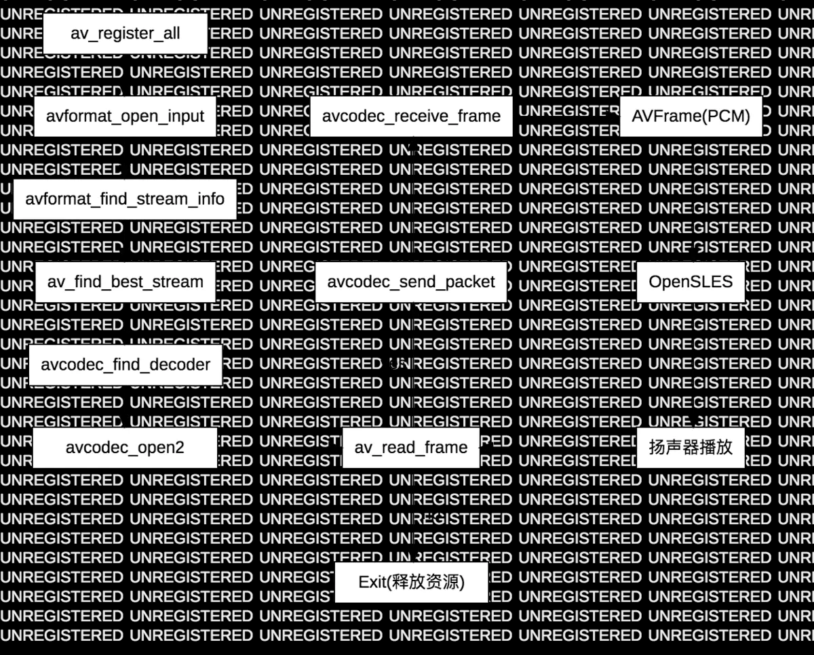

# <center>83.FFmpeg-音乐播放器<center>

具体代码请看：**[NDKPractice项目的ffmpeg83](https://github.com/EastUp/NDKPractice/tree/master/ffmpeg83)**


先来看下流程图：



# 1.获取音频 Meta 信息

```c++
extern "C" JNIEXPORT void JNICALL
Java_com_east_ffmpeg83_media_JaminPlayer_nPlay(JNIEnv *env, jobject instance,
                                                       jstring url_) {
    const char *url = env->GetStringUTFChars(url_,0);
    // 1.初始化所有组件，只有调用了该函数，才能使用复用器和编解码器（源码）
    av_register_all();
    // 2.初始化网络
    avformat_network_init();

    AVFormatContext *pFormatContext = NULL;
    int formatOpenInputRes = -1;
    int formatFindStreamInfoRes = -1;
    int audioStreamIndex = -1;
    AVStream *audio_stream;

    // 3.打开输入
    formatOpenInputRes = avformat_open_input(&pFormatContext,url,NULL,NULL);
    if(formatOpenInputRes !=0 ){
        // 第一件事，需要回调给 Java层
        // 第二件 事，需要释放资源
        LOGE("format open input error：%s",av_err2str(formatOpenInputRes));
        // 一般不推荐这么写，但是的确很方便。
        goto __av_resources_destroy;
    }

    // 4.找出输入流的信息
    formatFindStreamInfoRes = avformat_find_stream_info(pFormatContext,NULL);
    if(formatFindStreamInfoRes < 0){
        LOGE("format find stream info error: %s",av_err2str(formatFindStreamInfoRes));
        goto __av_resources_destroy;
    }

    // 5.查找音频流的 index
    audioStreamIndex = av_find_best_stream(pFormatContext,AVMediaType::AVMEDIA_TYPE_AUDIO,-1,-1,NULL,0);
    if(audioStreamIndex < 0){
        LOGE("format audio stream error");
        goto __av_resources_destroy;
    }
    // 获取采样率和通道
    audio_stream = pFormatContext->streams[audioStreamIndex];
    LOGE("采样率：%d, 通道数: %d", audio_stream->codecpar->sample_rate, audio_stream->codecpar->channels);

    __av_resources_destroy:
    if(pFormatContext != NULL){
        avformat_close_input(&pFormatContext);
        avformat_free_context(pFormatContext);
        pFormatContext = NULL;
    }
    avformat_network_deinit();

    env->ReleaseStringUTFChars(url_,url);
}
```

# 2.解码音频数据

关于解码函数 avcodec_decode_audio4 已经过时了，取而代之的是 avcodec_send_packet 和 avcodec_receive_frame 。

```c++
// 6.查找解码
    pCodecParameters = pFormatContext->streams[audioStreamIndex]->codecpar;
    pCodec = avcodec_find_decoder(pCodecParameters->codec_id);
    if(pCodec == NULL){
        LOGE("codec find audio decoder error");
        goto __av_resources_destroy;
    }

    // 7.创建一个解码器的上下文
    pCodecContext = avcodec_alloc_context3(pCodec);
    if(pCodecContext == NULL){
        LOGE("codec alloc context error");
        goto __av_resources_destroy;
    }
    // 8.根据参数值填充Codec上下文参数
    codecParametersToContextRes = avcodec_parameters_to_context(pCodecContext,pCodecParameters);
    if (codecParametersToContextRes < 0) {
        LOGE("codec parameters to context error: %s", av_err2str(codecParametersToContextRes));
        goto __av_resources_destroy;
    }
    // 9.打开解码器
    codecOpenRes = avcodec_open2(pCodecContext,pCodec,NULL);
    if (codecOpenRes != 0) {
        LOGE("codec audio open error: %s", av_err2str(codecOpenRes));
        goto __av_resources_destroy;
    }

    pPacket = av_packet_alloc();
    pFrame = av_frame_alloc();
    // 循环从上下文中读取帧到包中
    while(av_read_frame(pFormatContext,pPacket) >= 0){
        if(pPacket->stream_index == audioStreamIndex){
            // Packet 包，压缩的数据，解码成 pcm 数据
            int codecSendPacketRes = avcodec_send_packet(pCodecContext,pPacket);
            if(codecSendPacketRes == 0){
                int codecReceiveFrameRes = avcodec_receive_frame(pCodecContext,pFrame);
                if(codecReceiveFrameRes == 0){
                    // AVPacket -> AVFrame
                    index++;
                    LOGE("解码第 %d 帧",index);
                }
            }
        }
        // 解引用
        av_packet_unref(pPacket);
        av_frame_unref(pFrame);
    }

    // 1.解引用数据 data, 2.销魂 pPacket 结构体内存， 3.pPacket = NULL;
    av_packet_free(&pPacket);
    av_frame_free(&pFrame);

    __av_resources_destroy:
    if(pCodecContext != NULL){
        avcodec_close(pCodecContext);
        avcodec_free_context(&pCodecContext);
        pCodecContext = NULL;
    }

    if(pFormatContext != NULL){
        avformat_close_input(&pFormatContext);
        avformat_free_context(pFormatContext);
        pFormatContext = NULL;
    }
    avformat_network_deinit();

    env->ReleaseStringUTFChars(url_,url);
```

# 3.播放音频
播放 pcm 数据目前比较流行的有两种方式，一种是通过 Android 的 AudioTrack 来播放，另一种是采用跨平台的 OpenSLES(直接用的底层操作驱动播放) 来播放，   
个人比较倾向于用更加高效的 [OpenSLES](https://github.com/googlesamples/android-ndk/tree/master/native-audio) 来播放音频，大家可以先看看 Google 官方的 native-audio 事例，这里我们先采用 AudioTrack 来播放

AudioTrack 来播：  
1. 创建 AudioTack 对象 
2. 启动循环，设置为播放状态 (play)
3. 把数据推到指定数组中 (write)


```c++
jobject createAudioTrack(JNIEnv *env){
    /*AudioTrack(int streamType, int sampleRateInHz, int channelConfig, int audioFormat,
        int bufferSizeInBytes, int mode)*/
    jclass jAudioTrackClass = env->FindClass("android/media/AudioTrack");
    jmethodID  jAudioTackCMid = env->GetMethodID(jAudioTrackClass,"<init>","(IIIIII)V");

    int streamType = 3;
    int sampleRateInHz = AUDIO_SAMPLE_RATE;
    int channelConfig = (0x4 | 0x8);
    int audioFormat = 2;
    int mode = 1;

    // int getMinBufferSize(int sampleRateInHz, int channelConfig, int audioFormat)
    jmethodID  getMinBufferSizeMID = env->GetStaticMethodID(jAudioTrackClass,"getMinBufferSize","(III)I");
    int bufferSizeInBytes = env->CallStaticIntMethod(jAudioTrackClass,getMinBufferSizeMID,sampleRateInHz,
            channelConfig,audioFormat);
    LOGE("bufferSizeInBytes = %d",bufferSizeInBytes);

    jobject jAudioTrackObj = env->NewObject(jAudioTrackClass,jAudioTackCMid,streamType,sampleRateInHz,channelConfig,
            audioFormat,bufferSizeInBytes,mode);

    // play
    jmethodID playMid = env->GetMethodID(jAudioTrackClass,"play","()V");
    env->CallVoidMethod(jAudioTrackObj,playMid);

    return jAudioTrackObj;
}

{
    // 10.使用AudioTrack播放
        jAudioTrackClass = env->FindClass("android/media/AudioTrack");
        //  public int write(@NonNull byte[] audioData, int offsetInBytes, int sizeInBytes)
        jWriteMid = env->GetMethodID(jAudioTrackClass,"write","([BII)I");
        jAudioTrackObj = createAudioTrack(env);
    
        pPacket = av_packet_alloc();
        pFrame = av_frame_alloc();
        // 循环从上下文中读取帧到包中
        while(av_read_frame(pFormatContext,pPacket) >= 0){
            if(pPacket->stream_index == audioStreamIndex){
                // Packet 包，压缩的数据，解码成 pcm 数据
                int codecSendPacketRes = avcodec_send_packet(pCodecContext,pPacket);
                if(codecSendPacketRes == 0){
                    int codecReceiveFrameRes = avcodec_receive_frame(pCodecContext,pFrame);
                    if(codecReceiveFrameRes == 0){
                        // AVPacket -> AVFrame
                        index++;
                        LOGE("解码第 %d 帧",index);
    
                        // write 写到缓冲区 pFrame.data -> javabyte
                        // size 是多大，装 pcm 的数据
                        // 1s 44100 点，2通道， 2字节 44100*2*2
                        // 1帧不是一秒，pFrame->nb_samples点
                        int dataSize = av_samples_get_buffer_size(NULL,pFrame->channels,
                                                                  pFrame->nb_samples,pCodecContext->sample_fmt,0);
                        jbyteArray jPcmByteArray = env->NewByteArray(dataSize);
                        // native 创建 c 数组
                        jbyte *jPcmData= env->GetByteArrayElements(jPcmByteArray,NULL);
                        memcpy(jPcmData,pFrame->data,dataSize);
                        // 0 把 c 的数组的数据同步到 jbyteArray,然后释放native数组
                        env->ReleaseByteArrayElements(jPcmByteArray,jPcmData,0);
                        env->CallIntMethod(jAudioTrackObj,jWriteMid,jPcmByteArray,0,dataSize);
                        // 解除 jPcmDataArray 的持有，让 javaGC 回收
                        env->DeleteLocalRef(jPcmByteArray);
                    }
                }
            }
            // 解引用
            av_packet_unref(pPacket);
            av_frame_unref(pFrame);
        }
    
        // 1.解引用数据 data, 2.销魂 pPacket 结构体内存， 3.pPacket = NULL;
        av_packet_free(&pPacket);
        av_frame_free(&pFrame);
        env->DeleteLocalRef(jAudioTrackObj);
    
        __av_resources_destroy:
        if(pCodecContext != NULL){
            avcodec_close(pCodecContext);
            avcodec_free_context(&pCodecContext);
            pCodecContext = NULL;
        }
    
        if(pFormatContext != NULL){
            avformat_close_input(&pFormatContext);
            avformat_free_context(pFormatContext);
            pFormatContext = NULL;
        }
        avformat_network_deinit();
    
        env->ReleaseStringUTFChars(url_,url);
}
```

这块播放还是有杂音，而且内存持续上涨，下节我们通过多线程播放来解决


