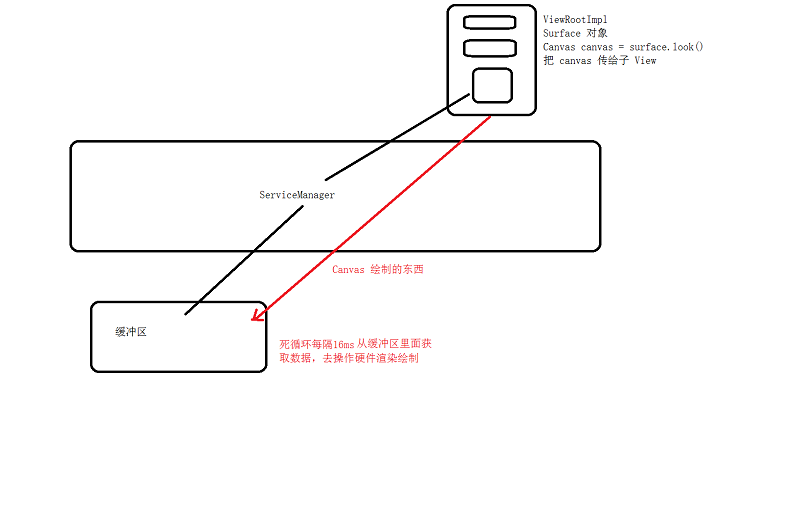

# <center>86.FFmpeg-视频播放器1<center>

具体代码请看：**[NDKPractice项目的ffmpeg86](https://github.com/EastUp/NDKPractice/tree/master/ffmpeg86)**

将之前的音乐播放器代码整合进来

# 知识点：

## 1.使用FFmpeg解码视频

跟使用FFmpeg解码音频流程一致，但需要判断是否能硬解码

```c++
 //-------------需要将视频的格式一般为yuv420P转为RBGA8888-------------------------//
    // 1. 获取窗体
    ANativeWindow *pNativeWindow = ANativeWindow_fromSurface(env,surface);
    // 2.设置缓冲区的数据
    ANativeWindow_setBuffersGeometry(pNativeWindow,pCodecContext->width,pCodecContext->height,
            WINDOW_FORMAT_RGBA_8888);
    // Window 缓冲区的 Buffer
    ANativeWindow_Buffer outBuffer;
    // 3.初始化转换上下文
    SwsContext *pSwsContext = sws_getContext(pCodecContext->width,pCodecContext->height,pCodecContext->pix_fmt,
                   pCodecContext->width,pCodecContext->height,AV_PIX_FMT_RGBA,
                   SWS_BILINEAR,NULL,NULL,NULL);
    AVFrame *pRgbaFrame = av_frame_alloc();
    int frameSize = av_image_get_buffer_size(AV_PIX_FMT_RGBA,pCodecContext->width,
            pCodecContext->height,1);
    uint8_t *frameBuffer = (uint8_t*)malloc(frameSize);
    // 填充
    av_image_fill_arrays(pRgbaFrame->data,pRgbaFrame->linesize,frameBuffer,AV_PIX_FMT_RGBA,
                         pCodecContext->width,pCodecContext->height,1);

    pPacket = av_packet_alloc();
    pFrame = av_frame_alloc();
    while (av_read_frame(pFormatContext, pPacket) >= 0) {
        if (pPacket->stream_index == audioStramIndex) {
            // Packet 包，压缩的数据，解码成 pcm 数据
            int codecSendPacketRes = avcodec_send_packet(pCodecContext, pPacket);
            if (codecSendPacketRes == 0) {
                int codecReceiveFrameRes = avcodec_receive_frame(pCodecContext, pFrame);
                if (codecReceiveFrameRes == 0) {
                    // AVPacket -> AVFrame
                    index++;
                    LOGE("解码第 %d 帧", index);
                    // 渲染，显示，OpenGLES (高效，硬件支持)，SurfaceView
                    // 硬件加速和不加速有什么区别？cup 主要是用于计算，gpu 图像支持（硬件）
                    // 这个 pFrame->data , 一般 yuv420P 的，RGBA8888，因此需要转换
                    // 假设拿到了转换后的 RGBA 的 data 数据，如何渲染，把数据推到缓冲区
                    sws_scale(pSwsContext,pFrame->data,pFrame->linesize,
                            0,pCodecContext->height,pRgbaFrame->data,pRgbaFrame->linesize);
                    // 把数据推到缓冲区
                    ANativeWindow_lock(pNativeWindow,&outBuffer,NULL);
                    memcpy(outBuffer.bits,frameBuffer,frameSize);
                    ANativeWindow_unlockAndPost(pNativeWindow);
                }
            }
        }
        // 解引用
        av_packet_unref(pPacket);
        av_frame_unref(pFrame);
    }


```


<font color=red>问题：视音频还是没同步的问题（视频快，音频正常）</font>

## 2.渲染视频

### 2.1 OpenGLES解释（渲染视频高效，硬件支持）

#### 2.1.1 OpenGL概念

OpenGL 是一种应用程序的编程接口，它是一种可以对图像硬件设备进行访问的软件库，OpenGL 被设计为一个现代化的，硬件无关的接口，  
因此我们不用考虑操作系统的前提下，在多种不同的图像硬件系统上通过软件的形式来实现 OpenGL 接口。  
OpenGL 也没有提供任何表达三维物体模型和读取图文的操作，我们需要用一系列的几何图元来创建三维物体。  
图元：线，三角形，点，patch  


#### 2.1.2 OpenGL 用来干什么

渲染视频、图形，图片处理，2D/3D 游戏引擎，科学可视化，CAD，虚拟现实，AI人工智能等等

#### 2.1.3 OpenGL 与 OpenGLES 有什么关系？

OpenGLES 是 OpenGL 阉割（精简）版本，主要用于移动端


#### 2.1.4 OpenGL后续学习

看谷歌的[示例](https://github.com/googlesamples/android-ndk/tree/master/gles3jni)  

学开发编程的约定，坐标系变化，标量向量，渲染流水线  

基础绘制（数学基础），纹理，模型，雾效果，相机，美容，native 层  


### 2.2 SurfaceView 渲染视频（这节先用SurfaceView）

```
源代码分析：
ViewRootImpl.performDraw()
-> ViewRootImpl.draw(fullRedrawNeeded);
-> ViewRootImpl.drawSoftware(surface, mAttachInfo, xOffset, yOffset,
                           scalingRequired, dirty, surfaceInsets)
   
    canvas = mSurface.lockCanvas(dirty);
    mView.draw(canvas);

最后通过 ViewGroup 绘制子 View 将 canvas 传递下去

```


#### 2.2.1 Button 和 TextView 的 Canvas 是不是同一个？
是！！！

#### 2.2.2 Canvas 是从哪里来的？
根布局的 `Canvas canvas = mSurface.lockCanvas(dirty)`

#### 2.2.3 Canvas 绘制的东西到哪里去了（怎么渲染出来的）？



#### 2.2.4 为什么 SurfaceView 能在子线程中更新 UI 

只要View是在子线程中创建的，就可以在子线程中可以更新UI。（代码中判断的是不是当前线程）

#### 2.2.5 SurfaceView的挖洞原理（显示机制）SurfaceFilnger


