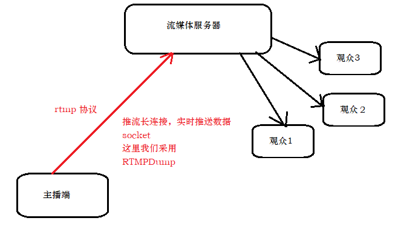
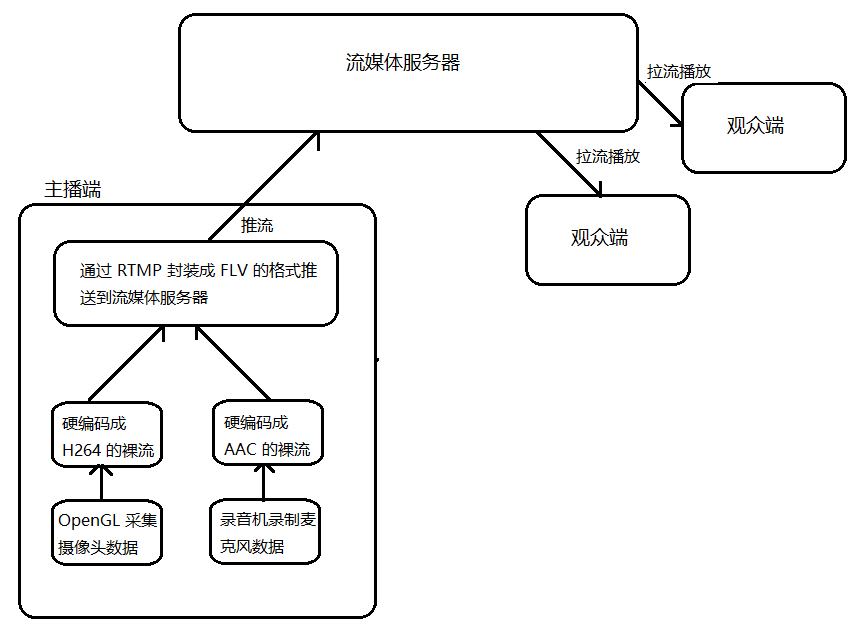

# <center>88.FFmpeg-直播推、拉流<center>

<font color = red> 以下使用&nbsp;&nbsp;&nbsp;&nbsp;Ubuntu&nbsp;&nbsp;&nbsp;&nbsp;环境搭建的</font>

具体代码请看：**[NDKPractice项目的ffmpeg88livepush](https://github.com/EastUp/NDKPractice/tree/master/ffmpeg88livepush)**

# 知识点：

## 1.搭建流媒体服务器

### 1.1 安装

1. 在ubuntu系统中首先切换到`root`用户,然后cd到`lib`目录下，`mkdir新建nginx`文件夹。

2. 使用 `wget ftp://ftp.pcre.org/pub/pcre/pcre-8.38.zip` 下载 `pcre-8.38.zip版本`，也可以直接下载最新的版本.  
    - 下载下来后使用`chmod u+x pcre-8.38.zip`修改权限,`unzip pcre-8.38.zip`解压然后进入解压的文件夹中。
    - 使用`./configure`运行会生成CMakeLists.txt  
    - 接着使用`make`指令执行.    
    - 最后使用`make install `指令执行.  
    
3. 下载`zlib`,点击 [链接](https://github.com/madler/zlib/releases) 右键点击最新版本的`tar.gz`复制链接地址。
    - 返回nginx目录下使用 `wget https://github.com/madler/zlib/archive/v1.2.11.tar.gz` 下载。
    - 下载下来后使用`chmod u+x v1.2.11.tar.gz`修改权限,`tar -zxvf v1.2.11.tar.gz`解压然后进入解压的文件夹中。
    - 使用`./configure`运行会生成CMakeLists.txt  
    - 接着使用`make`指令执行.    
    - 最后使用`make install `指令执行.  
    
4. 下载`rtmp`,点击 [链接](https://github.com/arut/nginx-rtmp-module/releases) 右键点击最新版本的`tar.gz`复制链接地址。
    - 返回nginx目录下使用 `wget https://github.com/arut/nginx-rtmp-module/archive/v1.2.1.tar.gz` 下载。
    - 下载下来后使用`chmod u+x v1.2.1.tar.gz`修改权限,`tar -zxvf v1.2.1.tar.gz`解压。这个不需要安装。
    
5. 下载`openssl`,点击 [链接](https://github.com/openssl/openssl/releases) 右键点击最新版本的`tar.gz`复制链接地址。
    - 返回nginx目录下使用 `wget https://github.com/openssl/openssl/archive/OpenSSL_1_1_1c.tar.gz` 下载。
    - 下载下来后使用`chmod u+x OpenSSL_1_1_1c.tar.gz`修改权限,`tar -zxvf OpenSSL_1_1_1c.tar.gz`解压然后进入解压的文件夹中。
    - 使用 `./config --prefix=`&#96;`pwd`&#96;`/libs` 运行会生成CMakeLists.txt文件，&#96;pwd&#96;指令代表当前目录文件
    - 接着使用`make`指令执行.    
    - 最后使用`make install `指令执行.  
    
6. 下载`nginx`,<font color=red>必须依赖前面安装的所有东西</font> 点击 [链接](https://github.com/nginx/nginx/releases) 右键点击最新版本的`tar.gz`复制链接地址。
    - 返回nginx目录下使用 `wget https://github.com/nginx/nginx/archive/release-1.17.1.tar.gz` 下载。
    - 下载下来后使用`chmod u+x release-1.17.1.tar.gz`修改权限,`tar -zxvf release-1.17.1.tar.gz`解压然后进入解压的文件夹中。
    - 使用 `./auto/configure --add-module=/lib/nginx/nginx-rtmp-module-1.2.1 --with-cc-opt="-Wimplicit-fallthrough=0" --with-openssl=/lib/nginx/openssl-OpenSSL_1_1_1c`
    - 接着使用`make`指令执行.    
    - 最后使用`make install `指令执行.  
    
- nginx:  https://github.com/nginx/nginx/releases
- rtmp:  https://github.com/arut/nginx-rtmp-module/releases
- pcre:  ftp://ftp.pcre.org/pub/pcre/ 下载最新版本，这边下载 pcre-8.38.zip
- zlib:  https://github.com/madler/zlib/releases
- openssl:  https://github.com/openssl/openssl

**出现的问题**：

```
checking for OS
 + Linux 5.4.0-48-generic x86_64
checking for C compiler ... not found

./auto/configure: error: C compiler cc is not found

解决：sudo apt-get install gcc
```

```
nginx 执行make时出现的问题
......

../nginx-rtmp-module-master/ngx_rtmp_eval.c: In function ‘ngx_rtmp_eval’:
../nginx-rtmp-module-master/ngx_rtmp_eval.c:160:17: error: this statement may fall through [-Werror=implicit-fallthrough=]
                 switch (c) {
                 ^~~~~~
../nginx-rtmp-module-master/ngx_rtmp_eval.c:170:13: note: here
             case ESCAPE:
             ^~~~
cc1: all warnings being treated as errors
make[1]: *** [objs/Makefile:1349: objs/addon/nginx-rtmp-module-master/ngx_rtmp_eval.o] Error 1
make[1]: Leaving directory '/home/pi/nginx-1.19.0'
make: *** [Makefile:8: build] Error 2

解决：

禁用gcc中的“ fallthrough”，在配置时添加选项
./auto/configure --add-module=/lib/nginx/nginx-rtmp-module-1.2.1 --with-cc-opt="-Wimplicit-fallthrough=0" --with-openssl=/lib/nginx/openssl-OpenSSL_1_1_1c

```


### 1.2 配置

执行命令`cp /lib/nginx/nginx-rtmp-module-1.2.1/test/nginx.conf /usr/local/nginx/conf/`  

替换`nginx.cong`。具体的可参考[链接](https://github.com/arut/nginx-rtmp-module)中的`Example nginx.conf`

类似下面这种：
```
orker_processes  1;

error_log  logs/error.log debug;

events {
    worker_connections  1024;
}

rtmp {
    server {
        listen 1935;

        application myapp {
            live on;

            #record keyframes;
            #record_path /tmp;
            #record_max_size 128K;
            #record_interval 30s;
            #record_suffix .this.is.flv;

....
```

### 1.3 启动和停止

- 启动：`./nginx`
- 停止：`./nginx -s stop`

常见问题：

1. 端口被占用（默认8080端口）
2. 启动错误：比如 xxx.so 找不到。

    解决：   
    使用`ldd $(which ./nginx)`查看依赖包。  
    调用`export LD_LIBRARY_PATH=/usr/local/lib:$LD_LIBRARY_PATH`  
    
### 1.4 测试

windows ffmpeg[下载地址](https://github.com/BtbN/FFmpeg-Builds/releases)

mac 和 linux 类似，进入[官网下载](http://www.ffmpeg.org/download.html) 。

下面以windows为例测试步骤：

1. 进入下载好的ffmpeg解压目录的/bin目录文件夹下
2. 使用命令推流：`.\ffmpeg.exe -re -i 等风来不如追风去.mp4 -vcodec libx264 -acodec aac -f flv rtmp://192.168.1.20/myapp/mystream`

推流命令说明：

- `等风来不如追风去.mp4`：是要推流的视频绝对路径。
- `rtmp://192.168.1.20/myapp/mystream`：要推流的地址。192.168.1.20为公网地址或局域网的地址。

## 2.集成 RTMP 推流源码

  



采用一种 socket 通讯方案 [RTMPDump](http://rtmpdump.mplayerhq.hu/)

1. git clone 上面网站中的地址 `git clone git://git.ffmpeg.org/rtmpdump`
2. 将clone下来的文件夹中的librtmp目录中的所有`*.c`和`*.h`文件拷贝到工程目录中开始开发。
3. 如果出现下面的错误就在CMakeLists.txt 中添加 `set(CMAKE_C_FLAGS "${CMAKE_C_FLAGS} -DNO_CRYPTO")`

```
****\src\main\cpp\rtmp\hashswf.c:56:10: fatal error: 'openssl/ssl.h' file not found

```

```c++
void *threadInitConnect(void *args) {
    LivePush *livePush = (LivePush *) args;
    // 1.创建RTMP
    livePush->pRtmp = RTMP_Alloc();
    // 2. 初始化
    RTMP_Init(livePush->pRtmp);
    // 3. 设置参数
    livePush->pRtmp->Link.timeout = 10; // 超时时间 10 秒
    livePush->pRtmp->Link.lFlags = RTMP_LF_LIVE; // 长连接
    RTMP_SetupURL(livePush->pRtmp, livePush->liveUrl);// 设置推流的地址
    RTMP_EnableWrite(livePush->pRtmp);// 可写
    // 4. 开始连接
    if (!RTMP_Connect(livePush->pRtmp, nullptr)) {
        // 回调到java层
        LOGE("rtmp connect error");
        livePush->pJniCall->callConnectError(THREAD_CHILD, INIT_RTMP_CONNECT_ERROR_CODE,
                                             "rtmp connect error");
        return (void *)(INIT_RTMP_CONNECT_ERROR_CODE);
    }

    if (!RTMP_ConnectStream(livePush->pRtmp, 0)) {
        // 回调到java层
        LOGE("rtmp connect stream error");
        livePush->pJniCall->callConnectError(THREAD_CHILD, INIT_RTMP_CONNECT_STREAM_ERROR_CODE,
                                             "rtmp connect stream error");
        return (void *)(INIT_RTMP_CONNECT_STREAM_ERROR_CODE);
    }

    LOGE("rtmp connect success");
    livePush->pJniCall->callConnectSuccess(THREAD_CHILD);

    return 0;
}

```