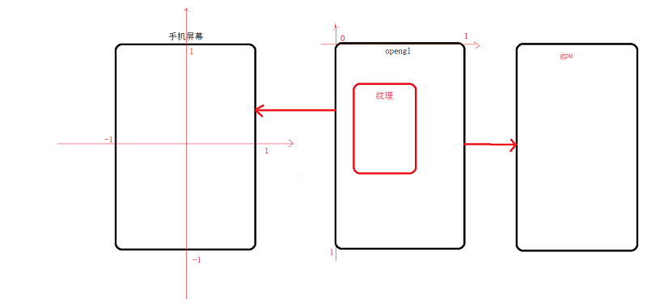

# <center>89.FFmpeg-OpenGL朋友圈录制视频<center>

具体代码请看：**[NDKPractice项目的ffmpeg88livepush](https://github.com/EastUp/NDKPractice/tree/master/ffmpeg88livepush)**

# 1.OpenGL渲染流程介绍
怎么渲染一张图片：

1. 继承`GLSurfaceView`
2. 继承`GLSurfaceView.Renderer`
3. 写顶点和纹理渲染的代码
4. 编译链接生成程序
5. 生成加载 bitmap 的纹理
6. 绘制到屏幕


介绍一下纹理坐标系：

```java
    /**
     * 顶点坐标
     */
    private float[] mVertexCoordinate = new float[]{
            -1f, -1f, // 左下角
            1f, -1f,  // 右下角
            -1f, 1f,  // 左上角
            1f, 1f    // 右上角
    };
    private FloatBuffer mVertexBuffer;

    /**
     * 纹理坐标(对应全屏)
     */
    private float[] mFragmentCoordinate = new float[]{
            0f, 1f,
            1f, 1f,
            0f, 0f,
            1f, 0f
    };

    /**
     * 纹理坐标(对应半屏)
     */
    private float[] mFragmentCoordinate = new float[]{
            0f, 0.5f,
            1f, 0.5f,
            0f, 0f,
            1f, 0f
    };
```

右边是OpenGL的渲染流程：


# 2.OpenGL渲染摄像头数据

```java
    /**
     * 初始化视频的 MediaCodec
     *
     * @param width
     * @param height
     */
    private void initVideoCodec(int width, int height) throws IOException {
        MediaFormat videoFormat = MediaFormat.createVideoFormat(MediaFormat.MIMETYPE_VIDEO_AVC, width, height);
        // 设置颜色格式
        videoFormat.setInteger(MediaFormat.KEY_COLOR_FORMAT, MediaCodecInfo.CodecCapabilities.COLOR_FormatSurface);
        videoFormat.setInteger(MediaFormat.KEY_BIT_RATE, width * height * 4);
        // 设置帧率
        videoFormat.setInteger(MediaFormat.KEY_FRAME_RATE, 24);
        // 设置 I 帧的间隔时间
        videoFormat.setInteger(MediaFormat.KEY_I_FRAME_INTERVAL, 1);

        // 创建编码器
        mVideoCodec = MediaCodec.createEncoderByType(MediaFormat.MIMETYPE_VIDEO_AVC);
        mVideoCodec.configure(videoFormat, null, null, MediaCodec.CONFIGURE_FLAG_ENCODE);

        mSurface = mVideoCodec.createInputSurface();
        // 开启一个编码采集 InputSurface 上的数据，合成视频
        mVideoThread = new VideoEncoderThread(mVideoRecorderWr);
    }

    /**
     * 视频的渲染线程
     */
    private static final class VideoRenderThread extends Thread {
        private WeakReference<BaseVideoRecorder> mVideoRecorderWr;
        private volatile boolean mShouldExit = false;
        private EglHelper mEglHelper;
        private boolean mHashCreateContext = false;
        private boolean mHashSurfaceCreated = false;
        private boolean mHashSurfaceChanged = false;
        private int mWidth;
        private int mHeight;

        public VideoRenderThread(WeakReference<BaseVideoRecorder> videoRecorderWr) {
            this.mVideoRecorderWr = videoRecorderWr;
            mEglHelper = new EglHelper();
        }

        @Override
        public void run() {

            try {
                while (true) {
                    if (mShouldExit) {
                        return;
                    }

                    BaseVideoRecorder videoRecorder = mVideoRecorderWr.get();
                    if (videoRecorder == null) {
                        return;
                    }

                    // 1. 创建 EGL 上下文
                    if (!mHashCreateContext) {
                        mEglHelper.initCreateEgl(videoRecorder.mSurface, videoRecorder.mEglContext);
                        mHashCreateContext = true;
                    }

                    // 回调 Render
                    GL10 gl = (GL10) mEglHelper.getEglContext().getGL();
                    if (!mHashSurfaceCreated) {
                        videoRecorder.mRenderer.onSurfaceCreated(gl, mEglHelper.getEGLConfig());
                        mHashSurfaceCreated = true;
                    }

                    if (!mHashSurfaceChanged) {
                        videoRecorder.mRenderer.onSurfaceChanged(gl, mWidth, mHeight);
                        mHashSurfaceChanged = true;
                    }

                    videoRecorder.mRenderer.onDrawFrame(gl);

                    mEglHelper.swapBuffers();

                    // 60 fps
                    Thread.sleep(16);
                }
            } catch (Exception e) {
                e.printStackTrace();
            } finally {
                onDestroy();
            }
        }

        private void onDestroy() {
            mEglHelper.destroy();
        }

        private void requestExit() {
            mShouldExit = true;
        }

        public void setSize(int width, int height) {
            this.mWidth = width;
            this.mHeight = height;
        }
    }
```


# 3.视频编码录制

```java
    /**
     * 视频的编码线程
     */
    private static final class VideoEncoderThread extends Thread {
        private final MediaMuxer mMediaMuxer;
        private WeakReference<BaseVideoRecorder> mVideoRecorderWr;
        private volatile boolean mShouldExit = false;
        private MediaCodec mVideoCodec;
        private MediaCodec.BufferInfo mBufferInfo;
        private int mVideoTrackIndex = -1;
        private long mVideoPts = 0;
        private final CyclicBarrier mStartCb, mDestroyCb;

        public VideoEncoderThread(WeakReference<BaseVideoRecorder> videoRecorderWr) {
            this.mVideoRecorderWr = videoRecorderWr;
            mVideoCodec = videoRecorderWr.get().mVideoCodec;
            mMediaMuxer = videoRecorderWr.get().mMediaMuxer;
            mBufferInfo = new MediaCodec.BufferInfo();
            mStartCb = videoRecorderWr.get().mStartCb;
            mDestroyCb = videoRecorderWr.get().mDestroyCb;
        }

        @Override
        public void run() {
            try {
                mVideoCodec.start();

                while (true) {
                    if (mShouldExit) {
                        return;
                    }

                    BaseVideoRecorder videoRecorder = mVideoRecorderWr.get();
                    if (videoRecorder == null) {
                        return;
                    }

                    // 代码先不写，先测试，从 surface 上获取数据，编码成 h264 ,通过 MediaMuxer 合成 mp4
                    int outputBufferIndex = mVideoCodec.dequeueOutputBuffer(mBufferInfo, 0);
                    if (outputBufferIndex == MediaCodec.INFO_OUTPUT_FORMAT_CHANGED) {
                        mVideoTrackIndex = mMediaMuxer.addTrack(mVideoCodec.getOutputFormat());
                        mMediaMuxer.start();
                        mStartCb.await();
                    } else {
                        while (outputBufferIndex >= 0) {
                            // 获取数据
                            ByteBuffer outBuffer = mVideoCodec.getOutputBuffers()[outputBufferIndex];
                            outBuffer.position(mBufferInfo.offset);
                            outBuffer.limit(mBufferInfo.offset + mBufferInfo.size);

                            // 修改 pts
                            if (mVideoPts == 0) {
                                mVideoPts = mBufferInfo.presentationTimeUs;
                            }
                            mBufferInfo.presentationTimeUs -= mVideoPts;

                            // 写入数据
                            mMediaMuxer.writeSampleData(mVideoTrackIndex, outBuffer, mBufferInfo);

                            // 回调当前录制的时间
                            if (videoRecorder.mRecordListener != null) {
                                videoRecorder.mRecordListener.onTime(mBufferInfo.presentationTimeUs / 1000);
                            }

                            mVideoCodec.releaseOutputBuffer(outputBufferIndex, false);
                            outputBufferIndex = mVideoCodec.dequeueOutputBuffer(mBufferInfo, 0);
                        }
                    }
                }
            } catch (Exception e) {
                e.printStackTrace();
            } finally {
                onDestroy();
            }
        }

        private void onDestroy() {
            try {
                mVideoCodec.stop();
                mVideoCodec.release();
                mDestroyCb.await();
                mMediaMuxer.stop();
                mMediaMuxer.release();
            } catch (Exception e) {
                e.printStackTrace();
            }
        }

        private void requestExit() {
            mShouldExit = true;
        }
    }
```