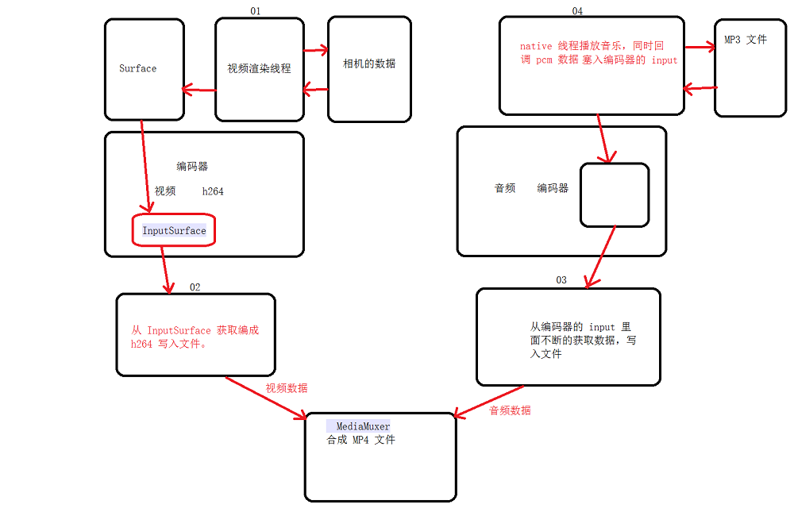
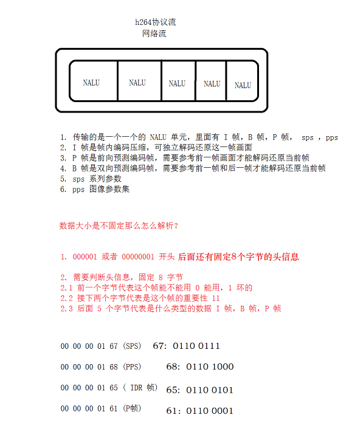
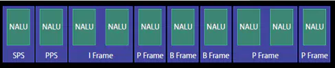

# <center>90.FFmpeg-视频加背景音乐、H.264协议<center>

具体代码请看：**[NDKPractice项目的ffmpeg88livepush](https://github.com/EastUp/NDKPractice/tree/master/ffmpeg88livepush)**

# 1.实现视频加背景音乐
```java

    private MediaInfoListener mMediaInfoListener = new MediaInfoListener() {
        private long mAudioPts = 0;
        private int mSampleRate = 0;
        private int mChannels = 0;

        @Override
        public void musicInfo(int sampleRate, int channels) {
            // 获取了音频的信息
            try {
                initAudioCodec(sampleRate, channels);
            } catch (Exception e) {
                e.printStackTrace();
            }
            this.mSampleRate = sampleRate;
            this.mChannels = channels;
        }

        @Override
        public void callbackPcm(byte[] pcmData, int size) {
            // 把数据写入到 mAudioCodec 的 InputBuffer
            int inputBufferIndex = mAudioCodec.dequeueInputBuffer(0);
            if (inputBufferIndex >= 0) {
                ByteBuffer byteBuffer = mAudioCodec.getInputBuffers()[inputBufferIndex];
                byteBuffer.clear();
                byteBuffer.put(pcmData);

                // pts  44100 * 2 *2
                mAudioPts += size * 1000000 / mSampleRate * mChannels * 2;
                // size 22050*2*2
                mAudioCodec.queueInputBuffer(inputBufferIndex, 0, size, mAudioPts, 0);
            }
        }
    };
    
    /**
     * 音频的编码线程
     */
    private static final class AudioEncoderThread extends Thread {
        private final MediaMuxer mMediaMuxer;
        private WeakReference<BaseVideoRecorder> mVideoRecorderWr;
        private volatile boolean mShouldExit = false;
        private MediaCodec mAudioCodec;
        private MediaCodec.BufferInfo mBufferInfo;
        private int mAudioTrackIndex = -1;
        private long mAudioPts = 0;
        private final CyclicBarrier mStartCb, mDestroyCb;

        public AudioEncoderThread(WeakReference<BaseVideoRecorder> videoRecorderWr) {
            this.mVideoRecorderWr = videoRecorderWr;
            mAudioCodec = videoRecorderWr.get().mAudioCodec;
            mMediaMuxer = videoRecorderWr.get().mMediaMuxer;
            mBufferInfo = new MediaCodec.BufferInfo();
            mStartCb = videoRecorderWr.get().mStartCb;
            mDestroyCb = videoRecorderWr.get().mDestroyCb;
        }

        @Override
        public void run() {
            try {
                while (true) {
                    if (mShouldExit) {
                        return;
                    }

                    BaseVideoRecorder videoRecorder = mVideoRecorderWr.get();
                    if (videoRecorder == null) {
                        return;
                    }

                    // 获取音频数据，那这个音频数据从哪里来？音乐播放器里面来，pcm 数据
                    int outputBufferIndex = mAudioCodec.dequeueOutputBuffer(mBufferInfo, 0);
                    if (outputBufferIndex == MediaCodec.INFO_OUTPUT_FORMAT_CHANGED) {
                        mAudioTrackIndex = mMediaMuxer.addTrack(mAudioCodec.getOutputFormat());
                        mStartCb.await();
                        // mMediaMuxer.start();
                    } else {
                        while (outputBufferIndex >= 0) {
                            // 获取数据
                            ByteBuffer outBuffer = mAudioCodec.getOutputBuffers()[outputBufferIndex];
                            outBuffer.position(mBufferInfo.offset);
                            outBuffer.limit(mBufferInfo.offset + mBufferInfo.size);

                            // 修改 pts
                            if (mAudioPts == 0) {
                                mAudioPts = mBufferInfo.presentationTimeUs;
                            }
                            mBufferInfo.presentationTimeUs -= mAudioPts;

                            // 写入数据
                            mMediaMuxer.writeSampleData(mAudioTrackIndex, outBuffer, mBufferInfo);

                            mAudioCodec.releaseOutputBuffer(outputBufferIndex, false);
                            outputBufferIndex = mAudioCodec.dequeueOutputBuffer(mBufferInfo, 0);
                        }
                    }
                }
            } catch (Exception e) {
                e.printStackTrace();
            } finally {
                onDestroy();
            }
        }

        private void onDestroy() {
            try {
                mAudioCodec.stop();
                mAudioCodec.release();
                mDestroyCb.await();
            } catch (Exception e) {
                e.printStackTrace();
            }
        }

        private void requestExit() {
            mShouldExit = true;
        }
    }
```



# 2.详解H.264协议



首先需要明确 H264 可以分为两层，对于 VCL 具体的编解码算法这里暂时先不介绍，只介绍常用的 NAL 层，即网络提取层，这是解码的基础。：  
1.VCL video codinglayer（视频编码层）
2.NAL network abstraction layer（网络提取层）。



- SPS：序列参数集
- PPS：图像参数集
- I帧：帧内编码帧，可独立解码生成完整的图片。
- P帧: 前向预测编码帧，需要参考其前面的一个I 或者B 来生成一张完整的图片。
- B帧: 双向预测内插编码帧，则要参考其前一个I或者P帧及其后面的一个P帧来生成一张完整的图片


# 4.获取 MediaCodec 的 sps 和 pps

- SPS：Sequence Paramater Set，又称作序列参数集。SPS中保存了一组编码视频序列(Coded video sequence)的全局参数。所谓的编码视频序列即原始视频的一帧一帧的像素数据经过编码之后的结构组成的序列
- PPS:除了序列参数集SPS之外，H.264中另一重要的参数集合为图像参数集Picture Paramater Set(PPS)。 

```java
    /**
     * 视频的编码线程
     */
    private static final class VideoEncoderThread extends Thread {
        private WeakReference<BaseVideoPush> mVideoRecorderWr;
        private volatile boolean mShouldExit = false;
        private MediaCodec mVideoCodec;
        private MediaCodec.BufferInfo mBufferInfo;
        private long mVideoPts = 0;
        private final CyclicBarrier mStartCb, mDestroyCb;
        private byte[] mVideoSps,mVideoPps;

        public VideoEncoderThread(WeakReference<BaseVideoPush> videoRecorderWr) {
            this.mVideoRecorderWr = videoRecorderWr;
            mVideoCodec = videoRecorderWr.get().mVideoCodec;
            mBufferInfo = new MediaCodec.BufferInfo();
            mStartCb = videoRecorderWr.get().mStartCb;
            mDestroyCb = videoRecorderWr.get().mDestroyCb;
        }

        @Override
        public void run() {
            try {
                mVideoCodec.start();

                while (true) {
                    if (mShouldExit) {
                        return;
                    }

                    BaseVideoPush videoRecorder = mVideoRecorderWr.get();
                    if (videoRecorder == null) {
                        return;
                    }

                    // 代码先不写，先测试，从 surface 上获取数据，编码成 h264 ,通过 MediaMuxer 合成 mp4
                    int outputBufferIndex = mVideoCodec.dequeueOutputBuffer(mBufferInfo, 0);
                    if (outputBufferIndex == MediaCodec.INFO_OUTPUT_FORMAT_CHANGED) {
                        // mStartCb.await();

                        // 获取 sps 和 pps
                        Log.e("TAG", "获取 sps 和 pps");
                        ByteBuffer byteBuffer = mVideoCodec.getOutputFormat().getByteBuffer("csd-0");
                        mVideoSps = new byte[byteBuffer.remaining()];
                        byteBuffer.get(mVideoSps, 0, mVideoSps.length);

                        Log.e("sps", bytesToHexString(mVideoSps));

                        byteBuffer = mVideoCodec.getOutputFormat().getByteBuffer("csd-1");
                        mVideoPps = new byte[byteBuffer.remaining()];
                        byteBuffer.get(mVideoPps, 0, mVideoPps.length);

                        Log.e("pps", bytesToHexString(mVideoPps));
                    } else {
                        while (outputBufferIndex >= 0) {
                            // 获取数据
                            ByteBuffer outBuffer = mVideoCodec.getOutputBuffers()[outputBufferIndex];
                            outBuffer.position(mBufferInfo.offset);
                            outBuffer.limit(mBufferInfo.offset + mBufferInfo.size);

                            // 修改 pts
                            if (mVideoPts == 0) {
                                mVideoPts = mBufferInfo.presentationTimeUs;
                            }
                            mBufferInfo.presentationTimeUs -= mVideoPts;

                            byte[] data = new byte[outBuffer.remaining()];
                            outBuffer.get(data, 0, data.length);
                            Log.e("TAG",bytesToHexString(data));

                            // 回调当前录制的时间
                            if (videoRecorder.mRecordListener != null) {
                                videoRecorder.mRecordListener.onTime(mBufferInfo.presentationTimeUs / 1000);
                            }

                            mVideoCodec.releaseOutputBuffer(outputBufferIndex, false);
                            outputBufferIndex = mVideoCodec.dequeueOutputBuffer(mBufferInfo, 0);
                        }
                    }
                }
            } catch (Exception e) {
                e.printStackTrace();
            } finally {
                onDestroy();
            }
        }

        private void onDestroy() {
            try {
                mVideoCodec.stop();
                mVideoCodec.release();
                // mDestroyCb.await();
            } catch (Exception e) {
                e.printStackTrace();
            }
        }

        private void requestExit() {
            mShouldExit = true;
        }
    }
```